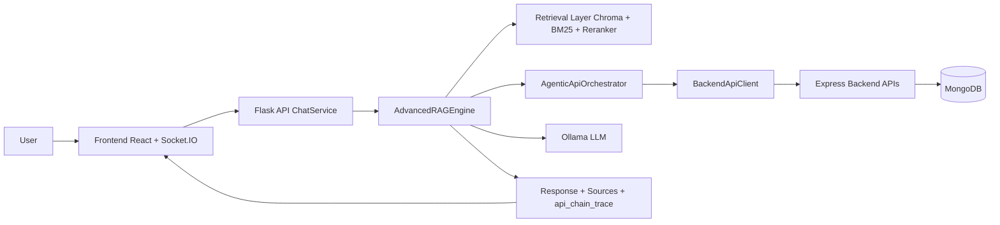
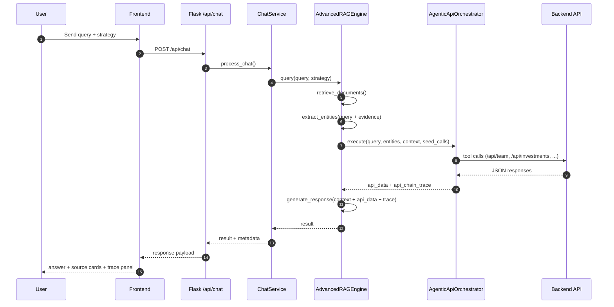
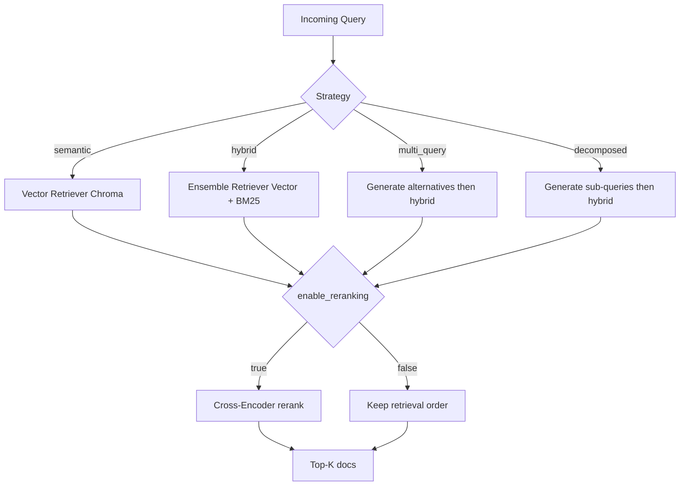
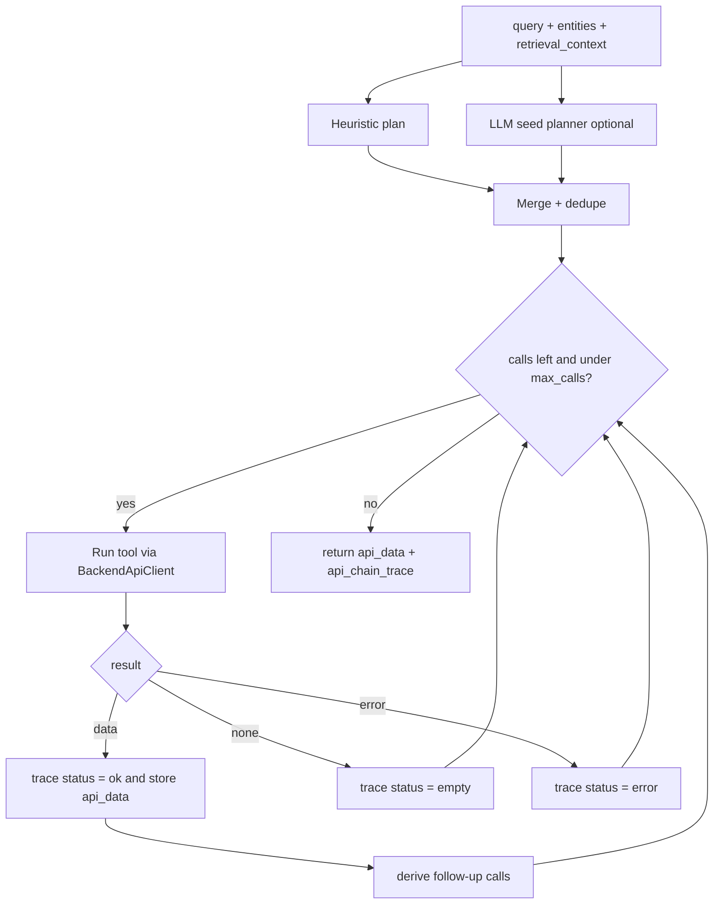
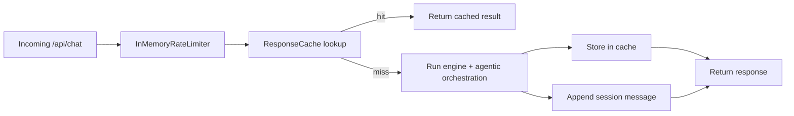

# Agentic RAG In This Project

This document explains how "agentic RAG" is implemented in this repository, using the actual code paths, data contracts, and runtime behavior.

## Table Of Contents

1. [What "Agentic RAG" Means Here](#1-what-agentic-rag-means-here)
2. [High-Level Architecture](#2-high-level-architecture)
3. [End-To-End Request Lifecycle](#3-end-to-end-request-lifecycle)
4. [Core Components And Responsibilities](#4-core-components-and-responsibilities)
5. [Retrieval Layer Details](#5-retrieval-layer-details)
6. [Agentic Planning And Execution](#6-agentic-planning-and-execution)
7. [Tool Catalog And Backend Route Mapping](#7-tool-catalog-and-backend-route-mapping)
8. [Runtime State: Cache, Sessions, Rate Limit](#8-runtime-state-cache-sessions-rate-limit)
9. [API And UI Exposure Of Agentic Signals](#9-api-and-ui-exposure-of-agentic-signals)
10. [Security And Auth Boundary](#10-security-and-auth-boundary)
11. [Configuration Knobs Relevant To Agentic RAG](#11-configuration-knobs-relevant-to-agentic-rag)
12. [Failure Modes And Behavior](#12-failure-modes-and-behavior)
13. [Example Chat Result Shape](#13-example-chat-result-shape)
14. [How To Add A New Agentic Tool](#14-how-to-add-a-new-agentic-tool)
15. [Practical Definition For This Repository](#15-practical-definition-for-this-repository)

## 1) What "Agentic RAG" Means Here

In this project, agentic RAG means:

1. Retrieve relevant evidence from indexed documents.
2. Extract entities/intents from query + retrieved evidence.
3. Plan backend tool calls (heuristics, optionally seeded by an LLM planner).
4. Execute calls, chain follow-up calls, and keep an execution trace.
5. Fuse retrieved context + tool outputs into the final response.

In essence, it is a full RAG pipeline with deterministic orchestration and optional LLM-assisted tool planning.

## 2) High-Level Architecture



## 3) End-To-End Request Lifecycle



## 4) Core Components And Responsibilities

### 4.1 API and application service

- `rag_system/api/factory.py`
  - Exposes `/api/chat`, `/api/chat/completions`, `/api/strategies`, `/api/tools`, `/health`, and Socket.IO events.
- `rag_system/services/chat_service.py`
  - Orchestrates request validation, cache lookup, engine calls, metadata enrichment, and session persistence.

Key runtime metadata added in chat service:

- `cache_hit`
- `latency_ms`
- `timestamp`
- `api_chain_calls` (count of trace entries)

### 4.2 RAG engine

- `rag_system/engine.py` (`AdvancedRAGEngine`)
  - Ingestion and indexing from backend ZIP or local docs fallback.
  - Retrieval strategy routing (`semantic`, `hybrid`, `multi_query`, `decomposed`).
  - Optional reranking via cross-encoder.
  - Entity extraction.
  - Tool planning seed with LLM.
  - Orchestrator call and response synthesis.

### 4.3 Agentic orchestrator

- `rag_system/services/agentic_orchestrator.py` (`AgenticApiOrchestrator`)
  - Heuristic plan generation from query, entities, retrieval context.
  - Merge + dedupe with optional LLM seed calls.
  - Sequential execution loop up to `max_calls` (default `14`).
  - Follow-up chaining rules from tool results.
  - Trace construction with `status: ok | empty | error`.

### 4.4 Backend tool client

- `rag_system/clients/backend_api.py` (`BackendApiClient`)
  - Maps tool names to typed backend HTTP calls.
  - Uses `requests` + retry (tenacity) for resilience.
  - Treats backend 404 as no-data (`None`) in `_safe_get`.

## 5) Retrieval Layer Details



Retrieval notes:

- Vector store: Chroma.
- Lexical retriever: BM25.
- Hybrid: `EnsembleRetriever` (equal weights currently).
- Reranker: `cross-encoder/ms-marco-MiniLM-L-6-v2` when enabled.
- Strategy enum lives in `rag_system/models.py`.

## 6) Agentic Planning And Execution



### 6.1 Planning inputs

- `query`
- `entities` (`persons`, `companies`, `sectors`, `urls`)
- `retrieval_context` (first retrieved chunks)
- optional `seed_calls` from LLM planner

### 6.2 Heuristic intent detection

The orchestrator checks keyword intent classes:

- people intent (`team`, `profile`, `leadership`, etc.)
- investment intent (`investment`, `portfolio`, `company`, etc.)
- sector intent (`sector`, `industry`, `market`, etc.)
- consultation intent (`consult`, `advisor`, etc.)
- scrape intent (`scrape`, `website`, `url`) or explicit URL entity

Then it maps detected entities/intents to tool calls and dedupes.

### 6.3 LLM seed planner behavior

Before orchestration, engine asks the LLM to return a JSON array of tool calls with rules:

- use only available tools
- max 6 calls
- valid params
- return `[]` when unnecessary

Parser is defensive:

- extracts bracketed JSON slice if wrapper text exists
- ignores invalid entries
- truncates to 6 seed calls

### 6.4 Follow-up chaining rules

Current automatic follow-ups:

1. `investment_profile` result with `sectors` -> add up to 2 `sector_profile` calls.
2. `sector_profile` result with `investment_team` -> add up to 2 `team_profile` calls.

## 7) Tool Catalog And Backend Route Mapping

| Tool name | Backend route | Purpose |
|---|---|---|
| `team_profile` | `GET /api/team?name=` | person profile fields |
| `team_insights` | `GET /api/team/insights?name=` | person insights list |
| `investment_profile` | `GET /api/investments?company_name=` | company profile fields |
| `investment_insights` | `GET /api/investments/insights?company_name=` | company insights list |
| `sector_profile` | `GET /api/sectors?sector=` | sector object |
| `consultations` | `GET /api/consultations?name=` | consultation records |
| `scrape_page` | `GET /api/scrape?url=` | simulated scrape payload |

Important note:

- `backend/src/routes/scrape.ts` currently returns Faker-generated simulated data, not real scraping.

## 8) Runtime State: Cache, Sessions, Rate Limit



- Session store: `InMemorySessionStore` (thread-safe, bounded message history per session).
- Response cache: `ResponseCache` (thread-safe LRU with TTL, default 900s).
- Rate limiter: `InMemoryRateLimiter` sliding window on `/api/*`.

All three are process-local and in-memory.

## 9) API And UI Exposure Of Agentic Signals

### 9.1 API response fields

`/api/chat` result includes:

- `response`
- `sources[]`
- `api_data_keys[]`
- `api_chain_trace[]`
- `metadata` (including `api_chain_calls`)

OpenAI-compatible endpoint (`/api/chat/completions`) also returns agentic metadata.

### 9.2 Frontend rendering

UI surfaces:

1. Strategy label on assistant messages.
2. Source cards.
3. "Agentic API Chain" panel showing recent trace items.
4. Sidebar list of backend tools from `/api/tools`.

## 10) Security And Auth Boundary

- Backend API requires bearer token middleware (`psJN7z3J9q` in current demo backend).
- RAG `BackendApiClient` sends `Authorization: Bearer <API_TOKEN>`.
- If token mismatch happens, tool calls fail and appear as `error` in `api_chain_trace`.
- RAG API has optional gateway auth for clients (`ENABLE_GATEWAY_AUTH` + `API_GATEWAY_TOKEN`).

## 11) Configuration Knobs Relevant To Agentic RAG

In `rag_system/config.py`:

- retrieval quality/latency
  - `TOP_K`
  - `ENABLE_HYBRID_SEARCH`
  - `ENABLE_RERANKING`
  - `CHUNK_SIZE`, `CHUNK_OVERLAP`
- model selection
  - `LLM_MODEL`
  - `EMBEDDING_MODEL`
  - `RERANK_MODEL`
- backend integration
  - `API_BASE_URL`
  - `API_TOKEN`
  - `API_TIMEOUT_SECONDS`
- runtime controls
  - `RATE_LIMIT_REQUESTS_PER_MINUTE`
  - `RESPONSE_CACHE_SIZE`
  - `MAX_SESSION_MESSAGES`

## 12) Failure Modes And Behavior

1. Backend unavailable:
   - tool calls fail, trace entries marked `error`, response still generated from documents if available.
2. Backend 404:
   - treated as empty (`None`), trace status `empty`.
3. LLM planner emits bad JSON:
   - parser drops invalid output and fallback heuristics still run.
4. Document API download fails:
   - engine falls back to local `backend/documents`.
5. No docs available:
   - engine may initialize as not ready; readiness endpoint reflects this.

## 13) Example Chat Result Shape

```json
{
  "query": "Tell me about Scott Varner and SaaS investments",
  "response": " ... ",
  "strategy": "hybrid",
  "num_documents": 5,
  "sources": [
    {
      "source": "peakspan_master_class_...txt",
      "score": 0.82,
      "preview": "..."
    }
  ],
  "api_data_keys": [
    "team_profile(name=Scott Varner)",
    "investment_profile(company_name=Acme Cloud)"
  ],
  "api_chain_trace": [
    {
      "tool": "team_profile",
      "params": {"name": "Scott Varner"},
      "reason": "person entity detected",
      "status": "ok"
    }
  ],
  "metadata": {
    "cache_hit": false,
    "latency_ms": 834.42,
    "timestamp": "2026-02-08T17:00:00+00:00",
    "api_chain_calls": 4
  }
}
```

Note:

- Frontend type includes optional `duration_ms`, but backend trace currently does not populate it.

## 14) How To Add A New Agentic Tool

Recommended minimal path:

1. Add backend route and data contract in `backend/src/routes`.
2. Add client method in `rag_system/clients/backend_api.py`.
3. Register tool name in `available_tools()`.
4. Update heuristic planning rules in `AgenticApiOrchestrator._plan_tool_calls`.
5. Optionally add follow-up rule in `_follow_up_calls`.
6. Ensure LLM planner prompt can include the tool (it pulls dynamic tool names automatically).
7. Add tests in `tests/test_agentic_orchestrator.py` (and client tests if introduced).
8. Verify UI tool list updates automatically via `/api/tools`.

## 15) Practical Definition For This Repository

This repository implements a strong "agentic RAG" baseline:

- retrieval-augmented generation,
- dynamic tool invocation,
- chained follow-ups from intermediate results,
- and transparent trace output for observability.

**Note**: It is designed for grounded portfolio intelligence workflows rather than open-ended autonomous agency. Please refer to the architecture and code for specifics.
