# RAG AI Portfolio Support Platform: Architecture Reference

This document is the technical source of truth for system design, runtime behavior, and production operating model for the RAG AI Portfolio Support platform.

---

## Table Of Contents

1. [Design Goals](#design-goals)
2. [Technology Stack](#technology-stack)
3. [System Context](#system-context)
4. [Container Architecture](#container-architecture)
5. [RAG Service Internal Architecture](#rag-service-internal-architecture)
6. [Backend Service Architecture](#backend-service-architecture)
7. [Frontend Architecture](#frontend-architecture)
8. [Data Model](#data-model)
9. [Primary Execution Flows](#primary-execution-flows)
10. [Security Model](#security-model)
11. [Deployment Topologies](#deployment-topologies)
12. [Scalability And Reliability](#scalability-and-reliability)
13. [Observability And Operations](#observability-and-operations)
14. [Failure Modes And Recovery](#failure-modes-and-recovery)
15. [Request Context Propagation Model](#request-context-propagation-model)
16. [State Placement Strategy](#state-placement-strategy)
17. [CI/CD And Release Control Plane](#cicd-and-release-control-plane)
18. [Known Constraints](#known-constraints)
19. [Extension Points](#extension-points)
20. [Related Documents](#related-documents)

---

## Design Goals

### Functional goals

- Deliver source-backed responses from portfolio content.
- Enrich responses with structured backend API data via tool chaining.
- Support multiple retrieval strategies for varied query patterns.
- Provide a modern chat UX with streaming and traceability.

### Non-functional goals

- Production-operable runtime with health/readiness/liveness endpoints.
- Traceable requests using `X-Request-ID`.
- Deployable across local Docker, AWS EKS, and OCI OKE.
- Progressive delivery support (rolling/canary/blue-green).

### Overall RAG System Design Illustration

<p align="center">
  
</p>

---

## Technology Stack

This architecture covers the full technology inventory used across application services, retrieval runtime, frontend, infrastructure, and delivery tooling.

### Languages And Formats


### RAG, AI, And Python Runtime


### Backend API Stack


### Frontend Stack


### Data, Infra, And Operations


### Quality And Developer Tooling


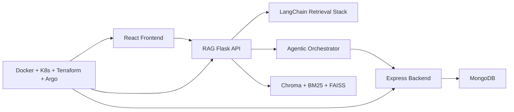

---

## System Context

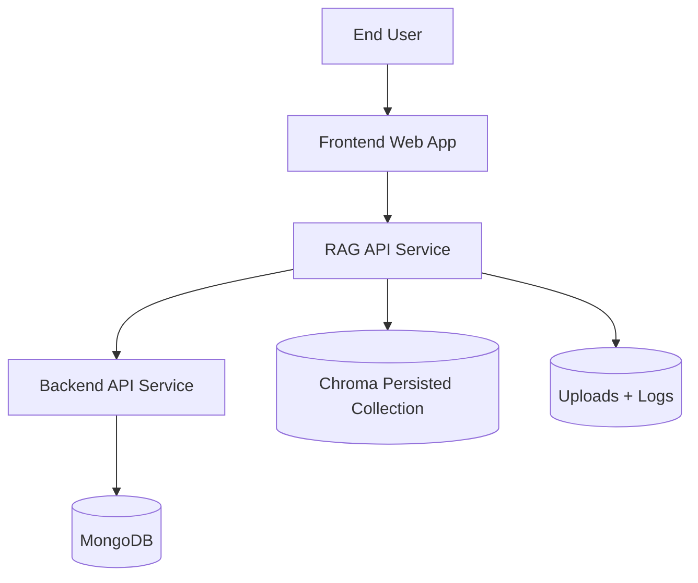

### Bounded responsibilities

| Boundary | Responsibility |
|---|---|
| `frontend` | User interface and interaction orchestration |
| `rag-app` | Chat API, retrieval orchestration, tool chaining, response synthesis |
| `backend` | Structured domain APIs and document export |
| `mongodb` | Backend persistence |

---

## Container Architecture

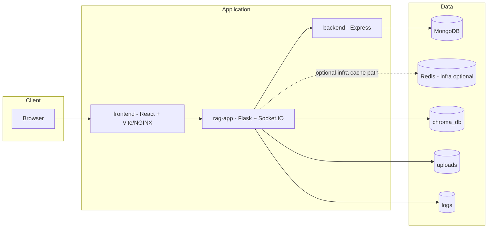

### Runtime port map

| Service | Internal Port | External Port (default) |
|---|---:|---:|
| `frontend` | `80` (nginx build) / `3000` (vite dev) | `3000` |
| `rag-app` | `5000` | `5000` |
| `backend` | `3456` | `3456` |
| `mongodb` | `27017` | `27017` |
| `redis` | `6379` | `6379` |

---

## RAG Service Internal Architecture

Primary code roots:
- `rag_system/api/factory.py`
- `rag_system/services/chat_service.py`
- `rag_system/engine.py`
- `rag_system/services/agentic_orchestrator.py`
- `rag_system/clients/backend_api.py`
- `rag_system/storage/*`

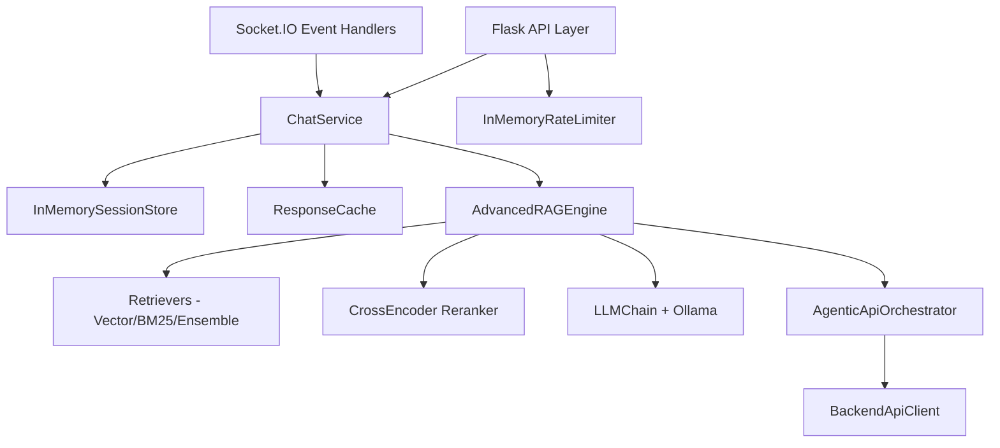

### API middleware behavior

`rag_system/api/factory.py` implements:
- Request start timing
- Request ID assignment and response echo (`X-Request-ID`)
- Optional gateway auth for non-public paths
- In-memory rate limiting for `/api/*`
- Structured JSON errors

Public endpoints exempted from gateway checks:
- `/livez`
- `/readyz`
- `/health`
- `/openapi.json`

### Retrieval strategies

Defined via enum and routed in `engine.py`:
- `semantic`
- `hybrid`
- `multi_query`
- `decomposed`

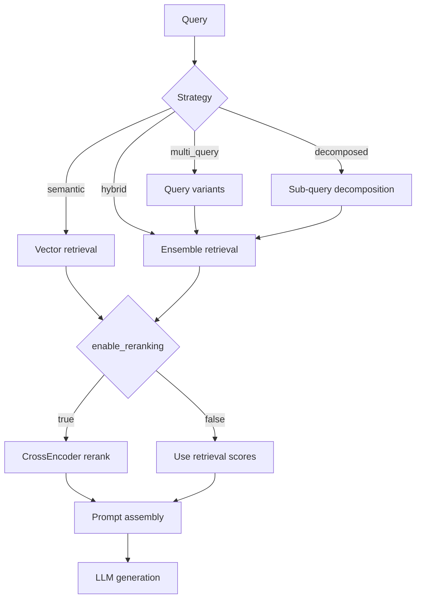

### Agentic orchestration flow

`AgenticApiOrchestrator`:
- plans calls from query/entities/context
- executes backend tools
- appends follow-up calls from response-derived cues
- emits execution trace with status (`ok`, `empty`, `error`)

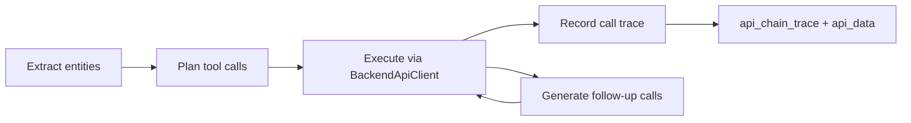

---

## Backend Service Architecture

Primary code roots:
- `backend/src/app.ts`
- `backend/src/routes/*`
- `backend/src/models/*`
- `backend/src/db.ts`

### Route groups

- auth: `/auth/token` (unprotected)
- auth-protected domain routes:
  - `/ping`
  - `/api/documents/download`
  - `/api/team`
  - `/api/team/insights`
  - `/api/investments`
  - `/api/investments/insights`
  - `/api/sectors`
  - `/api/consultations`
  - `/api/scrape`

### Auth behavior

Bearer middleware enforces token equality (current demo token behavior). Replace with production identity integration for hardened deployments.

### Backend request flow

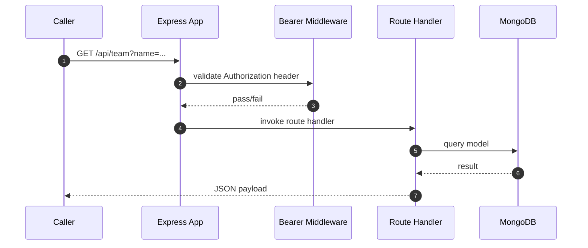

---

## Frontend Architecture

Primary code roots:
- `frontend/src/App.tsx`
- `frontend/src/components/ChatInterface.tsx`
- `frontend/src/lib/api.ts`
- `frontend/vite.config.ts`

### Key behavior

- API client via Axios with request-ID injection.
- Optional gateway token forwarding (`VITE_API_GATEWAY_TOKEN`).
- Socket.IO streaming + REST fallback.
- Session management UI and persisted client preferences.
- Tool trace + source citation visualization.

### Frontend interaction model

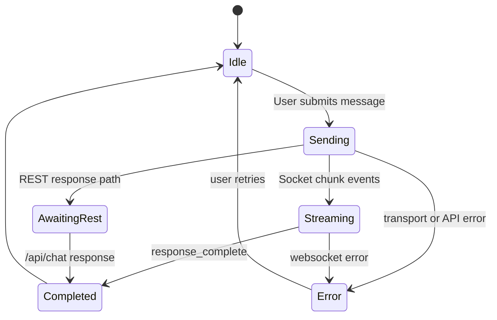

### Vite proxy routing (dev)

During local dev, frontend proxies:
- `/api/*`
- `/health`, `/readyz`, `/livez`
- `/openapi.json`
- `/socket.io`

to `http://localhost:5000`.

<p align="center">
  
</p>

---

## Data Model

### Backend domain model (Mongo)

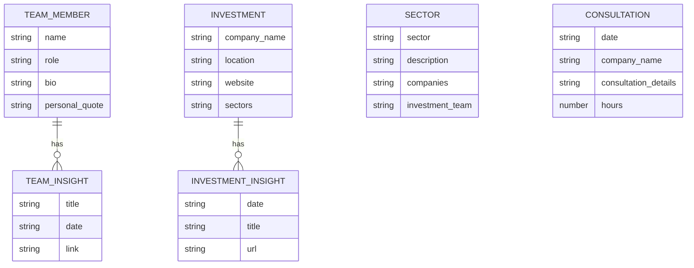

### RAG app state model (in-memory + filesystem)

| Store | Type | Scope |
|---|---|---|
| Session store | in-memory | process-local |
| Response cache | in-memory | process-local |
| Rate limiter | in-memory | process-local |
| Vector index | Chroma persisted directory | node-local filesystem/PV |
| Uploads | filesystem | node-local filesystem/PV |

---

## Primary Execution Flows

### REST chat flow

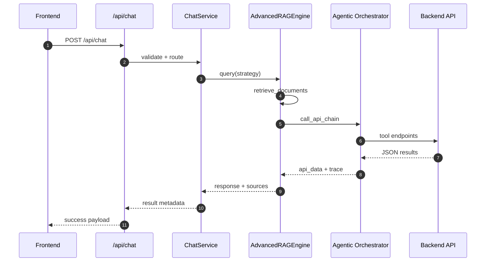

### WebSocket streaming flow

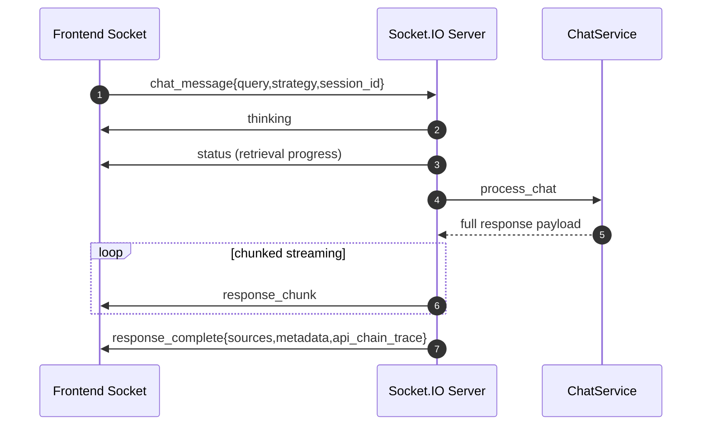

### Upload and indexing flow

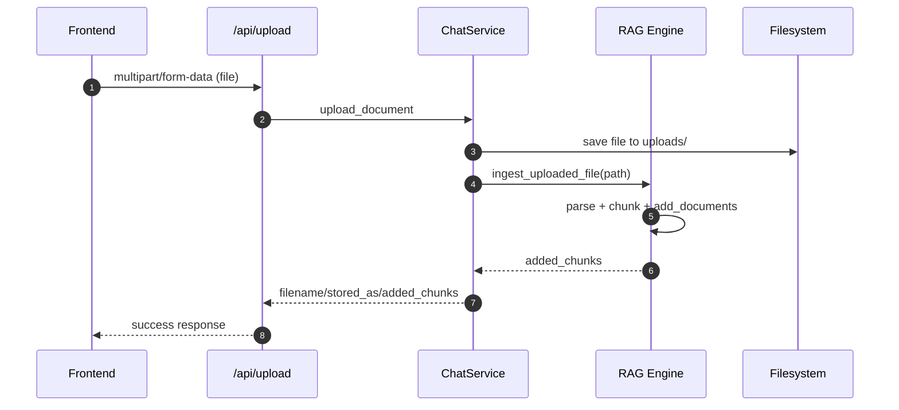

---

## Security Model

### Current controls

- Backend bearer token middleware (demo/static token behavior).
- Optional gateway bearer auth on RAG API.
- Request ID trace propagation (`X-Request-ID`).
- In-memory rate limiting on RAG `/api/*`.
- K8s manifests include ingress TLS-ready definitions and network policies.

### Security boundaries

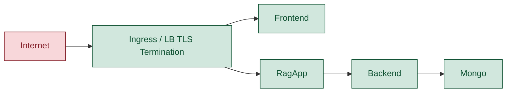

### Production hardening recommendations

- Replace demo bearer auth with real identity/authz stack.
- Externalize secrets to cloud secret manager + operator.
- Centralize audit logs and retention policy.
- Add WAF/rate controls at edge in addition to app-level checks.

---

## Deployment Topologies

### Local Docker topology

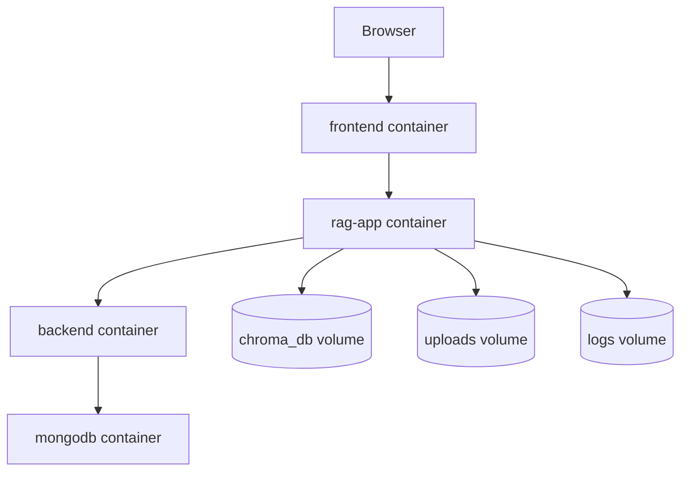

### Kubernetes topology (conceptual)

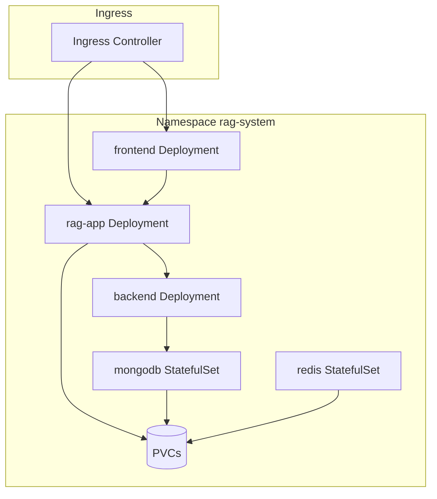

### Progressive delivery state machine

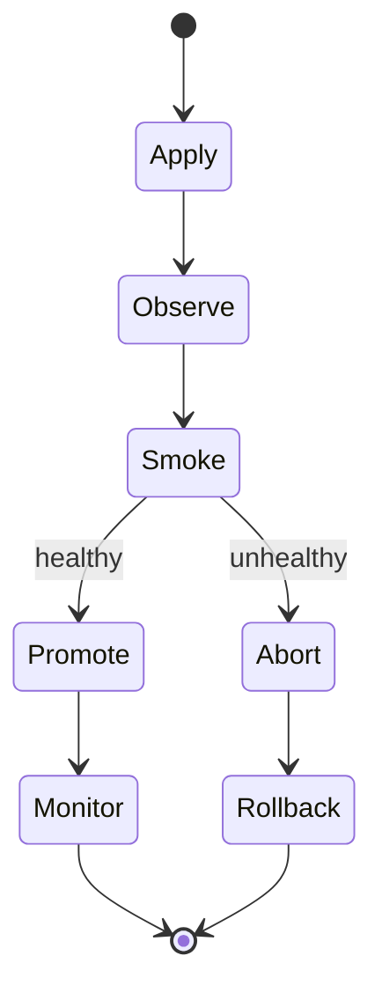

---

## Scalability And Reliability

### Current scaling posture

- Frontend/backend support horizontal scaling with deployment replicas + HPA.
- `rag-app` can scale horizontally only with careful storage/session/cache externalization.

### Critical scale coupling points

- Session store is process-local memory.
- Response cache is process-local memory.
- Rate limiter is process-local memory.
- Vector/upload directories require shared storage semantics for multi-replica behavior.

### Reliability controls in place

- readiness/liveness probes
- startup sequencing in compose/k8s
- PDB manifests for service availability maintenance
- rollout scripts for controlled release actions

---

## Observability And Operations

### Built-in observability signals

- Request-level structured logs (method/path/status/latency/request_id)
- Health endpoints for synthetic checks
- `X-Request-ID` in responses
- API trace payload from agentic orchestration (`api_chain_trace`)

### Operational scripts

- root command dispatcher: `scripts/system.sh`
- deploy actions: `deploy/scripts/rollout.sh`
- endpoint smoke: `deploy/scripts/smoke-test.sh`

### Day-2 command map

| Goal | Command |
|---|---|
| full local setup | `scripts/system.sh setup` |
| run quality gate | `scripts/system.sh test` |
| local health checks | `scripts/system.sh health` |
| local smoke chat | `scripts/system.sh smoke` |
| deploy rollout apply | `deploy/scripts/rollout.sh <strategy> <cloud> apply` |
| rollout status | `deploy/scripts/rollout.sh <strategy> <cloud> status` |
| promote/abort | `deploy/scripts/rollout.sh <strategy> <cloud> promote|abort <service>` |

---

## Failure Modes And Recovery

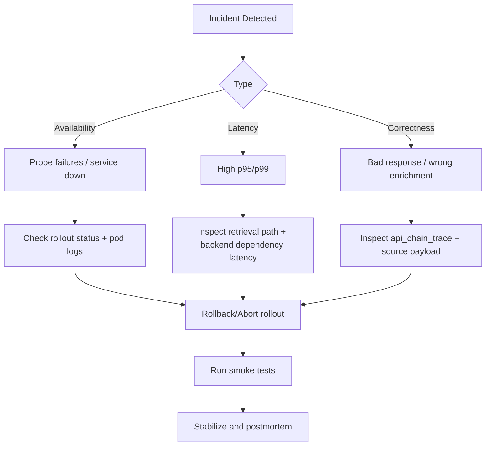

Recommended recovery order:
1. Stop blast radius (`abort`/rollback strategy).
2. Re-establish health endpoints.
3. Validate chat and tools via smoke checks.
4. Capture request IDs and traces for root-cause analysis.

---

## Request Context Propagation Model

The platform uses request-context propagation for observability, tracing, and support diagnostics.

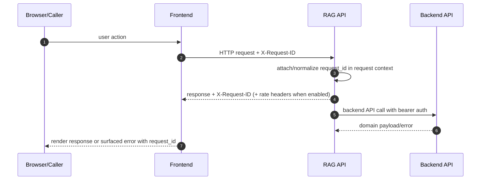

Operational implications:
- request IDs can be correlated across UI reports, API logs, and rollout windows
- rate-limit metadata can drive client retry behavior
- `api_chain_trace` plus request IDs enables tool-call-level triage

---

## State Placement Strategy

Current architecture intentionally keeps some state local for simplicity, with an explicit evolution path for horizontally consistent scaling.

### Current placement

| State | Current location | Shared across replicas | Production implication |
|---|---|---|---|
| session history | process memory | No | conversation continuity is instance-local |
| response cache | process memory | No | cache efficiency degrades with scale-out |
| rate limit counters | process memory | No | limits are not globally enforced |
| vector index | local PV/filesystem | Partial | failover/scale requires storage discipline |
| uploads | local PV/filesystem | Partial | stateless scale requires shared object storage |

### Evolution path

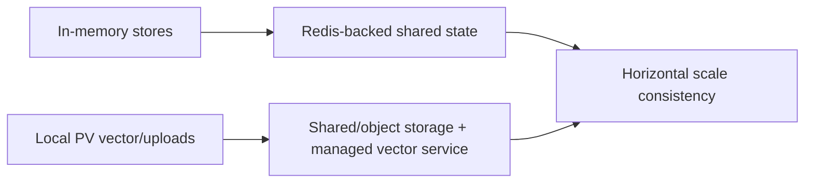

Recommended sequence:
1. externalize session/cache/rate limit to shared Redis
2. decouple uploads from node-local storage
3. move vector persistence to shared or managed infrastructure
4. scale `rag-app` replicas with deterministic behavior guarantees

---

## CI/CD And Release Control Plane

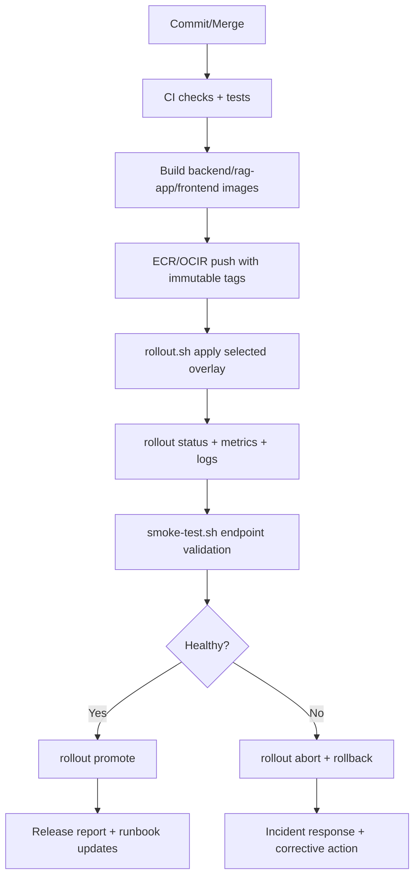

Control points:
- pre-release quality gate: `scripts/system.sh test`
- rollout orchestration: `deploy/scripts/rollout.sh`
- release validation: `deploy/scripts/smoke-test.sh`
- promotion prerequisite checklist: `deploy/docs/PRODUCTION_CHECKLIST.md`

---

## Known Constraints

- In-memory stores are not shared across replicas.
- RAG stateful assets require shared storage strategy for strict multi-replica consistency.
- Canary/blue-green operations depend on Argo Rollouts installation and cluster permissions.
- Backend auth is currently a demo token model and must be replaced for high-security production requirements.

---

## Extension Points

### High-value extensions

- Externalize session/cache/rate limit to Redis.
- Replace backend auth with OIDC/JWT verification.
- Add centralized metrics/tracing (OpenTelemetry pipeline).
- Add asynchronous ingestion queue for large file processing.
- Introduce model provider abstraction for non-Ollama managed inference backends.

### Extension dependency map

```mermaid
graph LR
    OBS[Observability stack] --> API[rag-app + backend]
    AUTH[OIDC/JWT auth] --> API
    REDIS[Shared Redis] --> SESS[session/cache/rate stores]
    QUEUE[Async ingest queue] --> UPLOAD[api/upload pipeline]
    MODEL[Managed model endpoint] --> LLM[response generation]
```

---

## Related Documents

- Platform overview: [`README.md`](README.md)
- Agentic RAG design: [`AGENTIC_RAG.md`](AGENTIC_RAG.md)
- Operator runbook: [`QUICKSTART.md`](QUICKSTART.md)
- Deployment docs:
  - `deploy/README.md`
  - `deploy/k8s/README.md`
  - `deploy/docs/PROGRESSIVE_DELIVERY.md`
  - `deploy/docs/PRODUCTION_CHECKLIST.md`
- Unified API contract: [`openapi.yaml`](openapi.yaml)
