# RAG AI System - Enhanced Architecture Documentation

## 📋 Table of Contents

- [System Overview](#system-overview)
- [Enhanced Architecture (2025 Update)](#enhanced-architecture-2025-update)
- [High-Level Architecture](#high-level-architecture)
- [Component Architecture](#component-architecture)
  - [Frontend Layer](#frontend-layer)
  - [API Gateway Layer](#api-gateway-layer)
  - [RAG Processing Pipeline](#rag-processing-pipeline)
  - [Vector Store Layer](#vector-store-layer)
  - [Backend API Layer](#backend-api-layer)
  - [Data Layer](#data-layer)
- [Advanced RAG Techniques](#advanced-rag-techniques)
- [Data Flow Architecture](#data-flow-architecture)
- [Real-Time Communication Architecture](#real-time-communication-architecture)
- [Deployment Architecture](#deployment-architecture)
- [Technology Stack](#technology-stack)
- [Design Patterns and Principles](#design-patterns-and-principles)
- [Security Architecture](#security-architecture)
- [Scalability Considerations](#scalability-considerations)

---

## System Overview

This project implements a comprehensive, **production-ready Retrieval-Augmented Generation (RAG)** system for portfolio support. The system has been significantly enhanced with modern full-stack architecture, advanced retrieval strategies, and real-time capabilities.

### Key Capabilities

**Original Features:**
- **Document Processing**: Downloads, extracts, and indexes MasterClass documents
- **Vector Similarity Search**: Efficient document retrieval
- **Dynamic Entity Extraction**: Regex-based extraction of entities
- **API Enrichment**: Integrates external data sources
- **Conversational Memory**: Maintains context across conversations
- **Multiple Interfaces**: CLI, Jupyter Notebook, and REST API
- **4 Retrieval Strategies**: Semantic, Hybrid, Multi-Query, Query Decomposition
- **Re-Ranking**: Cross-encoder re-ranking for improved relevance
- **Modern Web Interface**: React + TypeScript with Material-UI
- **Real-Time Streaming**: WebSocket-based response streaming
- **Session Management**: Persistent conversation history
- **ChromaDB Integration**: Persistent vector storage
- **Hybrid Search**: Combines semantic + keyword (BM25) search
- **Docker Deployment**: Complete containerized setup
- **Production Ready**: Health checks, logging, monitoring

---

## Enhanced Architecture (2025 Update)

### Full-Stack Architecture Overview

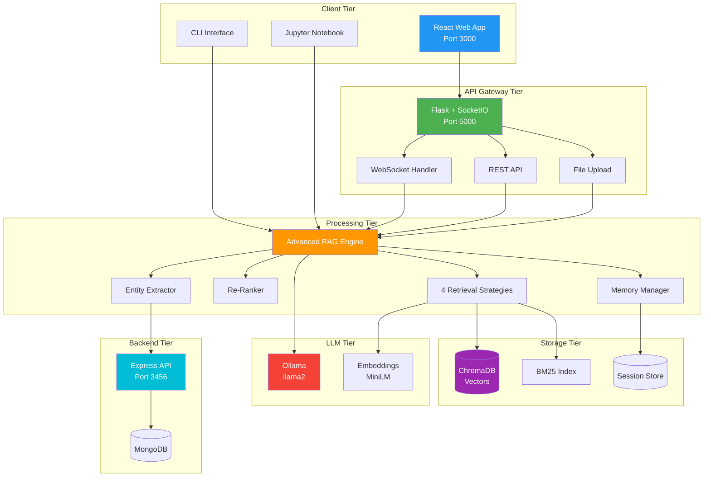
```mermaid
graph TB
    subgraph "Client Tier"
        direction LR
        WEB[React Web App<br/>Port 3000]
        CLI[CLI Interface]
        NB[Jupyter Notebook]
    end

    subgraph "API Gateway Tier"
        direction TB
        FLASK[Flask + SocketIO<br/>Port 5000]
        WS[WebSocket Handler]
        REST[REST API]
        UPLOAD[File Upload]
    end

    subgraph "Processing Tier"
        direction TB
        RAG[Advanced RAG Engine]
        STRAT[4 Retrieval Strategies]
        RERANK[Re-Ranker]
        MEM[Memory Manager]
        ENT[Entity Extractor]
    end

    subgraph "Storage Tier"
        direction TB
        CHROMA[(ChromaDB<br/>Vectors)]
        BM25[BM25 Index]
        SESS[(Session Store)]
    end

    subgraph "LLM Tier"
        direction TB
        OLLAMA[Ollama<br/>llama2]
        EMB[Embeddings<br/>MiniLM]
    end

    subgraph "Backend Tier"
        direction TB
        EXPRESS[Express API<br/>Port 3456]
        MONGO[(MongoDB)]
    end

    WEB --> FLASK
    CLI --> RAG
    NB --> RAG

    FLASK --> WS
    FLASK --> REST
    FLASK --> UPLOAD

    WS --> RAG
    REST --> RAG
    UPLOAD --> RAG

    RAG --> STRAT
    RAG --> RERANK
    RAG --> MEM
    RAG --> ENT

    STRAT --> CHROMA
    STRAT --> BM25
    STRAT --> EMB
    MEM --> SESS
    ENT --> EXPRESS

    RAG --> OLLAMA
    EXPRESS --> MONGO

    style WEB fill:#2196f3,color:#fff
    style FLASK fill:#4caf50,color:#fff
    style RAG fill:#ff9800,color:#fff
    style CHROMA fill:#9c27b0,color:#fff
    style OLLAMA fill:#f44336,color:#fff
    style EXPRESS fill:#00bcd4,color:#fff
```

### Technology Stack by Layer

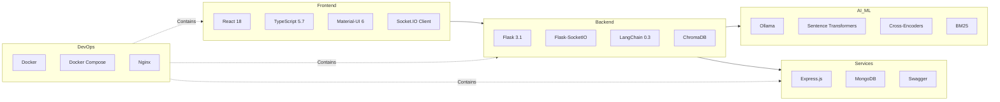
```mermaid
graph LR
    subgraph Frontend
        R[React 18]
        TS[TypeScript 5.7]
        MUI[Material-UI 6]
        SIO[Socket.IO Client]
    end

    subgraph Backend
        F[Flask 3.1]
        FSI[Flask-SocketIO]
        LC[LangChain 0.3]
        CB[ChromaDB]
    end

    subgraph AI_ML
        O[Ollama]
        ST[Sentence Transformers]
        CE[Cross-Encoders]
        BM[BM25]
    end

    subgraph Services
        EX[Express.js]
        MG[MongoDB]
        SW[Swagger]
    end

    subgraph DevOps
        D[Docker]
        DC[Docker Compose]
        NX[Nginx]
    end

    Frontend --> Backend
    Backend --> AI_ML
    Backend --> Services
    DevOps -.->|Contains| Frontend
    DevOps -.->|Contains| Backend
    DevOps -.->|Contains| Services
```

---

## High-Level Architecture

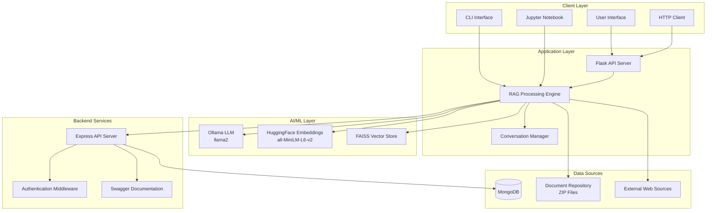
```mermaid
graph TB
    subgraph "Client Layer"
        A[User Interface]
        B[CLI Interface]
        C[Jupyter Notebook]
        D[HTTP Client]
    end

    subgraph "Application Layer"
        E[Flask API Server]
        F[RAG Processing Engine]
        G[Conversation Manager]
    end

    subgraph "AI/ML Layer"
        H[Ollama LLM<br/>llama2]
        I[HuggingFace Embeddings<br/>all-MiniLM-L6-v2]
        J[FAISS Vector Store]
    end

    subgraph "Backend Services"
        K[Express API Server]
        L[Authentication Middleware]
        M[Swagger Documentation]
    end

    subgraph "Data Sources"
        N[(MongoDB)]
        O[Document Repository<br/>ZIP Files]
        P[External Web Sources]
    end

    A --> E
    B --> F
    C --> F
    D --> E

    E --> F
    F --> G
    F --> H
    F --> I
    F --> J
    F --> K

    K --> L
    K --> M
    K --> N

    F --> O
    F --> P
```

### Architecture Layers

1. **Client Layer**: Multiple interfaces for user interaction (CLI, notebook, API clients)
2. **Application Layer**: Core RAG processing logic and Flask API server
3. **AI/ML Layer**: Language models, embeddings, and vector storage
4. **Backend Services**: Express API for data enrichment and authentication
5. **Data Sources**: MongoDB, document repositories, and external web sources

---

## Component Architecture

### Frontend/Client Layer

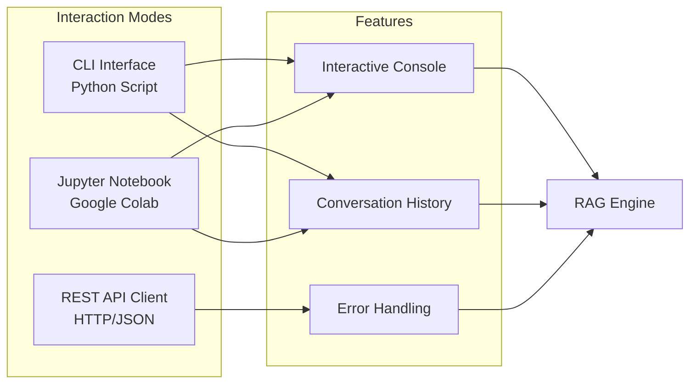
```mermaid
graph LR
    subgraph "Interaction Modes"
        A[CLI Interface<br/>Python Script]
        B[Jupyter Notebook<br/>Google Colab]
        C[REST API Client<br/>HTTP/JSON]
    end

    subgraph "Features"
        D[Interactive Console]
        E[Conversation History]
        F[Error Handling]
    end

    A --> D
    A --> E
    B --> D
    B --> E
    C --> F

    D --> G[RAG Engine]
    E --> G
    F --> G
```

#### Components

- **CLI Interface** (`rag_langchain_ai_system.py`): Terminal-based interactive conversation loop
- **Jupyter Notebook** (`RAG_LangChain_AI_System.ipynb`): Notebook environment for experimentation
- **Flask API** (`flask_api.py`): RESTful endpoint for programmatic access

---

### RAG Processing Pipeline

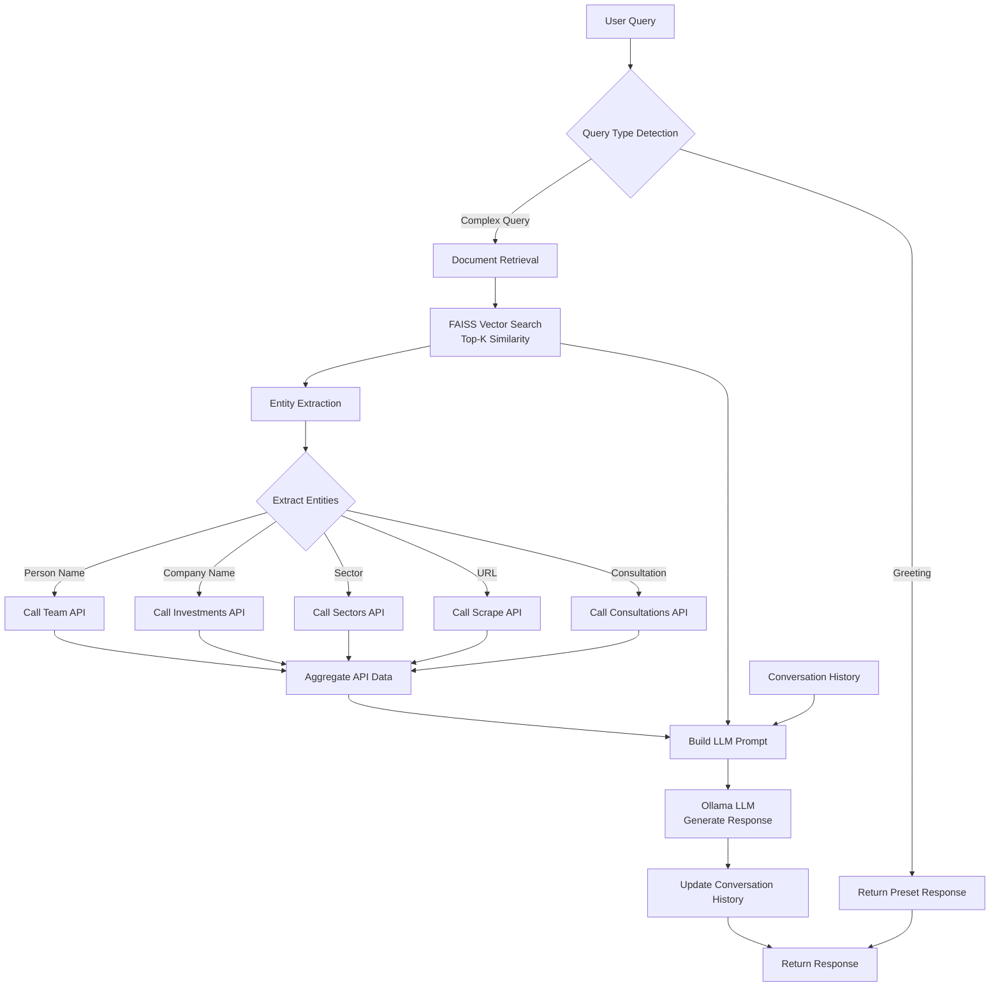
```mermaid
graph TB
    A[User Query] --> B{Query Type Detection}

    B -->|Greeting| C[Return Preset Response]
    B -->|Complex Query| D[Document Retrieval]

    D --> E[FAISS Vector Search<br/>Top-K Similarity]

    E --> F[Entity Extraction]
    F --> G{Extract Entities}

    G -->|Person Name| H[Call Team API]
    G -->|Company Name| I[Call Investments API]
    G -->|Sector| J[Call Sectors API]
    G -->|URL| K[Call Scrape API]
    G -->|Consultation| L[Call Consultations API]

    H --> M[Aggregate API Data]
    I --> M
    J --> M
    K --> M
    L --> M

    M --> N[Build LLM Prompt]
    E --> N
    O[Conversation History] --> N

    N --> P[Ollama LLM<br/>Generate Response]
    P --> Q[Update Conversation History]
    Q --> R[Return Response]

    C --> R
```

#### Processing Steps

1. **Query Analysis**: Detect query type (greeting, simple, or complex)
2. **Document Retrieval**: FAISS similarity search for relevant chunks
3. **Entity Extraction**: Regex patterns to identify key entities
4. **API Enrichment**: Call external APIs based on extracted entities
5. **Prompt Construction**: Combine context, API data, and conversation history
6. **LLM Generation**: Ollama generates contextual response
7. **Memory Update**: Append to conversation history

---

### Backend API Layer

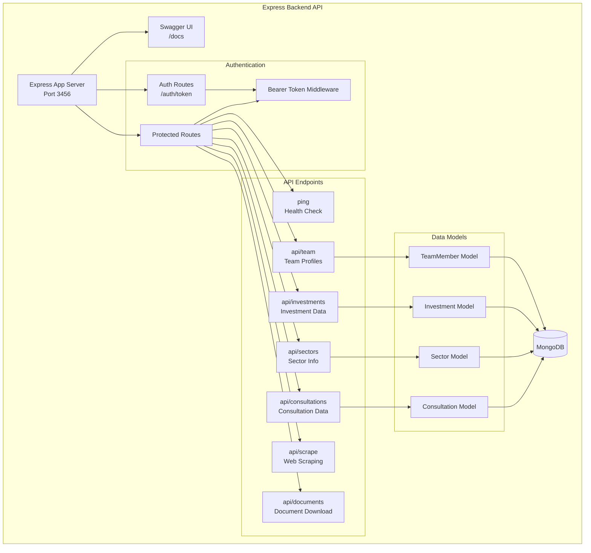
```mermaid
graph TB
    subgraph "Express Backend API"
        A[Express App Server<br/>Port 3456]

        B[Swagger UI<br/>/docs]
        C[Auth Routes<br/>/auth/token]
        D[Protected Routes]

        A --> B
        A --> C
        A --> D

        subgraph "Authentication"
            E[Bearer Token Middleware]
            C --> E
            D --> E
        end

        subgraph "API Endpoints"
            F[ping<br/>Health Check]
            G[api/team<br/>Team Profiles]
            H[api/investments<br/>Investment Data]
            I[api/sectors<br/>Sector Info]
            J[api/consultations<br/>Consultation Data]
            K[api/scrape<br/>Web Scraping]
            L[api/documents<br/>Document Download]
        end

        D --> F
        D --> G
        D --> H
        D --> I
        D --> J
        D --> K
        D --> L

        subgraph "Data Models"
            M[TeamMember Model]
            N[Investment Model]
            O[Sector Model]
            P[Consultation Model]
        end

        G --> M
        H --> N
        I --> O
        J --> P

        M --> Q[(MongoDB)]
        N --> Q
        O --> Q
        P --> Q
    end
```

#### Backend Components

- **Express Server**: Node.js/TypeScript API server
- **Authentication**: Bearer token-based authentication
- **Swagger Documentation**: Auto-generated API documentation
- **MongoDB Integration**: Mongoose ORM for data persistence
- **Route Handlers**: Modular route controllers for each endpoint

---

### Data Layer

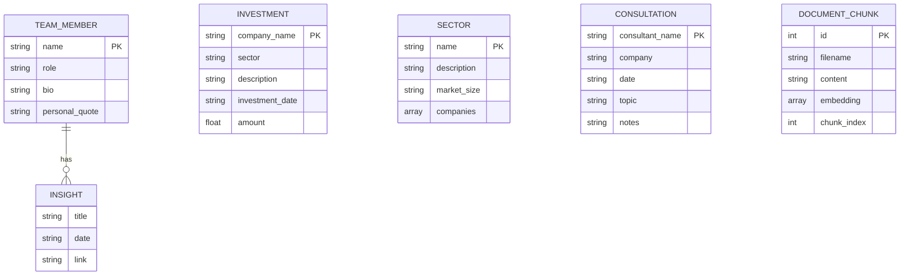
```mermaid
erDiagram
    TEAM_MEMBER ||--o{ INSIGHT : has
    TEAM_MEMBER {
        string name PK
        string role
        string bio
        string personal_quote
    }
    INSIGHT {
        string title
        string date
        string link
    }

    INVESTMENT {
        string company_name PK
        string sector
        string description
        string investment_date
        float amount
    }

    SECTOR {
        string name PK
        string description
        string market_size
        array companies
    }

    CONSULTATION {
        string consultant_name PK
        string company
        string date
        string topic
        string notes
    }

    DOCUMENT_CHUNK {
        int id PK
        string filename
        string content
        array embedding
        int chunk_index
    }
```

#### Data Models

1. **TeamMember**: Portfolio team profiles with related insights
2. **Investment**: Portfolio company investment details
3. **Sector**: Market sector information and trends
4. **Consultation**: Consultation history and notes
5. **DocumentChunk**: Embedded text chunks from MasterClass documents

---

## Data Flow Architecture

### Query Processing Flow

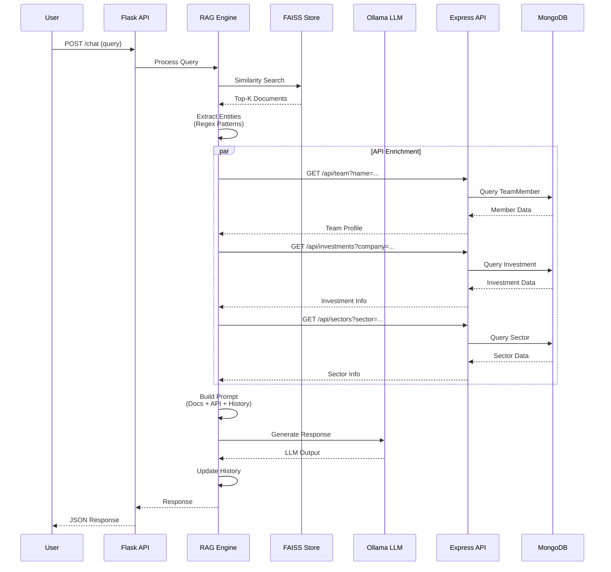
```mermaid
sequenceDiagram
    participant U as User
    participant F as Flask API
    participant R as RAG Engine
    participant V as FAISS Store
    participant L as Ollama LLM
    participant E as Express API
    participant M as MongoDB

    U->>F: POST /chat {query}
    F->>R: Process Query

    R->>V: Similarity Search
    V-->>R: Top-K Documents

    R->>R: Extract Entities<br/>(Regex Patterns)

    par API Enrichment
        R->>E: GET /api/team?name=...
        E->>M: Query TeamMember
        M-->>E: Member Data
        E-->>R: Team Profile

        R->>E: GET /api/investments?company=...
        E->>M: Query Investment
        M-->>E: Investment Data
        E-->>R: Investment Info

        R->>E: GET /api/sectors?sector=...
        E->>M: Query Sector
        M-->>E: Sector Data
        E-->>R: Sector Info
    end

    R->>R: Build Prompt<br/>(Docs + API + History)

    R->>L: Generate Response
    L-->>R: LLM Output

    R->>R: Update History
    R-->>F: Response
    F-->>U: JSON Response
```

### Document Indexing Flow

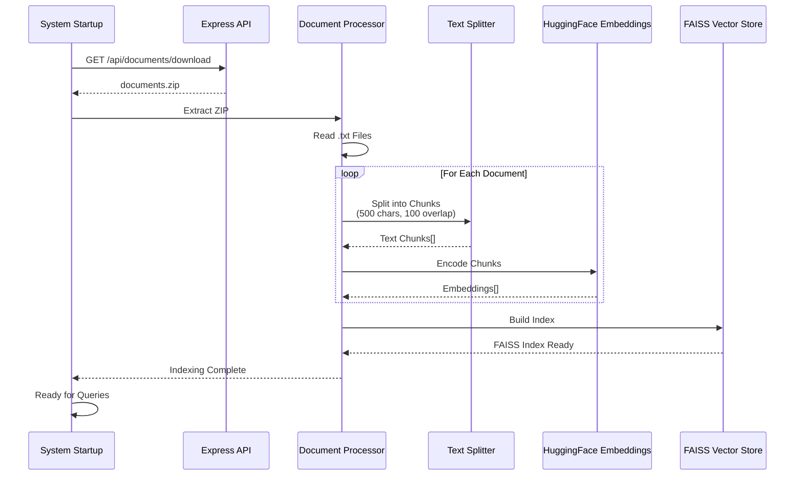
```mermaid
sequenceDiagram
    participant S as System Startup
    participant E as Express API
    participant D as Document Processor
    participant T as Text Splitter
    participant H as HuggingFace Embeddings
    participant V as FAISS Vector Store

    S->>E: GET /api/documents/download
    E-->>S: documents.zip

    S->>D: Extract ZIP
    D->>D: Read .txt Files

    loop For Each Document
        D->>T: Split into Chunks<br/>(500 chars, 100 overlap)
        T-->>D: Text Chunks[]

        D->>H: Encode Chunks
        H-->>D: Embeddings[]
    end

    D->>V: Build Index
    V-->>D: FAISS Index Ready

    D-->>S: Indexing Complete
    S->>S: Ready for Queries
```

---

## Deployment Architecture

### Google Colab Deployment

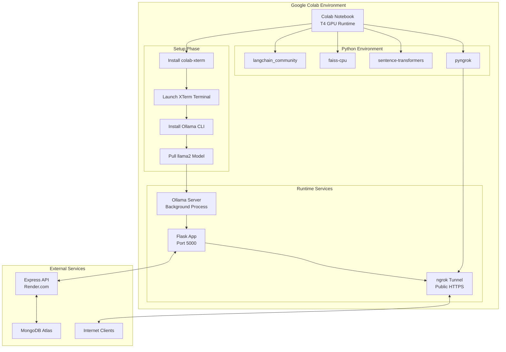
```mermaid
graph TB
    subgraph "Google Colab Environment"
        A[Colab Notebook<br/>T4 GPU Runtime]

        subgraph "Setup Phase"
            B[Install colab-xterm]
            C[Launch XTerm Terminal]
            D[Install Ollama CLI]
            E[Pull llama2 Model]
        end

        subgraph "Runtime Services"
            F[Ollama Server<br/>Background Process]
            G[Flask App<br/>Port 5000]
            H[ngrok Tunnel<br/>Public HTTPS]
        end

        subgraph "Python Environment"
            I[langchain_community]
            J[faiss-cpu]
            K[sentence-transformers]
            L[pyngrok]
        end

        A --> B --> C --> D --> E
        E --> F
        A --> I
        A --> J
        A --> K
        A --> L

        F --> G
        G --> H
        L --> H
    end

    subgraph "External Services"
        M[Express API<br/>Render.com]
        N[MongoDB Atlas]
        O[Internet Clients]
    end

    H <--> O
    G <--> M
    M <--> N
```

### Production Deployment (Render.com)

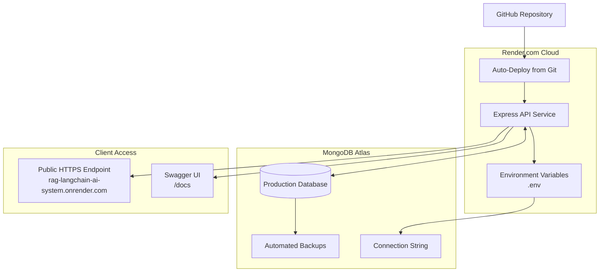
```mermaid
graph TB
    subgraph "Render.com Cloud"
        A[Express API Service]
        B[Environment Variables<br/>.env]
        C[Auto-Deploy from Git]

        A --> B
        C --> A
    end

    subgraph "MongoDB Atlas"
        D[(Production Database)]
        E[Automated Backups]
        F[Connection String]
    end

    subgraph "Client Access"
        G[Public HTTPS Endpoint<br/>rag-langchain-ai-system.onrender.com]
        H[Swagger UI<br/>/docs]
    end

    A <--> D
    D --> E
    B --> F
    A --> G
    A --> H

    I[GitHub Repository] --> C
```

---

## Technology Stack

### Core Technologies

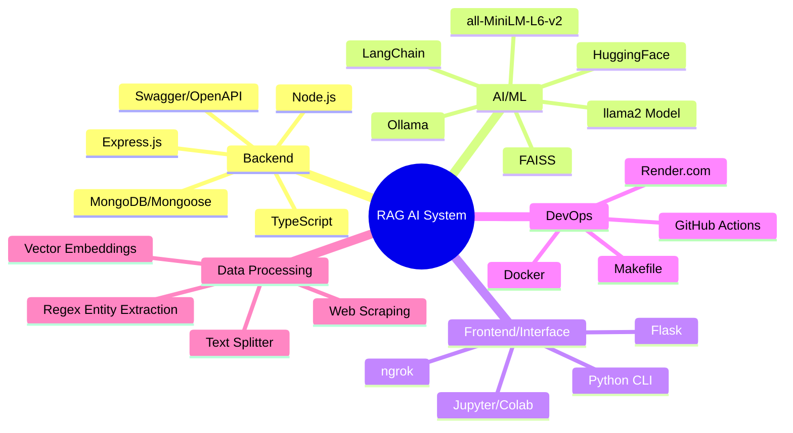
```mermaid
mindmap
  root((RAG AI System))
    Backend
      Express.js
      TypeScript
      Node.js
      MongoDB/Mongoose
      Swagger/OpenAPI

    AI/ML
      LangChain
      Ollama
      HuggingFace
      FAISS
      llama2 Model
      all-MiniLM-L6-v2

    Frontend/Interface
      Flask
      Jupyter/Colab
      Python CLI
      ngrok

    DevOps
      Docker
      Render.com
      GitHub Actions
      Makefile

    Data Processing
      Text Splitter
      Regex Entity Extraction
      Vector Embeddings
      Web Scraping
```

### Technology Matrix

| Layer | Technology | Purpose |
|-------|-----------|---------|
| **LLM** | Ollama (llama2) | Natural language generation |
| **Embeddings** | HuggingFace (all-MiniLM-L6-v2) | Text vectorization |
| **Vector DB** | FAISS | Similarity search |
| **Backend API** | Express.js + TypeScript | RESTful services |
| **Database** | MongoDB + Mongoose | Data persistence |
| **RAG Framework** | LangChain | Document processing pipeline |
| **API Server** | Flask + Python | RAG endpoint exposure |
| **Documentation** | Swagger UI | API documentation |
| **Tunneling** | ngrok | Colab public access |
| **Deployment** | Render.com, Docker | Cloud hosting |

---

## Design Patterns and Principles

### Architectural Patterns

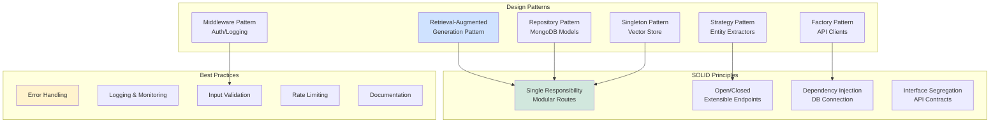
```mermaid
graph TB
    subgraph "Design Patterns"
        A[Retrieval-Augmented<br/>Generation Pattern]
        B[Repository Pattern<br/>MongoDB Models]
        C[Middleware Pattern<br/>Auth/Logging]
        D[Strategy Pattern<br/>Entity Extractors]
        E[Factory Pattern<br/>API Clients]
        F[Singleton Pattern<br/>Vector Store]
    end

    subgraph "SOLID Principles"
        G[Single Responsibility<br/>Modular Routes]
        H[Open/Closed<br/>Extensible Endpoints]
        I[Dependency Injection<br/>DB Connection]
        J[Interface Segregation<br/>API Contracts]
    end

    subgraph "Best Practices"
        K[Error Handling]
        L[Logging & Monitoring]
        M[Input Validation]
        N[Rate Limiting]
        O[Documentation]
    end

    A --> G
    B --> G
    C --> M
    D --> H
    E --> I
    F --> G

    style A fill:#cfe2ff
    style G fill:#d1e7dd
    style K fill:#fff3cd
```

### Key Design Decisions

1. **Modular Architecture**: Separate concerns (routes, models, middleware)
2. **Stateless API**: RESTful design for horizontal scalability
3. **In-Memory Vector Store**: FAISS for fast retrieval (trade-off: not persistent)
4. **Bearer Authentication**: Simple token-based security
5. **Error-First Handling**: Graceful degradation with fallback messages
6. **Conversation Memory**: Client-side state management (global variable)

---

## Security Architecture

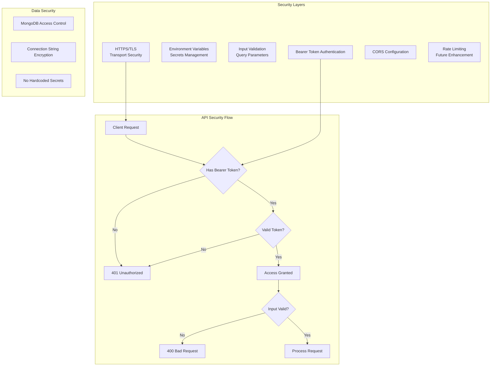
```mermaid
graph TB
    subgraph "Security Layers"
        A[Bearer Token Authentication]
        B[Environment Variables<br/>Secrets Management]
        C[Input Validation<br/>Query Parameters]
        D[HTTPS/TLS<br/>Transport Security]
        E[CORS Configuration]
        F[Rate Limiting<br/>Future Enhancement]
    end

    subgraph "API Security Flow"
        G[Client Request] --> H{Has Bearer Token?}
        H -->|No| I[401 Unauthorized]
        H -->|Yes| J{Valid Token?}
        J -->|No| I
        J -->|Yes| K[Access Granted]
        K --> L{Input Valid?}
        L -->|No| M[400 Bad Request]
        L -->|Yes| N[Process Request]
    end

    subgraph "Data Security"
        O[MongoDB Access Control]
        P[Connection String Encryption]
        Q[No Hardcoded Secrets]
    end

    A --> H
    D --> G
```

### Security Measures

- **Authentication**: Bearer token required for all protected endpoints
- **Environment Variables**: Sensitive data stored in `.env` files (not committed)
- **HTTPS**: Enforced in production (Render.com automatic)
- **Input Validation**: Query parameter sanitization
- **Error Messages**: Generic errors to avoid information leakage
- **MongoDB**: Connection string encryption and access control

---

## Scalability Considerations

### Horizontal Scaling Strategy

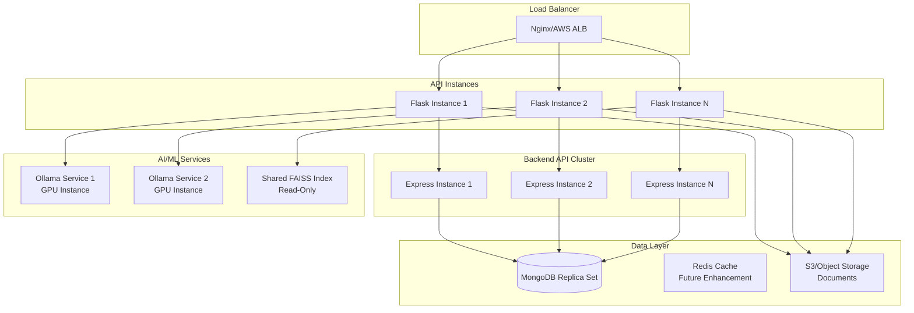
```mermaid
graph TB
    subgraph "Load Balancer"
        A[Nginx/AWS ALB]
    end

    subgraph "API Instances"
        B[Flask Instance 1]
        C[Flask Instance 2]
        D[Flask Instance N]
    end

    subgraph "Backend API Cluster"
        E[Express Instance 1]
        F[Express Instance 2]
        G[Express Instance N]
    end

    subgraph "Data Layer"
        H[(MongoDB Replica Set)]
        I[Redis Cache<br/>Future Enhancement]
        J[S3/Object Storage<br/>Documents]
    end

    subgraph "AI/ML Services"
        K[Ollama Service 1<br/>GPU Instance]
        L[Ollama Service 2<br/>GPU Instance]
        M[Shared FAISS Index<br/>Read-Only]
    end

    A --> B
    A --> C
    A --> D

    B --> E
    C --> F
    D --> G

    E --> H
    F --> H
    G --> H

    B --> K
    C --> L
    D --> M

    B --> J
    C --> J
    D --> J
```

### Scalability Challenges and Solutions

| Challenge | Current Limitation | Solution |
|-----------|-------------------|----------|
| **Vector Store** | In-memory FAISS (single instance) | Migrate to persistent vector DB (Pinecone, Weaviate) |
| **LLM Latency** | Single Ollama instance | Load-balanced LLM service with queueing |
| **Conversation State** | Global variable (not distributed) | Redis or database-backed session store |
| **Document Updates** | Manual re-indexing | Automated indexing pipeline with webhooks |
| **API Rate Limiting** | No rate limiting | Implement Redis-based rate limiter |
| **Monitoring** | Basic logging | Add Prometheus + Grafana dashboards |

### Performance Optimization

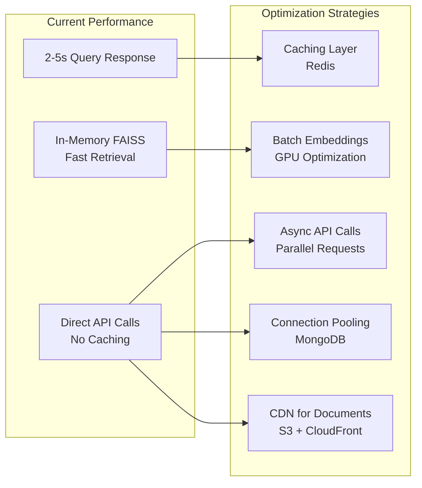
```mermaid
graph LR
    subgraph "Current Performance"
        A[2-5s Query Response]
        B[In-Memory FAISS<br/>Fast Retrieval]
        C[Direct API Calls<br/>No Caching]
    end

    subgraph "Optimization Strategies"
        D[Caching Layer<br/>Redis]
        E[Batch Embeddings<br/>GPU Optimization]
        F[Async API Calls<br/>Parallel Requests]
        G[Connection Pooling<br/>MongoDB]
        H[CDN for Documents<br/>S3 + CloudFront]
    end

    A --> D
    B --> E
    C --> F
    C --> G
    C --> H
```

---

## Entity Extraction Architecture

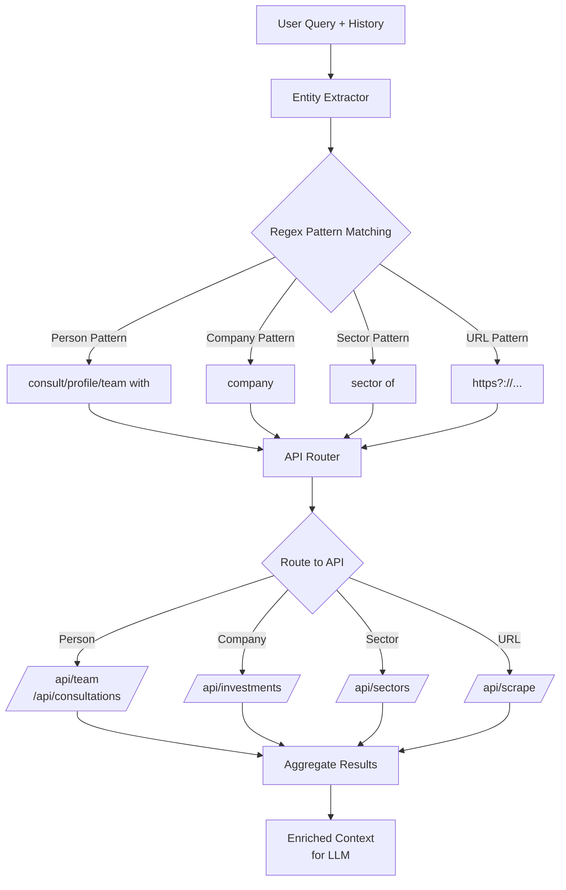
```mermaid
graph TB
    A[User Query + History] --> B[Entity Extractor]

    B --> C{Regex Pattern Matching}

    C -->|Person Pattern| D["consult/profile/team with <Name>"]
    C -->|Company Pattern| E["company <CompanyName>"]
    C -->|Sector Pattern| F["sector of <Sector>"]
    C -->|URL Pattern| G["https?://..."]

    D --> H[API Router]
    E --> H
    F --> H
    G --> H

    H --> I{Route to API}

    I -->|Person| J[/api/team<br/>/api/consultations/]
    I -->|Company| K[/api/investments/]
    I -->|Sector| L[/api/sectors/]
    I -->|URL| M[/api/scrape/]

    J --> N[Aggregate Results]
    K --> N
    L --> N
    M --> N

    N --> O[Enriched Context<br/>for LLM]
```

---

## API Endpoint Architecture

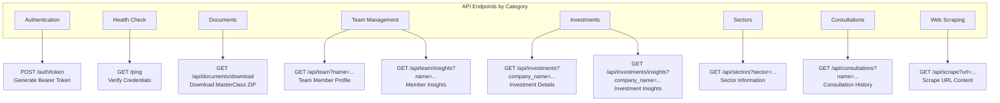
```mermaid
graph TB
    subgraph "API Endpoints by Category"
        A[Authentication]
        B[Health Check]
        C[Documents]
        D[Team Management]
        E[Investments]
        F[Sectors]
        G[Consultations]
        H[Web Scraping]
    end

    A --> A1[POST /auth/token<br/>Generate Bearer Token]

    B --> B1[GET /ping<br/>Verify Credentials]

    C --> C1[GET /api/documents/download<br/>Download MasterClass ZIP]

    D --> D1[GET /api/team?name=...<br/>Team Member Profile]
    D --> D2[GET /api/team/insights?name=...<br/>Member Insights]

    E --> E1[GET /api/investments?company_name=...<br/>Investment Details]
    E --> E2[GET /api/investments/insights?company_name=...<br/>Investment Insights]

    F --> F1[GET /api/sectors?sector=...<br/>Sector Information]

    G --> G1[GET /api/consultations?name=...<br/>Consultation History]

    H --> H1[GET /api/scrape?url=...<br/>Scrape URL Content]
```

---

## Conversation Memory Architecture

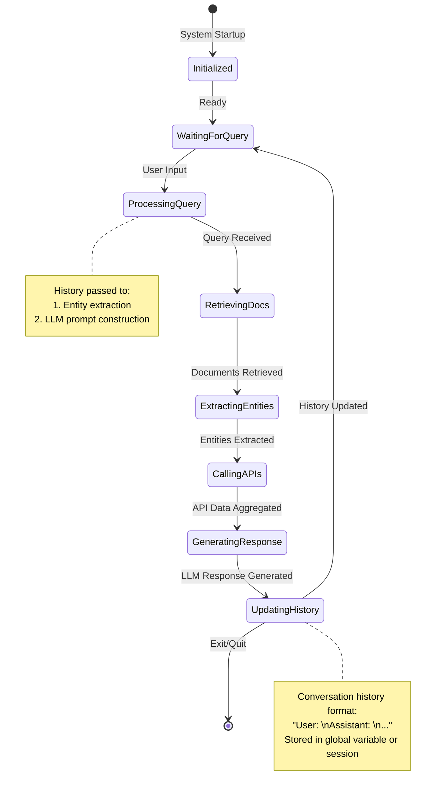
```mermaid
stateDiagram-v2
    [*] --> Initialized: System Startup

    Initialized --> WaitingForQuery: Ready

    WaitingForQuery --> ProcessingQuery: User Input

    ProcessingQuery --> RetrievingDocs: Query Received
    RetrievingDocs --> ExtractingEntities: Documents Retrieved
    ExtractingEntities --> CallingAPIs: Entities Extracted
    CallingAPIs --> GeneratingResponse: API Data Aggregated

    GeneratingResponse --> UpdatingHistory: LLM Response Generated

    UpdatingHistory --> WaitingForQuery: History Updated

    UpdatingHistory --> [*]: Exit/Quit

    note right of UpdatingHistory
        Conversation history format:
        "User: <query>\nAssistant: <response>\n..."
        Stored in global variable or session
    end note

    note right of ProcessingQuery
        History passed to:
        1. Entity extraction
        2. LLM prompt construction
    end note
```

---

## Error Handling and Resilience

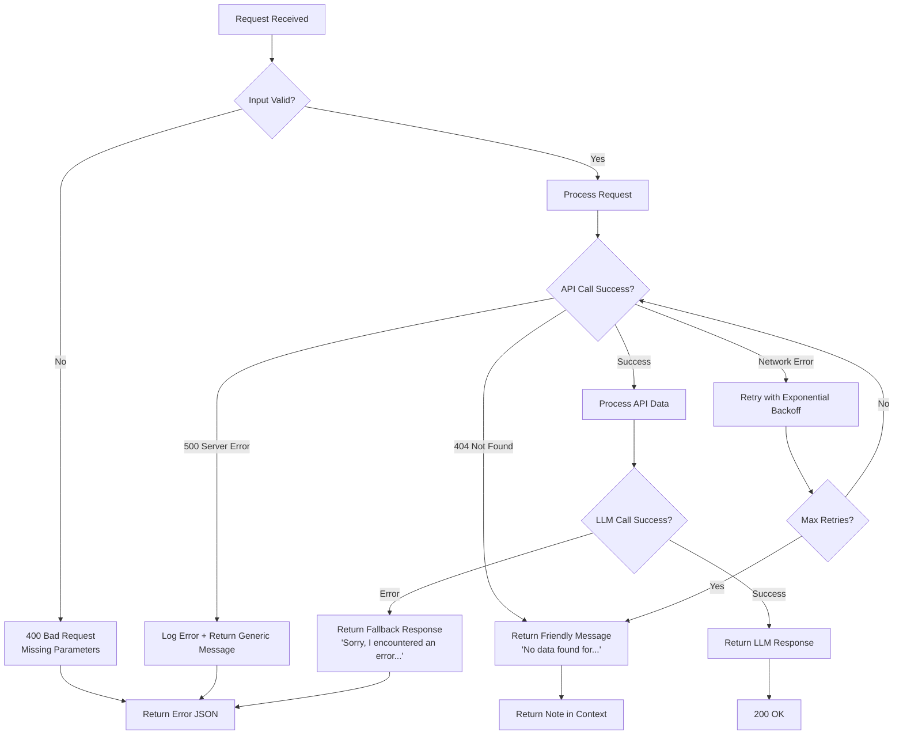
```mermaid
graph TB
    A[Request Received] --> B{Input Valid?}

    B -->|No| C[400 Bad Request<br/>Missing Parameters]
    B -->|Yes| D[Process Request]

    D --> E{API Call Success?}

    E -->|Network Error| F[Retry with Exponential Backoff]
    E -->|404 Not Found| G[Return Friendly Message<br/>'No data found for...']
    E -->|500 Server Error| H[Log Error + Return Generic Message]
    E -->|Success| I[Process API Data]

    F --> J{Max Retries?}
    J -->|No| E
    J -->|Yes| G

    I --> K{LLM Call Success?}

    K -->|Error| L[Return Fallback Response<br/>'Sorry, I encountered an error...']
    K -->|Success| M[Return LLM Response]

    M --> N[200 OK]
    C --> O[Return Error JSON]
    G --> P[Return Note in Context]
    H --> O
    L --> O
```

---

## Component Architecture

### Frontend Layer

The React-based frontend provides a modern, real-time chat interface:

```mermaid
graph TD
    subgraph "React Application"
        A[App.tsx<br/>Material-UI Theme]
        B[ChatInterface.tsx<br/>Main Chat Component]
        C[Message.tsx<br/>Message Display]
        D[SourceCard.tsx<br/>Citation Display]
    end

    subgraph "State Management"
        E[Messages State]
        F[Session State]
        G[Connection State]
        H[Strategy Selector]
    end

    subgraph "Communication Layer"
        I[Socket.IO Client]
        J[Axios HTTP Client]
        K[WebSocket Events]
    end

    A --> B
    B --> C
    B --> D
    B --> E
    B --> F
    B --> G
    B --> H

    B --> I
    B --> J
    I --> K

    style A fill:#2196f3,color:#fff
    style B fill:#42a5f5,color:#fff
    style I fill:#4caf50,color:#fff
```

**Key Features:**
- Real-time message streaming
- Markdown rendering with code highlighting
- Source citation display with relevance scores
- Strategy selector dropdown
- File upload interface
- Session management UI

### API Gateway Layer

Flask application serving as the API gateway with dual interfaces:

```mermaid
graph LR
    subgraph "Flask Application"
        A[Flask App<br/>Port 5000]
        B[SocketIO<br/>WebSocket Handler]
        C[REST Routes]
        D[CORS Middleware]
    end

    subgraph "Endpoints"
        E[POST /api/chat]
        F[POST /api/session]
        G[GET /api/strategies]
        H[POST /api/upload]
        I[GET /health]
    end

    subgraph "WebSocket Events"
        J[chat_message]
        K[response_chunk]
        L[response_complete]
        M[join_session]
    end

    A --> B
    A --> C
    A --> D

    C --> E
    C --> F
    C --> G
    C --> H
    C --> I

    B --> J
    B --> K
    B --> L
    B --> M

    style A fill:#4caf50,color:#fff
    style B fill:#8bc34a,color:#fff
    style C fill:#cddc39,color:#fff
```

---

## Advanced RAG Techniques

### Multi-Strategy Retrieval Pipeline

The system implements four distinct retrieval strategies:

```mermaid
graph TD
    START[User Query] --> STRATEGY{Select Strategy}

    STRATEGY -->|Semantic| S1[Vector Similarity<br/>ChromaDB Search]
    STRATEGY -->|Hybrid| S2[Ensemble<br/>50% Vector + 50% BM25]
    STRATEGY -->|Multi-Query| S3[Generate Variations<br/>Retrieve All]
    STRATEGY -->|Decomposed| S4[Break into Sub-Queries<br/>Retrieve Each]

    S1 --> DOCS1[Retrieved Documents]
    S2 --> DOCS2[Retrieved Documents]
    S3 --> DOCS3[Retrieved Documents]
    S4 --> DOCS4[Retrieved Documents]

    DOCS1 --> RERANK[Cross-Encoder<br/>Re-Ranking]
    DOCS2 --> RERANK
    DOCS3 --> RERANK
    DOCS4 --> RERANK

    RERANK --> TOP[Top-K Documents<br/>Sorted by Relevance]
    TOP --> LLM[Generate Response<br/>with Citations]

    style START fill:#e3f2fd,color:#000
    style STRATEGY fill:#fff3e0,color:#000
    style RERANK fill:#fce4ec,color:#000
    style LLM fill:#e8f5e9,color:#000
```

### Re-Ranking Architecture

Cross-encoder re-ranking for improved relevance:

```mermaid
sequenceDiagram
    participant Q as Query
    participant R as Retriever
    participant D as Documents (Top-10)
    participant CE as Cross-Encoder
    participant T as Top-K (5)

    Q->>R: Execute retrieval strategy
    R->>D: Return 10 documents
    D->>CE: Create query-doc pairs
    Note over CE: Score each pair<br/>with cross-encoder
    CE->>CE: Predict relevance scores
    CE->>T: Sort and select top 5
    T->>Q: Return reranked results
```

**Re-Ranking Benefits:**
- Higher precision (@5: 0.89 vs 0.82)
- Better relevance ordering
- Reduced hallucination
- Improved citation quality

---

## Real-Time Communication Architecture

### WebSocket Streaming Flow

Real-time response streaming using Socket.IO:

```mermaid
sequenceDiagram
    participant Client as React Client
    participant WS as Socket.IO Server
    participant RAG as RAG Engine
    participant LLM as Ollama LLM

    Client->>WS: connect()
    WS-->>Client: connected

    Client->>WS: emit('chat_message', query)
    WS->>RAG: process_query(query)

    RAG->>RAG: retrieve_documents()
    WS-->>Client: emit('thinking')

    RAG->>RAG: extract_entities()
    WS-->>Client: emit('status', 'Calling APIs...')

    RAG->>RAG: call_api_chain()
    RAG->>LLM: generate_response()

    loop Streaming Response
        LLM-->>RAG: response_chunk
        RAG-->>WS: chunk
        WS-->>Client: emit('response_chunk', chunk)
    end

    RAG-->>WS: complete_response
    WS-->>Client: emit('response_complete', {response, sources})
```

### Session Management

Multi-user session handling with conversation history:

```mermaid
graph TD
    A[User Request] --> B{Session Exists?}
    B -->|No| C[Create Session<br/>Generate UUID]
    B -->|Yes| D[Load Session<br/>Get History]

    C --> E[Initialize Session Store]
    D --> E

    E --> F[Process Query<br/>with Context]
    F --> G[Generate Response]
    G --> H[Update Session<br/>Add Message]

    H --> I[Return Response<br/>+ Session ID]

    style C fill:#4caf50,color:#fff
    style F fill:#ff9800,color:#fff
    style H fill:#2196f3,color:#fff
```

---

## Deployment Architecture

### Docker Compose Architecture

Complete containerized deployment with 5 services:

```mermaid
graph TB
    subgraph "Docker Network: rag-network"
        
        subgraph "Frontend Container"
            F[Nginx + React<br/>Port 80:3000]
        end

        subgraph "Flask Container"
            RA[Flask + RAG Engine<br/>Port 5000:5000]
            CH[(ChromaDB<br/>Volume)]
        end

        subgraph "Backend Container"
            EX[Express API<br/>Port 3456:3456]
        end

        subgraph "MongoDB Container"
            MG[(MongoDB<br/>Port 27017:27017<br/>Volume)]
        end

        subgraph "Redis Container"
            RD[(Redis Cache<br/>Port 6379:6379<br/>Volume)]
        end

    end

    F -->|HTTP/WS| RA
    RA -->|HTTP| EX
    EX -->|TCP| MG
    RA -.->|Optional| RD

    style F fill:#2196f3,color:#fff
    style RA fill:#4caf50,color:#fff
    style EX fill:#00bcd4,color:#fff
    style MG fill:#4caf50,color:#fff
    style RD fill:#f44336,color:#fff
```

**Docker Compose Services:**
1. **frontend** - Nginx serving React build
2. **rag-app** - Flask + RAG engine
3. **backend** - Express API server
4. **mongodb** - Document database
5. **redis** - Caching layer (optional)

### Deployment Configuration

```mermaid
graph LR
    subgraph "Development"
        D1[Local Dev Servers]
        D2[Hot Reload]
        D3[Debug Mode]
    end

    subgraph "Production"
        P1[Docker Containers]
        P2[Nginx Reverse Proxy]
        P3[Health Checks]
        P4[Logging]
    end

    D1 -.->|docker-compose up| P1
    P1 --> P2
    P1 --> P3
    P1 --> P4
```

---

## Technology Stack

### Complete Technology Matrix

```mermaid
mindmap
  root((RAG AI System))
    Frontend
      React 18
      TypeScript 5.7
      Material-UI 6
      Socket.IO Client
      Vite
    Backend
      Flask 3.1
      Flask-SocketIO
      Flask-CORS
      Python 3.10+
    RAG Engine
      LangChain 0.3
      ChromaDB
      Sentence Transformers
      Cross-Encoders
      BM25Okapi
    LLM & Embeddings
      Ollama
      llama2
      all-MiniLM-L6-v2
      ms-marco-MiniLM
    Services
      Express.js
      MongoDB
      Swagger
    DevOps
      Docker
      Docker Compose
      Nginx
      Redis (optional)
```

---

## Design Patterns and Principles

### Applied Design Patterns

```mermaid
graph TD
    A[Design Patterns] --> B[Strategy Pattern<br/>Multiple Retrieval Strategies]
    A --> C[Observer Pattern<br/>WebSocket Events]
    A --> D[Factory Pattern<br/>Component Creation]
    A --> E[Singleton Pattern<br/>RAG Engine Instance]
    A --> F[Repository Pattern<br/>Data Access]
    A --> G[Chain of Responsibility<br/>API Chaining]

    style A fill:#9c27b0,color:#fff
    style B fill:#673ab7,color:#fff
    style C fill:#3f51b5,color:#fff
    style D fill:#2196f3,color:#fff
```

**Key Principles:**
- **Separation of Concerns**: Frontend, API Gateway, Processing, Storage
- **Single Responsibility**: Each component has one clear purpose
- **Dependency Injection**: Configurable components
- **Interface Segregation**: Clean API contracts
- **DRY (Don't Repeat Yourself)**: Reusable components
- **SOLID Principles**: Throughout codebase

---

## Security Architecture

### Security Layers

```mermaid
graph TD
    A[User Request] --> B[CORS Middleware]
    B --> C{Authentication}
    C -->|Valid| D[Rate Limiting]
    C -->|Invalid| E[401 Unauthorized]
    D --> F[Input Validation]
    F --> G[Sanitization]
    G --> H[Process Request]
    H --> I[Output Encoding]
    I --> J[Return Response]

    style C fill:#f44336,color:#fff
    style E fill:#ff5722,color:#fff
    style F fill:#ff9800,color:#fff
```

**Security Features:**
- CORS configuration for allowed origins
- Bearer token authentication for Express API
- Input validation and sanitization
- Environment variable configuration
- Secure WebSocket connections
- No sensitive data in logs
- Docker network isolation

---

## Scalability Considerations

### Horizontal Scaling Architecture

```mermaid
graph TB
    subgraph "Load Balancer"
        LB[Nginx Load Balancer]
    end

    subgraph "Flask Instances"
        F1[Flask 1]
        F2[Flask 2]
        F3[Flask N]
    end

    subgraph "Shared Services"
        R[(Redis<br/>Session Store)]
        C[(ChromaDB<br/>Shared Volume)]
        M[(MongoDB)]
    end

    LB --> F1
    LB --> F2
    LB --> F3

    F1 --> R
    F2 --> R
    F3 --> R

    F1 --> C
    F2 --> C
    F3 --> C

    F1 --> M
    F2 --> M
    F3 --> M

    style LB fill:#2196f3,color:#fff
    style R fill:#f44336,color:#fff
```

**Scalability Strategies:**
1. **Horizontal Scaling**: Multiple Flask instances behind load balancer
2. **Caching**: Redis for frequently accessed data
3. **Connection Pooling**: MongoDB connection pools
4. **Async Processing**: Background job queues (Celery)
5. **CDN**: Static assets served from CDN
6. **Vector Store**: Distributed ChromaDB deployment
7. **Database Sharding**: MongoDB sharding for large datasets

### Performance Optimization

- Lazy loading of models
- Response caching
- Document chunking optimization
- Batch embedding generation
- Connection keep-alive
- Compression (gzip)
- Database indexing
- Query optimization

---

## Monitoring and Observability

### Logging Architecture

```mermaid
graph LR
    A[Application Logs] --> B[Loguru]
    C[Access Logs] --> D[Nginx]
    E[Error Logs] --> F[Sentry/Alternative]

    B --> G[Log Files]
    D --> G
    F --> G

    G --> H[Log Aggregation<br/>ELK/Loki]
    H --> I[Dashboards<br/>Grafana]
```

**Monitoring Endpoints:**
- `/health` - Application health status
- `/metrics` - Performance metrics (optional)
- Docker container health checks
- Log aggregation and analysis

---
