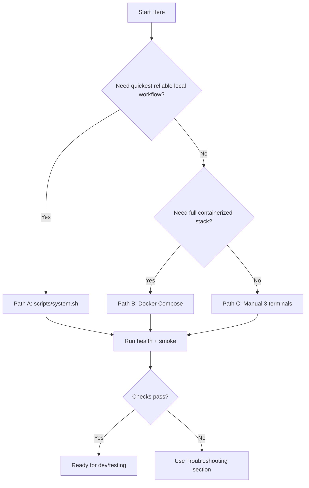
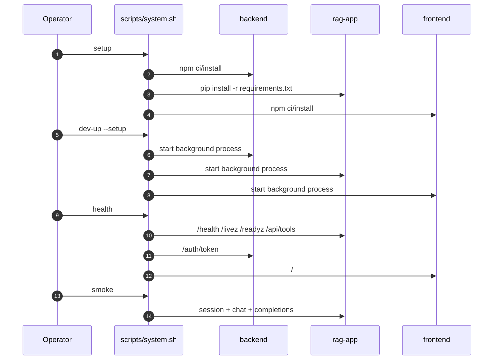
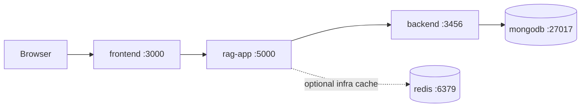
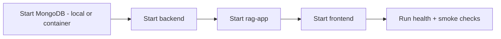
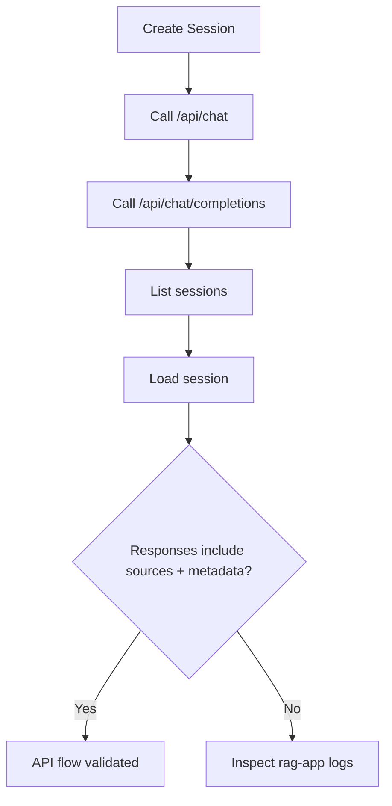
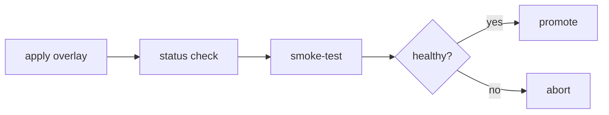
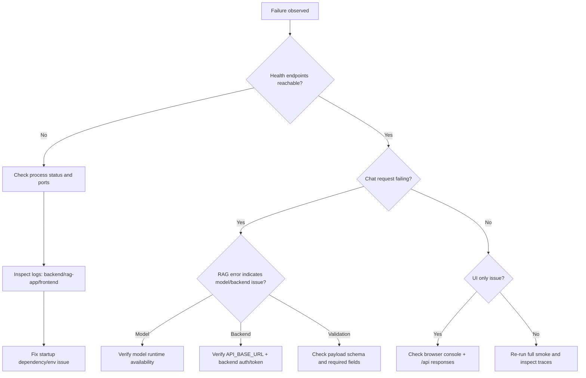
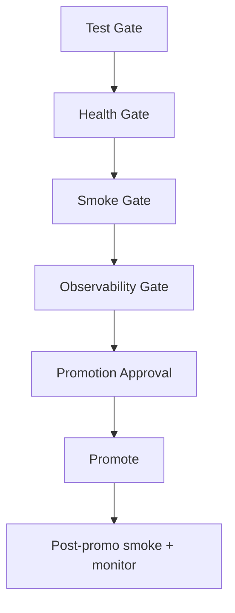

# RAG AI Portfolio Support Platform: Quickstart And Validation Runbook

This guide is the operator runbook for standing up, validating, and troubleshooting the entire platform in local or pre-production environments.

Use this document when you need a deterministic path from **clean machine -> healthy stack -> validated chat flow**.

---

## Table Of Contents

1. [Execution Paths](#execution-paths)
2. [Prerequisites](#prerequisites)
3. [Preflight Checks](#preflight-checks)
4. [Path A: Unified Script CLI (recommended)](#path-a-unified-script-cli-recommended)
5. [Path B: Docker Compose](#path-b-docker-compose)
6. [Path C: Manual 3-Terminal Local Dev](#path-c-manual-3-terminal-local-dev)
7. [API Validation Checklist](#api-validation-checklist)
8. [Frontend Validation Checklist](#frontend-validation-checklist)
9. [Deployment Quick Ops](#deployment-quick-ops)
10. [Troubleshooting Playbook](#troubleshooting-playbook)
11. [Production Promotion Readiness](#production-promotion-readiness)

---

## Execution Paths



---

## Prerequisites

### Required

- `python3` 3.10+
- `node` 18+
- `npm`
- `curl`
- `jq`

### Required for Docker path

- Docker Engine + Docker Compose plugin (`docker compose`)

### Required for deployment path

- `kubectl`
- `kustomize` (optional if using only `kubectl apply -k`)
- `kubectl argo rollouts` plugin (for canary/blue-green actions)

### Model runtime note

Current RAG engine is configured with Ollama-style model usage by default (`llm_model=llama2` in `rag_system/config.py`).
Ensure your target environment provides reachable model inference runtime before expecting successful generation responses.

---

## Preflight Checks

From repo root:

```bash
scripts/system.sh help
scripts/system.sh test
```

What `scripts/system.sh test` validates:
- Python tests
- backend TypeScript compilation
- frontend typecheck
- frontend production build

If this fails, fix build/test errors before starting runtime services.

---

## Path A: Unified Script CLI (recommended)

This is the fastest way to operate local lifecycle consistently.

### 1) Install dependencies

```bash
scripts/system.sh setup
```

### 2) Start all services

```bash
scripts/system.sh dev-up --setup
scripts/system.sh dev-status
```

Expected services:
- `backend`
- `rag-app`
- `frontend`

### 3) Tail logs

```bash
scripts/system.sh dev-logs all -f
```

### 4) Run checks

```bash
scripts/system.sh health
scripts/system.sh smoke
```

### 5) Stop services

```bash
scripts/system.sh dev-down
```

### Local lifecycle diagram



---

## Path B: Docker Compose

Use this path when you want network-isolated service wiring.

### 1) Start stack

```bash
docker compose up -d
docker compose ps
```

### 2) Monitor runtime

```bash
docker compose logs -f backend
docker compose logs -f rag-app
docker compose logs -f frontend
```

### 3) Validate

```bash
scripts/system.sh health
scripts/system.sh smoke
```

### 4) Stop stack

```bash
docker compose down
# include volumes only when you intentionally want a reset
# docker compose down -v
```

### Compose topology



---

## Path C: Manual 3-Terminal Local Dev

Use this path if you need direct control per process.

### Terminal 1: Backend

```bash
cd backend
cp .env.example .env  # first time only
npm install
npm run dev
```

### Terminal 2: RAG API

```bash
# from repository root
python3 -m venv .venv
source .venv/bin/activate
pip install -r requirements.txt
python run.py
```

### Terminal 3: Frontend

```bash
cd frontend
npm install
npm run dev
```

### Manual startup dependency order



---

## API Validation Checklist

### Core health and metadata

```bash
curl -s http://localhost:5000/health | jq
curl -s http://localhost:5000/livez | jq
curl -s http://localhost:5000/readyz | jq
curl -s http://localhost:5000/api/system/info | jq
curl -s http://localhost:5000/api/tools | jq
curl -s http://localhost:5000/openapi.json | jq '.info'
```

### Session + chat flow

Create session:

```bash
SESSION_ID=$(curl -s -X POST http://localhost:5000/api/session | jq -r '.session_id')
echo "$SESSION_ID"
```

Send chat:

```bash
curl -s -X POST http://localhost:5000/api/chat \
  -H "Content-Type: application/json" \
  -d '{
    "query": "Summarize current portfolio opportunities and risks",
    "strategy": "hybrid",
    "session_id": "'"${SESSION_ID}"'"
  }' | jq
```

List/load session:

```bash
curl -s http://localhost:5000/api/sessions | jq
curl -s http://localhost:5000/api/session/${SESSION_ID} | jq
```

OpenAI-compatible endpoint:

```bash
curl -s -X POST http://localhost:5000/api/chat/completions \
  -H "Content-Type: application/json" \
  -d '{
    "model": "llama2",
    "strategy": "hybrid",
    "session_id": "'"${SESSION_ID}"'",
    "messages": [
      {"role": "user", "content": "Provide a concise portfolio update"}
    ]
  }' | jq
```

### API validation flow



---

## Frontend Validation Checklist

At `http://localhost:3000` verify:

- Send/receive assistant messages.
- Strategy selector changes retrieval mode.
- Session sidebar loads, switches, and deletes sessions.
- Source cards render with score and preview.
- Agentic trace panel populates after responses.
- Health/system panel loads backend tools and runtime metadata.
- Upload flow accepts allowed file types (`txt`, `md`, `pdf`, `docx`).
- WebSocket disconnect gracefully falls back to REST behavior.
- If no backend functionality, frontend shows error notification, but still renders UI.

<p align="center">
  
</p>

---

## Deployment Quick Ops

### Rollout helper

```bash
# rolling
./deploy/scripts/rollout.sh rolling aws apply
./deploy/scripts/rollout.sh rolling aws status

# canary
./deploy/scripts/rollout.sh canary aws apply
./deploy/scripts/rollout.sh canary aws status
./deploy/scripts/rollout.sh canary aws promote frontend

# blue-green
./deploy/scripts/rollout.sh bluegreen oci apply
./deploy/scripts/rollout.sh bluegreen oci status
./deploy/scripts/rollout.sh bluegreen oci promote all
```

### Smoke live endpoint

```bash
./deploy/scripts/smoke-test.sh https://rag.example.com
```

### Wrapper equivalents

```bash
scripts/system.sh deploy canary aws apply
scripts/system.sh deploy canary aws status
scripts/system.sh deploy-smoke https://rag.example.com
```

### Progressive delivery flow



---

## Troubleshooting Playbook

### Decision tree



### Common issues and fixes

1. `readyz` is `not_ready`
- Verify backend is reachable from RAG app (`API_BASE_URL`).
- Verify documents/vector store initialization and model runtime.
- Check `rag-app` logs for initialization exceptions.

2. Backend crashes on startup
- Confirm `MONGO_URI` points to reachable MongoDB.
- Use `backend/.env.example` as baseline.
- Verify MongoDB service is up and accessible.

3. Frontend cannot connect to API
- Confirm `rag-app` is listening on `:5000`.
- For local Vite, verify proxy routes in `frontend/vite.config.ts`.
- Check CORS settings (`CORS_ORIGINS`) for non-default origins.

4. Upload request fails
- Allowed extensions are enforced in `rag_system/config.py`.
- Verify payload is multipart/form-data and contains `file`.
- Check max size (`MAX_CONTENT_LENGTH_MB`).

5. Rate limit failures (`429`)
- Tune `RATE_LIMIT_REQUESTS_PER_MINUTE` for environment.
- Ensure client retries/backoff respect `Retry-After`.

---

## Production Promotion Readiness

Use this minimum gate before promoting any deployment:

- `scripts/system.sh test` passes on release commit.
- Health endpoints are all green.
- Chat smoke passes including `/api/chat/completions`.
- Frontend smoke checklist fully passes.
- Deployment smoke (`deploy/scripts/smoke-test.sh`) passes against target endpoint.
- Rollback command for current strategy is pre-validated.



---

## Next References

- Deep design: [`ARCHITECTURE.md`](ARCHITECTURE.md)
- Agentic RAG implementation: [`AGENTIC_RAG.md`](AGENTIC_RAG.md)
- Platform overview: [`README.md`](README.md)
- Deployment docs:
  - `deploy/README.md`
  - `deploy/k8s/README.md`
  - `deploy/docs/PROGRESSIVE_DELIVERY.md`
  - `deploy/docs/PRODUCTION_CHECKLIST.md`
