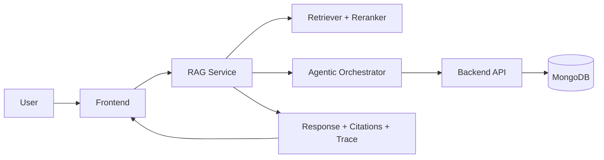

# RAG AI Portfolio Support Platform

A full-stack retrieval-augmented generation platform for document-grounded chat, portfolio intelligence, and API-enriched responses.

The repository combines three application layers:

- `frontend`: React and Vite chat interface with session history, source cards, and response trace views
- `rag_system`: Flask, LangChain, and Socket.IO service for retrieval, orchestration, and chat delivery
- `backend`: Express and MongoDB API for structured portfolio, team, sector, and consultation data

<p align="center">
  
</p>

## Overview

This project is designed to answer questions with stronger factual grounding by combining:

- retrieval over indexed documents
- structured data fetched from backend APIs
- multiple retrieval strategies, including semantic, hybrid, multi-query, and decomposed search
- optional reranking for higher-quality evidence selection
- REST and OpenAI-compatible chat endpoints

Typical flow:

1. A user submits a question from the frontend or API.
2. The RAG service retrieves relevant document context.
3. The orchestrator calls backend tools when structured evidence is useful.
4. The model generates a response with citations and trace metadata.

## Core Capabilities

- Multi-strategy retrieval with semantic and hybrid search
- Document ingestion for local knowledge augmentation
- Agentic tool chaining against backend portfolio data APIs
- Session management and cached responses
- Real-time streaming UX over Socket.IO
- Local development, Docker Compose, Kubernetes, and Terraform support

## Architecture



## Tech Stack

| Layer | Main Technologies |
|---|---|
| Frontend | React, TypeScript, Vite, Material UI, Socket.IO |
| RAG service | Python, Flask, LangChain, ChromaDB, BM25, Hugging Face, Ollama-compatible models |
| Backend API | Node.js, Express, TypeScript, MongoDB, Swagger |
| Platform | Docker Compose, Kubernetes, Argo Rollouts, Terraform |

## Repository Layout

```text
.
|-- backend/              # Express API and MongoDB-backed domain endpoints
|-- frontend/             # React chat application
|-- rag_system/           # Flask RAG service and orchestration engine
|-- scripts/              # Local setup, dev, test, health, smoke, and deploy wrappers
|-- deploy/               # Kubernetes manifests, rollout helpers, and operations docs
|-- infra/terraform/      # AWS and OCI infrastructure definitions
|-- tests/                # Python tests for RAG runtime components
|-- QUICKSTART.md         # Detailed local validation runbook
|-- ARCHITECTURE.md       # Deep technical architecture reference
|-- openapi.yaml          # Unified API contract
```

## Getting Started

For the most complete setup guidance, use [QUICKSTART.md](QUICKSTART.md). The short version is below.

### Option 1: Unified scripts

Recommended for local development.

```bash
scripts/system.sh setup
scripts/system.sh dev-up --setup
scripts/system.sh health
scripts/system.sh smoke
```

Local endpoints:

- Frontend: `http://localhost:3000`
- RAG service: `http://localhost:5000`
- Backend API docs: `http://localhost:3456/docs`

Stop services:

```bash
scripts/system.sh dev-down
```

### Option 2: Docker Compose

```bash
docker compose up -d
docker compose ps
```

Stop the stack:

```bash
docker compose down
```

### Option 3: Manual local startup

Backend:

```bash
cd backend
cp .env.example .env
npm install
npm run dev
```

RAG service:

```bash
python -m venv .venv
source .venv/bin/activate
pip install -r requirements.txt
python run.py
```

Frontend:

```bash
cd frontend
npm install
npm run dev
```

## Configuration

### RAG service

Important environment variables are defined in `rag_system/config.py`.

- `API_BASE_URL`: backend API base URL
- `API_TOKEN`: bearer token used by RAG tool calls
- `PORT`: RAG service port, default `5000`
- `TOP_K`: retrieval depth
- `ENABLE_RERANKING`: enable cross-encoder reranking
- `ENABLE_HYBRID_SEARCH`: enable vector and BM25 hybrid retrieval

### Backend

Backend runtime is configured through `backend/.env`.

- `MONGO_URI`
- `PORT`

### Frontend

Optional Vite variables:

- `VITE_API_BASE_URL`
- `VITE_SOCKET_URL`
- `VITE_API_GATEWAY_TOKEN`

## API Surface

### RAG service

- `GET /health`
- `GET /livez`
- `GET /readyz`
- `POST /api/chat`
- `POST /api/chat/completions`
- `POST /api/upload`
- `GET /api/strategies`
- `GET /api/tools`
- session endpoints under `/api/session` and `/api/sessions`

### Backend API

- `GET /auth/token`
- `GET /ping`
- `GET /api/team`
- `GET /api/team/insights`
- `GET /api/investments`
- `GET /api/investments/insights`
- `GET /api/sectors`
- `GET /api/consultations`
- `GET /api/scrape`
- `GET /api/documents/download`

See [openapi.yaml](openapi.yaml) for the consolidated contract.

## Testing And Validation

Run the main verification suite from the repository root:

```bash
scripts/system.sh test
```

This covers:

- Python tests with `pytest`
- backend TypeScript build
- frontend typecheck
- frontend production build

Additional checks:

```bash
scripts/system.sh health
scripts/system.sh smoke
```

## Deployment

The repository includes deployment assets for both local and production-style environments:

- Docker Compose for full local stack startup
- Kubernetes manifests under `deploy/k8s`
- progressive delivery overlays for rolling, canary, and blue-green rollouts
- Terraform for AWS and OCI infrastructure

Primary rollout helper:

```bash
deploy/scripts/rollout.sh <strategy> <cloud> <action> [service]
```

Examples:

```bash
deploy/scripts/rollout.sh rolling aws apply
deploy/scripts/rollout.sh canary aws status
deploy/scripts/rollout.sh bluegreen oci promote all
```

## Documentation

- [QUICKSTART.md](QUICKSTART.md): local setup and validation
- [ARCHITECTURE.md](ARCHITECTURE.md): system architecture deep dive
- [AGENTIC_RAG.md](AGENTIC_RAG.md): agentic RAG concepts and implementation notes
- [scripts/README.md](scripts/README.md): automation commands
- [deploy/README.md](deploy/README.md): deployment entrypoint
- [deploy/docs/PROGRESSIVE_DELIVERY.md](deploy/docs/PROGRESSIVE_DELIVERY.md): rollout strategy guidance

## Notes

- The current local implementation uses in-memory session, cache, and rate-limiting components in the RAG service.
- Production deployments should externalize state, centralize secrets, and harden authentication before multi-tenant use.
- Model availability depends on the configured inference runtime and environment.
