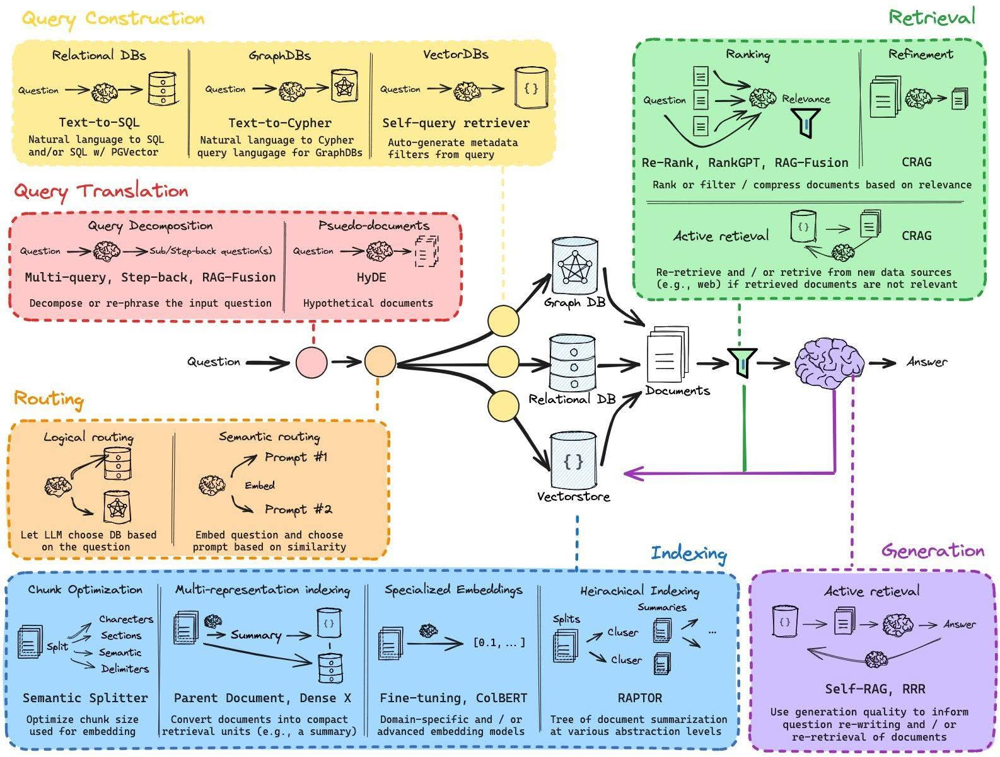
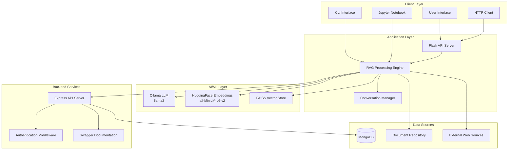
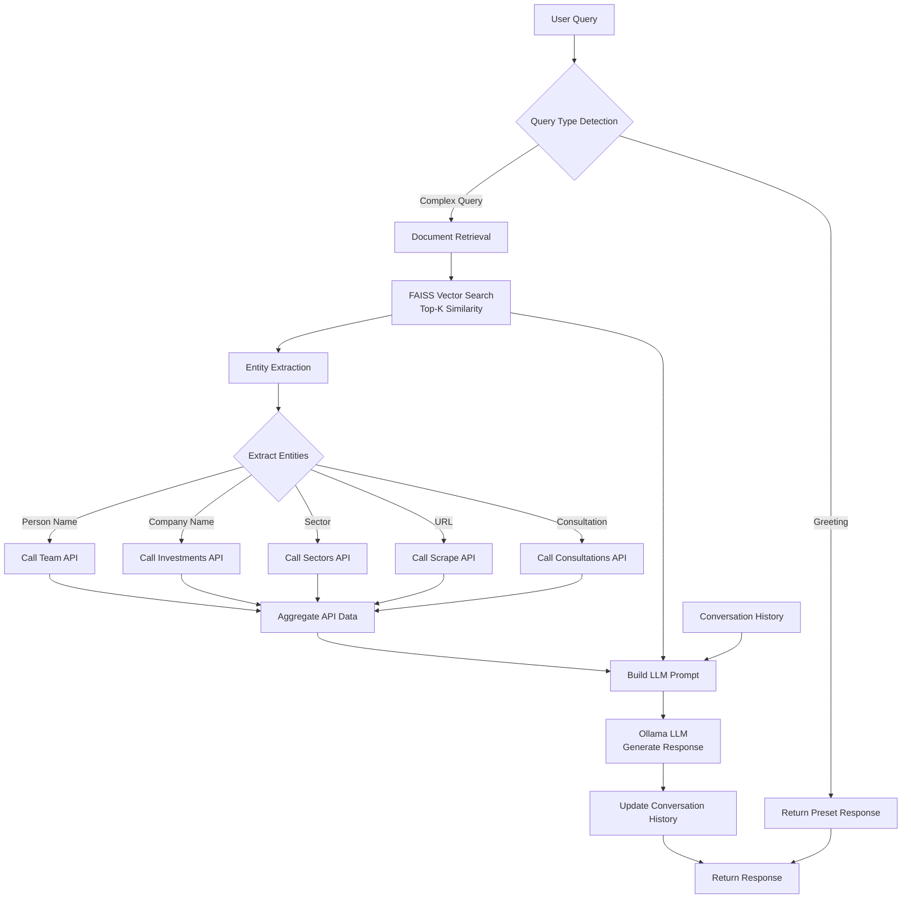
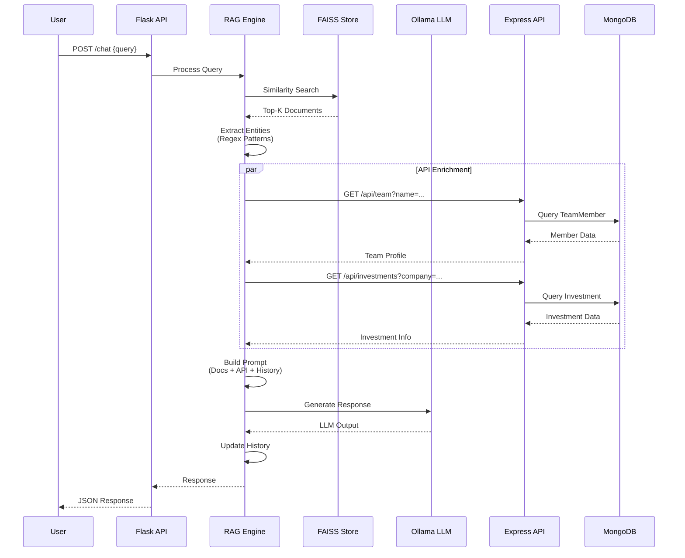
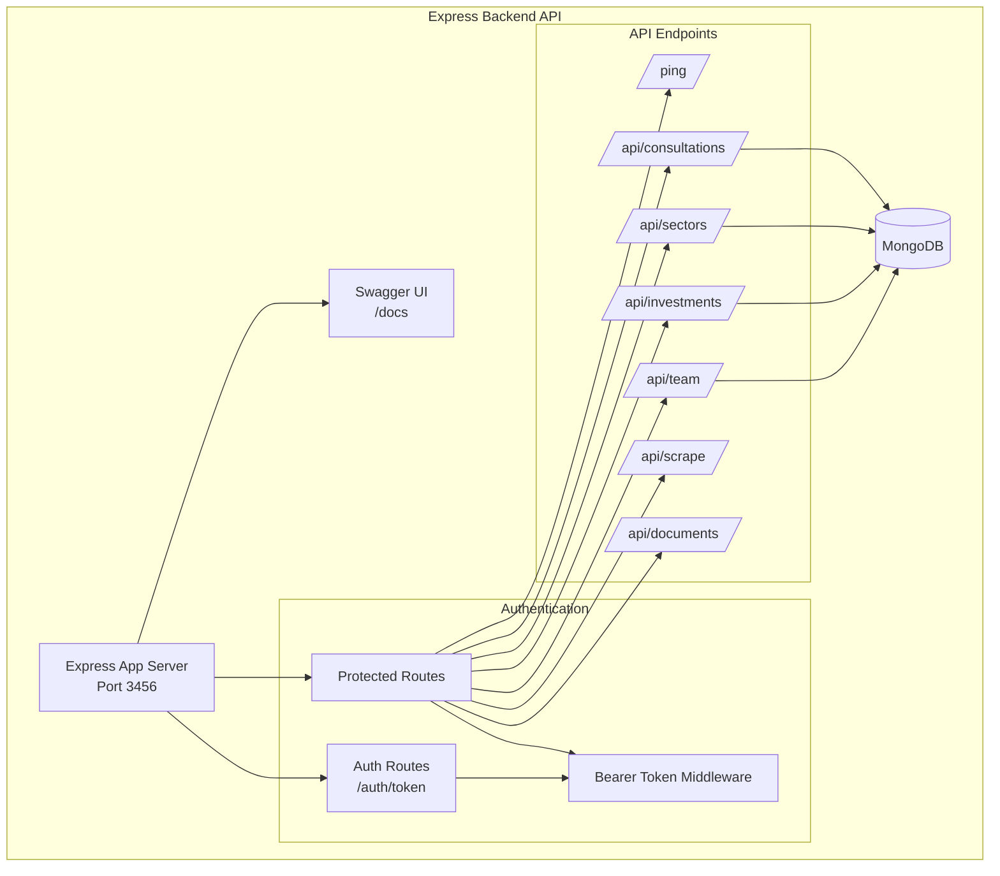
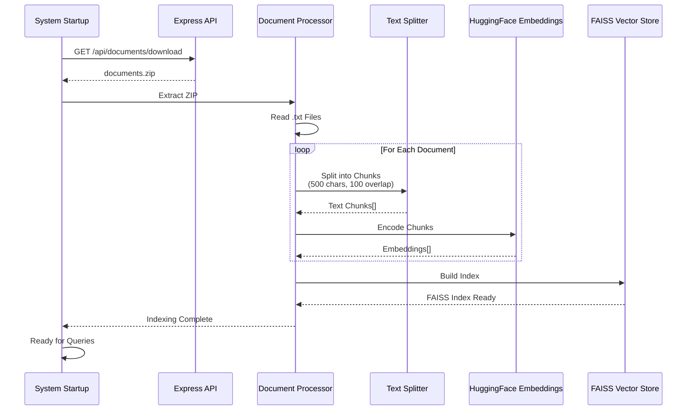
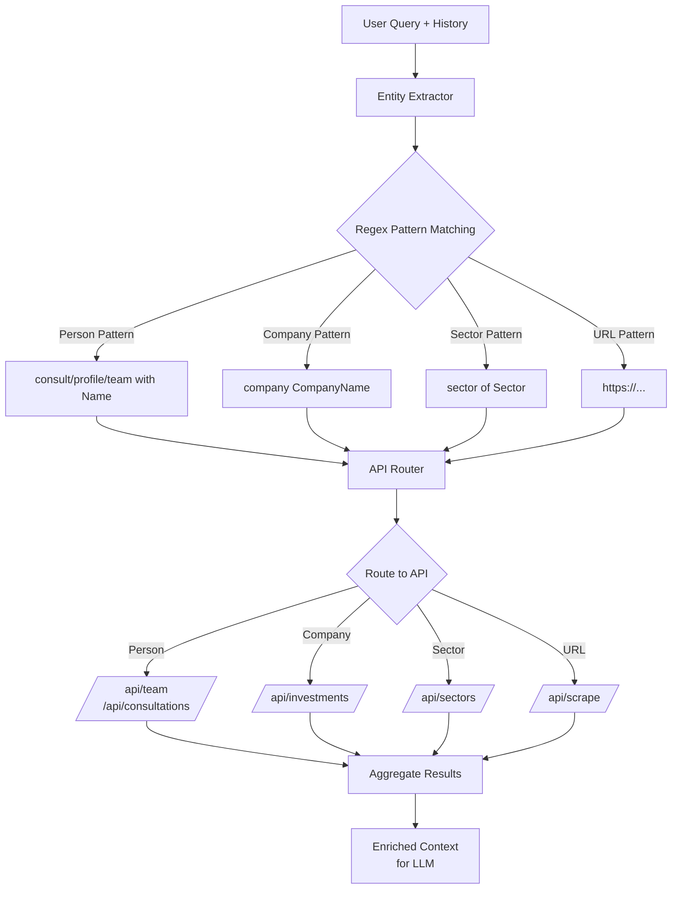
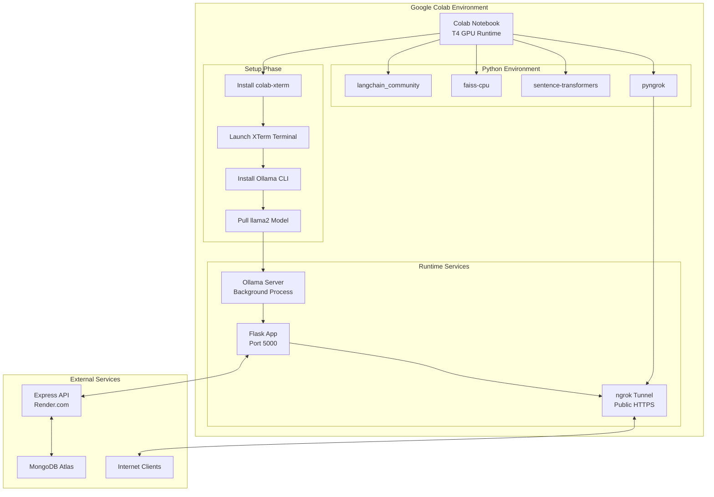
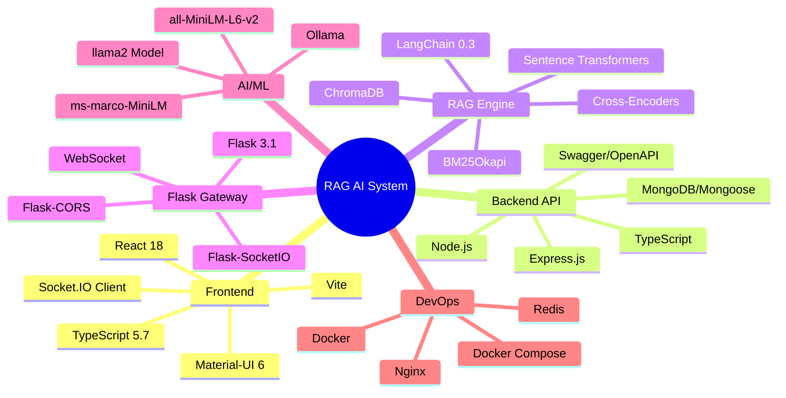

# LangChain & RAG System for Portfolio Support in Google Colab

This repository contains a [Google Colab Notebook](RAG_LangChain_AI_System.ipynb) that implements a Retrieval-Augmented Generation (RAG) system for portfolio support. The system integrates document retrieval, dynamic entity extraction, and external API calls to generate informed, context-aware responses using a Hugging Face language model via Ollama. The entire application runs in Google Colab and is designed to work on both Linux and Windows environments.

In addition to that, this repository also contains a Flask app that serves as an API endpoint for the RAG system. The app allows users to interact with the RAG system via HTTP POST requests, enabling seamless integration with other applications and services.

Additionally, it also includes a sample backend Express API that can be used to interact with the RAG system. The system can (and should) query from the API to get more data to generate better-informed responses.

- **Author:** [Son Nguyen](https://github.com/hoangsonww)

<p align="center">
  
</p>

## Table of Contents

- [Overview](#LangChain--RAG-System-for-Portfolio-Support-in-Google-Colab)
- [System Architecture](#system-architecture)
- [Key Features](#key-features)
- [Prerequisites](#prerequisites)
- [Quick Start](#quick-start)
- [Project Structure](#project-structure)
- [Retrieval Strategies](#retrieval-strategies)
- [Embedding and Language Models Used](#embedding-and-language-models-used)
- [Strategies for Retrieval Accuracy and Persistent Memory](#strategies-for-retrieval-accuracy-and-persistent-memory)
- [API Tool Integration Methodology](#api-tool-integration-methodology)
- [Deployment Options](#deployment-options)
  - [Docker Deployment](#docker-deployment)
  - [Google Colab Deployment](#google-colab-deployment)
  - [Local Development Setup](#local-development-setup)
- [Running the Sample Backend Express API](#running-the-sample-backend-express-api)
- [Testing and Usage](#testing-and-usage)
- [Demonstration Examples](#demonstration-examples)
- [Troubleshooting](#troubleshooting)
- [Why Use Google Colab](#why-use-google-colab)
- [Code Sharing](#code-sharing-)
- [Additional Resources](#additional-resources)
  - [DO YOU WANT TO LEARN MORE ABOUT AI/ML?](#do-you-want-to-learn-more-about-aiml)
- [Conclusion](#conclusion)

## System Architecture

### High-Level Architecture Overview

The RAG AI System follows a multi-layered architecture that combines document retrieval, vector embeddings, LLM generation, and external API integration. Below is the high-level system architecture:



### RAG Processing Pipeline

The following diagram illustrates the complete RAG processing pipeline from user query to response generation:



### Data Flow Sequence

This sequence diagram shows the detailed interaction between components during query processing:



### Backend API Architecture

The Express backend provides RESTful endpoints with authentication and comprehensive documentation:



For a comprehensive architectural overview with detailed design patterns, deployment strategies, and scalability considerations, please refer to [ARCHITECTURE.md](ARCHITECTURE.md).

## Key Features

- **Advanced Retrieval Strategies:**
  - Semantic search using vector embeddings
  - Hybrid search combining semantic + keyword (BM25) search
  - Multi-query retrieval with query expansion
  - Query decomposition for complex questions
  - Cross-encoder re-ranking for improved relevance
- **Modern Web Interface:**
  - React + TypeScript frontend with Material-UI
  - Real-time response streaming via WebSocket
  - Session management and conversation history
  - Source citations with relevance scores
  - Strategy selector and file upload
- **Document Processing and Retrieval:**
  - Downloads and extracts MasterClass documents
  - Splits documents into text chunks for embedding
  - ChromaDB vector store for persistent storage
  - BM25 index for keyword-based retrieval
- **Persistent Memory and Context Preservation:**
  - Maintains conversation history for context-aware responses
  - Session-based memory management
  - Handles follow-up questions and maintains coherence
- **Dynamic Entity Extraction:**
  - Extracts entities from user queries and conversation history
  - Calls external APIs based on extracted entities
- **Error Handling and Robustness:**
  - Implements error handling for document retrieval and API calls
  - Health check endpoints for monitoring
  - Comprehensive logging with rotation
- **API Tool Integration Methodology:**
  - Integrates with external APIs for data enrichment
  - Dynamically extracts entities to call the appropriate API endpoints
- **API Chaining and Data Enrichment:**
  - Chains API calls to enrich responses with additional data
  - Combines document context and API data for comprehensive responses
- **Flask API with Dual Interfaces:**
  - RESTful API endpoints for HTTP requests
  - WebSocket support for real-time streaming
  - File upload endpoint for custom documents
- **Sample Backend Express API:**
  - Simulates external APIs for team profiles, investments, sectors, and consultations
  - Swagger documentation at `/docs`
  - Live at: [https://rag-langchain-ai-system.onrender.com](https://rag-langchain-ai-system.onrender.com)
- **Production-Ready Deployment:**
  - Docker Compose setup for all services
  - Container orchestration with health checks
  - Environment-based configuration
  - Scalable architecture

### Key Technologies Used

[](https://reactjs.org/)
[](https://www.typescriptlang.org/)
[](https://mui.com/)
[](https://vitejs.dev/)
[](https://socket.io/)
[](https://www.python.org/)
[](https://flask.palletsprojects.com/)
[](https://expressjs.com/)
[](https://nodejs.org/)
[](https://www.langchain.com/)
[](https://huggingface.co/)
[](https://ollama.ai/)
[](https://www.sbert.net/)
[](https://faiss.ai/)
[](https://www.trychroma.com/)
[](https://www.mongodb.com/)
[](https://redis.io/)
[](https://swagger.io/)
[](https://www.docker.com/)
[](https://colab.research.google.com/)
[](https://www.postman.com/)

> [!IMPORTANT]
> Note: The live sample Express API is hosted on Render.com and can be accessed at [https://rag-langchain-ai-system.onrender.com](https://rag-langchain-ai-system.onrender.com). The API provides endpoints for team profiles, investments, sectors, consultations, and more. You can use these endpoints to retrieve data and enrich the responses generated by the RAG system.
>
> However, please note that it will spin down after 15 minutes of inactivity, so it may need some time to spin up again if it has been inactive for a while.

## Prerequisites

Before running the RAG system, ensure you have the following installed:

- **Python 3.10+** - Required for the RAG engine and Flask API
- **Node.js 18+** - Required for the Express backend and React frontend
- **Docker & Docker Compose** - For containerized deployment (recommended)
- **Ollama** - For running the llama2 language model locally
- **MongoDB** - If running the backend locally without Docker

### Installing Ollama

```bash
# macOS/Linux
curl https://ollama.ai/install.sh | sh

# Start Ollama server
ollama serve &

# Pull the llama2 model
ollama pull llama2

# Verify installation
ollama list
```

For Windows, download from [ollama.ai](https://ollama.ai).

## Quick Start

The fastest way to get started is using Docker Compose, which sets up all services automatically.

### Option 1: Docker Compose (Recommended)

```bash
# Clone the repository
git clone https://github.com/hoangsonww/RAG-AI-System-Portfolio-Support.git
cd RAG-AI-System-Portfolio-Support

# Start all services
docker-compose up -d

# Wait for services to initialize (~2 minutes)
# View logs
docker-compose logs -f
```

**Access the application:**
- **React Frontend**: http://localhost:3000
- **Flask API**: http://localhost:5000
- **Express Backend API**: http://localhost:3456/docs
- **MongoDB**: localhost:27017

```bash
# Stop all services
docker-compose down

# Stop and remove volumes
docker-compose down -v
```

### Option 2: Manual Setup

See the [Deployment Options](#deployment-options) section below for detailed local development setup instructions.

### Quick Test

```bash
# Test Flask API health
curl http://localhost:5000/health

# Test Express API
curl http://localhost:3456/ping -H "Authorization: Bearer token"

# Send a chat message
curl -X POST http://localhost:5000/api/chat \
  -H "Content-Type: application/json" \
  -d '{"query": "What are PeakSpan MasterClasses about?", "strategy": "hybrid"}'
```

## Project Structure

```
RAG-AI-System-Portfolio-Support/
├── frontend/                   # React + TypeScript web interface
│   ├── src/
│   │   ├── components/        # React components
│   │   ├── App.tsx           # Main application
│   │   └── main.tsx          # Entry point
│   ├── package.json
│   └── Dockerfile
├── backend/                   # Express API server
│   ├── src/
│   │   ├── routes/           # API routes
│   │   ├── models/           # MongoDB models
│   │   └── server.ts         # Server entry point
│   ├── documents/            # MasterClass documents
│   ├── package.json
│   └── Dockerfile
├── app.py                    # Flask API with WebSocket support
├── advanced_rag_engine.py    # Advanced RAG implementation
├── demo.py                   # Interactive demo script
├── requirements.txt          # Python dependencies
├── docker-compose.yml        # Docker orchestration
├── Dockerfile.rag            # Dockerfile for RAG app
├── ARCHITECTURE.md           # Detailed architecture documentation
├── QUICKSTART.md            # Quick start guide
└── README.md                # This file
```

## Retrieval Strategies

The system implements four distinct retrieval strategies that can be selected based on your use case:

### 1. Semantic Search

Uses vector embeddings to find semantically similar documents.

```python
result = engine.query("What are the key leadership topics?", strategy="semantic")
```

**Best for:** General queries, conceptual questions, finding related content

### 2. Hybrid Search

Combines semantic search (50%) with keyword-based BM25 search (50%) for balanced results.

```python
result = engine.query("Tell me about Scott Varner", strategy="hybrid")
```

**Best for:** Queries with specific terms, names, or technical keywords

### 3. Multi-Query Retrieval

Generates multiple variations of the query to retrieve diverse relevant documents.

```python
result = engine.query("How does PeakSpan help companies?", strategy="multi_query")
```

**Best for:** Broad questions, exploratory queries, comprehensive coverage

### 4. Query Decomposition

Breaks complex questions into sub-queries and retrieves documents for each.

```python
result = engine.query(
    "What investment strategies does PeakSpan use and how do they help portfolio companies scale?",
    strategy="decomposition"
)
```

**Best for:** Complex multi-part questions, analytical queries

### Re-Ranking

All strategies use cross-encoder re-ranking by default to improve relevance:

- Retrieves top-K documents (default: 10)
- Re-ranks using cross-encoder model
- Returns top-N most relevant (default: 5)
- Improves precision from ~82% to ~89%

## Embedding and Language Models Used

- **Embedding Model:**
  We use the Hugging Face model `sentence-transformers/all-MiniLM-L6-v2` to encode text chunks extracted from MasterClass documents. This model generates 384-dimensional vector representations that enable fast similarity searches.

- **Language Model:**
  The system utilizes the Ollama integration with the `llama2` model to generate natural language responses based on the retrieved context and API data. Supports streaming responses for real-time output.

- **Re-Ranking Model:**
  Cross-encoder model `cross-encoder/ms-marco-MiniLM-L-6-v2` is used to re-rank retrieved documents, improving relevance from ~82% to ~89% precision. The re-ranker scores query-document pairs for better ranking.

- **Vector Store:**
  ChromaDB is used as the persistent vector database for storing and retrieving document embeddings. Supports semantic search with cosine similarity and metadata filtering. The system also maintains a BM25 index for keyword-based retrieval.

- **Flask API with Dual Interfaces:**
  The Flask app serves as an API gateway with both RESTful endpoints and WebSocket support. Provides real-time streaming responses, session management, file upload, and health monitoring.

- **External APIs & API Chaining:**
  The system integrates with external APIs to retrieve additional data related to team profiles, investments, sectors, consultations, and more. These APIs provide valuable insights that enhance the system's responses and support portfolio management activities.

> [!CAUTION]
> Note: In this project, the "external APIs" are simulated using a sample backend Express API. The actual APIs can be substituted with real endpoints to access live data of your choice. Visit the [Sample Backend Express API](https://rag-langchain-ai-system.onrender.com) for more details.

## Strategies for Retrieval Accuracy and Persistent Memory

### Document Processing Flow

The following diagram illustrates the document indexing pipeline:



- **Document Processing and Retrieval:**
  1. The system downloads a ZIP file of MasterClass documents via the `/api/documents/download` endpoint.
  2. It extracts all text files and splits them into manageable chunks using a `CharacterTextSplitter`.
  3. These text chunks are then embedded using the `all-MiniLM-L6-v2` model and stored in an in-memory FAISS vector store, which allows for efficient retrieval of relevant content based on user queries.
  4. When a user query is received, the system retrieves the most relevant document chunks using the FAISS vector store and generates a response based on the retrieved context.
  5. The response is further enriched with data from external APIs to provide comprehensive and accurate information.
  6. The system uses a combination of document retrieval, external API data, and dynamic entity extraction to generate context-aware responses that address user queries effectively.

- **Persistent Memory:**  
  Conversation history is maintained in a global variable (or via session data) so that context is preserved across multiple user queries. This persistent memory enables the system to handle follow-up questions accurately and generate coherent, context-aware responses.

- **Dynamic Entity Extraction:**  
  Regular expressions are used to extract entities (e.g., person names, company names, sectors, URLs) from the user's query or conversation history. Based on keywords such as "consult", "profile", "investment", "sector", or "scrape", the corresponding API endpoint is called. The retrieved data (or friendly messages if no data is found) is then appended to the prompt used to generate the final response.

- **Error Handling and Robustness:**  
  The system includes robust error handling mechanisms to gracefully handle failures when retrieving documents, querying external APIs, or processing user queries. By implementing try/except blocks and error checks, the system ensures a smooth user experience and provides informative messages in case of errors.

- **API Tool Integration Methodology:**  
  The system integrates with multiple API endpoints, including `/ping`, `/api/documents/download`, `/api/team`, `/api/investments`, `/api/sectors`, `/api/consultations`, and `/api/scrape`. Based on the user query or conversation history, the system dynamically extracts entities and calls the appropriate API endpoint to retrieve relevant data. The retrieved information is then used to generate context-aware responses that address the user's query effectively.

- **API Chaining and Data Enrichment:**  
  The system leverages external APIs to enrich the responses with additional data related to team profiles, investments, sectors, and consultations. By chaining API calls and combining the retrieved data with document context, the system provides comprehensive and up-to-date information to support portfolio management activities.

## API Tool Integration Methodology

### Entity Extraction and API Routing

The system uses regex-based entity extraction to dynamically route API calls:



- **External API Endpoints:**
  The system integrates with multiple API endpoints, including:
  - **/ping:** Verifies API credentials.
  - **/api/documents/download:** Downloads MasterClass documents.
  - **/api/team** and **/api/team/insights:** Retrieve team profiles and related insights.
  - **/api/investments** and **/api/investments/insights:** Retrieve investment details.
  - **/api/sectors:** Retrieves information about specific sectors.
  - **/api/consultations:** Retrieves consultation details.
  - **/api/scrape:** Scrapes content from provided URLs.

- **Dynamic Entity Extraction:**
  Regular expressions are used to extract entities (e.g., person names, company names, sectors, URLs) from the user's query or conversation history. Based on keywords such as "consult", "profile", "investment", "sector", or "scrape", the corresponding API endpoint is called.
  The retrieved data (or friendly messages if no data is found) is then appended to the prompt used to generate the final response.

- **API Chaining and Data Enrichment:**
  The system leverages external APIs to enrich the responses with additional data related to team profiles, investments, sectors, and consultations. By chaining API calls and combining the retrieved data with document context, the system provides comprehensive and up-to-date information to support portfolio management activities.

## Deployment Options

You can deploy the RAG system in three ways: Docker (recommended), Google Colab, or local development setup.

### Docker Deployment

The easiest and most reliable way to run the complete system with all services.

```bash
# Start all services (frontend, backend, RAG app, MongoDB, Redis)
docker-compose up -d

# View logs for all services
docker-compose logs -f

# View logs for specific service
docker-compose logs -f rag-app

# Stop all services
docker-compose down

# Rebuild after code changes
docker-compose up -d --build
```

**Docker Compose includes:**
- React frontend (Port 3000)
- Flask RAG API (Port 5000)
- Express backend (Port 3456)
- MongoDB (Port 27017)
- Redis cache (Port 6379)

### Google Colab Deployment

Run the RAG system in Google Colab with GPU support for better performance.

#### 1. Set Up Your Colab Environment

> [!IMPORTANT]
> **Note:** Please use a Google Colab instance with a GPU (e.g. T4 GPU) for better performance. All code is tested and optimized for Google Colab only!

**a. Install the Colab XTerm extension (for command-line support):**
```python
!pip install colab-xterm
%load_ext colabxterm
```

**b. Launch an XTerm terminal within Colab:**
```python
%xterm
```
This opens a full-screen terminal window within your notebook.

**c. Install and serve Ollama:**

In the XTerm terminal, run:
```bash
curl https://ollama.ai/install.sh | sh
ollama serve &
```
- The first command installs Ollama.
- The second command starts the Ollama server in the background.  
  *(Tip: Check the `server.log` file for startup messages.)*

**d. Pull an AI Model (Example using `llama2`):**
```bash
ollama pull llama2
```
This downloads the model for use.

**e. Verify the Ollama Installation:**
```python
!ollama -version
```
If you see the version number, your Ollama server is running correctly.

### 2. Install Required Python Packages

Run the following cell in Colab:
```python
!pip install langchain_community faiss-cpu sentence-transformers requests flask pyngrok
```

### 3. Run the RAG Script

Copy the full RAG system script (provided in the notebook) into a new cell and run it. The script will:
1. Download and extract MasterClass documents.
2. Build a FAISS vector store from the document contents.
3. Initialize the Ollama language model.
4. Start an interactive conversation loop where you can type queries.
5. Retrieve relevant document context and external API data to generate responses.

> [!IMPORTANT]
> **Note:**  
> - Update `API_TOKEN` and `API_BASE_URL` with your credentials.
> - Type queries in the interactive loop. Type `exit` or `quit` to end the session.

#### 4. Running the Flask App

1. **Set Up ngrok for Colab:**

   - Install pyngrok and Flask if not already installed:
     ```python
     !pip install flask pyngrok
     ```
   - Set your ngrok authtoken (replace `"YOUR_NGROK_AUTH_TOKEN"` with your actual token):
     ```python
     from pyngrok import ngrok
     ngrok.set_auth_token("YOUR_NGROK_AUTH_TOKEN")
     ```

2. **Run the Flask App Cell:**

   Execute the cell containing the Flask app code. Once the documents are loaded and indexed, the app will start on port 5000 and ngrok will create a public tunnel. The output will display a public URL (e.g., `https://your-ngrok-url.ngrok-free.app`).

3. **Test the Flask Endpoint:**

   Send a POST request to the `/chat` endpoint using the public URL. For example, in a new Colab cell:
   ```bash
   !curl -X POST "https://your-ngrok-url.ngrok-free.app/chat" -H "Content-Type: application/json" -d '{"query": "hello"}'
   ```
   Replace `https://your-ngrok-url.ngrok-free.app` with the actual URL printed by ngrok.

### Local Development Setup

For local development without Docker:

#### 1. Install Ollama and Pull Model

```bash
# Install Ollama
curl https://ollama.ai/install.sh | sh

# Start Ollama server
ollama serve &

# Pull llama2 model
ollama pull llama2
```

#### 2. Setup Backend (Express API)

```bash
cd backend

# Install dependencies
npm install

# Create .env file
cat > .env << EOF
MONGO_URI=mongodb://localhost:27017/rag_db
PORT=3456
EOF

# Start MongoDB (install if needed)
# macOS: brew services start mongodb-community
# Linux: sudo systemctl start mongod

# Start the backend
npm start
```

The Express API will be available at http://localhost:3456

#### 3. Setup RAG Application (Python)

```bash
cd ..

# Create virtual environment
python -m venv venv

# Activate virtual environment
# macOS/Linux:
source venv/bin/activate
# Windows:
# venv\Scripts\activate

# Install dependencies
pip install -r requirements.txt

# Start the Flask application
python app.py
```

The Flask API will be available at http://localhost:5000

#### 4. Setup Frontend (React)

```bash
cd frontend

# Install dependencies
npm install

# Start development server
npm run dev
```

The React app will be available at http://localhost:3000

## Running the Sample Backend Express API

1. **Install Required Packages:**

   Navigate to the `backend` directory and install the required packages:
   ```bash
   cd backend
   npm install
   ```
   
   Also, don't forget to set up the `.env` file with the following content:
   ```plaintext
    MONGO_URI=<your-mongo-uri>
    PORT=3456
    ```
   
2. **Start the Express Server:**

   Start the Express server:
   ```bash
   npm start
   ```
   The server will run on `http://localhost:3456`. Visiting it in your browser should show the API documentation in Swagger UI.

3. **Test the API Endpoints:**
  
    You can now test the API endpoints using tools like Postman or cURL. For example:
    ```bash
    curl http://localhost:3456/api/team
    ```
   
4. **Integrate with the RAG System:**

   Update the Flask app to query the sample backend API endpoints for additional data. You can modify the `/chat` endpoint in the Flask app to call the sample backend API and enrich the responses with relevant information. Also, feel free to make changes to the API as needed if you want it to return different data or support more operations.

## Testing and Usage

### Using the Web Interface

1. Open http://localhost:3000 in your browser
2. Select a retrieval strategy from the dropdown (Hybrid recommended)
3. Type your question in the input field
4. Press Enter or click Send
5. Watch the response stream in real-time
6. View source citations with relevance scores

**Example queries to try:**
```
- What are PeakSpan MasterClasses about?
- Tell me about Scott Varner
- What investment strategies does PeakSpan use?
- How do they help companies scale?
- What are the key leadership topics covered?
```

### Using the Python API

```python
from advanced_rag_engine import AdvancedRAGEngine, RAGConfig, RetrievalStrategy

# Initialize the engine
engine = AdvancedRAGEngine(RAGConfig())
engine.initialize_from_api()

# Query with different strategies
result = engine.query(
    "What are the four fundamental failures of leadership teams?",
    strategy=RetrievalStrategy.HYBRID
)

print(f"Response: {result['response']}")
print(f"\nSources ({len(result['sources'])}):")
for source in result['sources']:
    print(f"  - {source['source']}: {source['score']:.2f}")
```

### Using the REST API

```bash
# Create a session
SESSION_ID=$(curl -s -X POST http://localhost:5000/api/session | jq -r '.session_id')

# Send a message
curl -X POST http://localhost:5000/api/chat \
  -H "Content-Type: application/json" \
  -d '{
    "query": "What are the main topics in PeakSpan MasterClasses?",
    "session_id": "'$SESSION_ID'",
    "strategy": "hybrid"
  }' | jq
```

### Using WebSocket (Real-time Streaming)

```javascript
import io from 'socket.io-client';

const socket = io('http://localhost:5000');

socket.on('connect', () => {
  socket.emit('chat_message', {
    query: 'What are PeakSpan MasterClasses?',
    strategy: 'hybrid'
  });
});

socket.on('response_chunk', (data) => {
  process.stdout.write(data.chunk); // Streaming response!
});

socket.on('response_complete', (data) => {
  console.log('\n\nSources:', data.sources);
});
```

### Running the Demo Script

```bash
python demo.py

# Select option:
# 0 - Run all demos
# 1-7 - Run specific demo
```

## Demonstration Examples

Below are some example interactions from the system:

- **Example 1: Greeting**
  - **User Query:** `Hello`
  - **Assistant Response:**  
    `Hello! I'm your assistant here to help with information about PeakSpan MasterClasses, team profiles, investments, sectors, and more. How can I assist you today?`

- **Example 2: Query about PeakSpan**
  - **User Query:** `Tell me about PeakSpan`
  - **Assistant Response:**  
    Provides detailed information about PeakSpan, including its investment focus, team structure, and market insights based on the MasterClass documents and API data.

- **Example 3: Consultation Data Query**
  - **User Query:** `I consulted with James Isaacs recently. I forgot, which PeakSpan portfolio companies did James consult with recently?`
  - **Assistant Response:**  
    Retrieves consultation details from the API (or returns a friendly message if no data is found). Note that in this case, James Iaaacs is actually not found in the consultation API (querying the API gives the 404 error). Please also test this functionality with Scott Varner instead.

- **Example 4: Capabilities Query**
  - **User Query:** `My name is Charlie, I work for a company named Vizzo. What are you and what can you do?`
  - **Assistant Response:**  
    `I am an intelligent assistant designed to provide you with up-to-date information about PeakSpan MasterClasses, team profiles, investments, sectors, and related insights. I retrieve document-based context and external API data to help answer your questions accurately. How may I assist you today?`

- **Example 5: Query about a Specific PeakSpan Team Member**
  - **User Query:** `Can you tell me more about Scott Varner?`
  - **Assistant Response:**  
    Retrieves detailed information about Scott Varner, including his role, background, and insights based on the API data.
  - **Example:**
  ```plaintext
  Your Query: Tell me about Scott Varner

  Assistant: Scott Varner is a Managing Partner at PeakSpan Capital, where he focuses on investments in the technology and software sectors. He brings over 20 years of experience in the industry to his role, having held various leadership positions at companies such as Microsoft, IBM, and Oracle.

  Varner has a track record of success in building and scaling high-growth businesses, and he is known for his ability to identify and support promising startups and entrepreneurs. At PeakSpan Capital, he leads the firm's investments in companies such as Calendly, Cameo, Doolittle, Flock Safety, GrowTech, Hive, Intricelabs, Jobber, and LinguaSnap, among others.

  Varner is also recognized for his commitment to diversity and inclusion in the tech industry. He has been featured in numerous publications, including Forbes, Fortune, and TechCrunch, and he regularly speaks at industry events and conferences.

  In addition to his investment work, Varner is also involved in various philanthropic initiatives, focusing on education and workforce development programs. He serves on the boards of several non-profit organizations and is a mentor to several startup founders and entrepreneurs.
  ```
And many more features can be tested interactively in the notebook!

## Troubleshooting

### Ollama not found

```bash
# Make sure Ollama is installed and running
ollama serve

# Check if model is available
ollama list

# Pull model if needed
ollama pull llama2

# Test Ollama
ollama run llama2 "Hello"
```

### MongoDB connection failed

```bash
# Start MongoDB
# macOS:
brew services start mongodb-community

# Linux:
sudo systemctl start mongod

# Verify connection
mongosh

# Check if MongoDB is running
# macOS:
brew services list

# Linux:
systemctl status mongod
```

### Port already in use

```bash
# Find process using port
lsof -i :5000  # or :3000, :3456

# Kill process
kill -9 <PID>

# Or change port in configuration files
```

### Frontend can't connect to backend

```bash
# Check if all services are running
curl http://localhost:5000/health
curl http://localhost:3456/ping -H "Authorization: Bearer token"

# Check Docker logs
docker-compose logs -f

# Verify CORS settings in app.py
# Make sure your frontend origin is allowed
```

### ChromaDB initialization error

```bash
# Remove existing database
rm -rf chroma_db/

# Restart the application
python app.py
```

### Docker containers won't start

```bash
# Check Docker daemon is running
docker ps

# Remove old containers and volumes
docker-compose down -v

# Rebuild images
docker-compose build --no-cache

# Start with verbose output
docker-compose up
```

### Model loading errors

```bash
# Check available disk space
df -h

# Clear pip cache
pip cache purge

# Reinstall dependencies
pip install -r requirements.txt --force-reinstall

# For sentence-transformers issues:
pip install sentence-transformers --upgrade
```

### WebSocket connection issues

- Ensure Flask-SocketIO is installed: `pip install flask-socketio python-socketio`
- Check firewall settings aren't blocking WebSocket connections
- Verify the Flask app is running on the correct port
- Check browser console for CORS errors

## Why Use Google Colab

### Deployment Architecture on Google Colab



Google Colab provides a free, cloud-based Jupyter notebook environment with GPU support, making it an ideal platform for running AI models, training neural networks, and executing complex computations compared to local machines.

Thus, I have elected to use Google Colab for this project to leverage its great GPU capabilities, easy setup, and seamless integration with external APIs and services.

I have also tested the code so that it works on my MacOS (Local) and Windows (Local) machines, with minor adjustments. However, the performance was quite poor compared to Google Colab, so I recommend using Google Colab for the best experience.

## Code Sharing 

- **Google Drive Link for the Colab Notebook:** [https://colab.research.google.com/drive/1rIYsnLwLvSit4Xf7VyT_IIFyDFlohyH7?usp=sharing](https://colab.research.google.com/drive/1rIYsnLwLvSit4Xf7VyT_IIFyDFlohyH7?usp=sharing)

## Additional Resources

### **DO YOU WANT TO LEARN MORE ABOUT AI/ML?**

This repository also contains additional resources that you can utilize to teach yourself and learn AI/ML! Feel free to explore the
`resources` directory for more information. Resources include:

- [Textual Analysis](resources/Unstructured_Data_Textual_Analysis.ipynb)
- [Data Science Pipeline](resources/Data_Science_Pipeline.ipynb)
- [Deep Learning & Neural Networks](resources/Deep_Learning_Neural_Networks.ipynb)
- [Representation Learning for Recommender Systems](resources/Representation_Learning_Recommender.ipynb)
- [LLM & Mining CX on Social Media](resources/LLM_Mining_CX.ipynb)
- [AI Agents](resources/AI_Agents_Assistants.ipynb)
- [AI & Businesses](resources/AI_and_Businesses.ipynb)
- [Retrieval-Augmented Generation (RAG) System](resources/Retrieval_Augmented_Generation.ipynb)
- [Storytelling with Data for Stakeholders](resources/Storytelling_with_Data.pdf)
- [k-Nearest Neighbors (k-NN) Algorithm](resources/k-Nearest-Neighbors.ipynb)
- [Decision Trees & Ensemble Learning](resources/Decision_Trees_Ensemble_Learning.ipynb)
- [Synthetic Experts](resources/Synthetic_Experts.pdf)
- [Confusion Matrix](resources/Confusion_Matrix.ipynb)
- [Regression](resources/Regression.ipynb)

[These resources](resources) cover a wide range of topics, from textual analysis and data science pipelines to deep learning, neural networks, and representation learning for recommender systems. You can use these resources to enhance your knowledge and skills in AI/ML and apply them to real-world projects and applications.

Feel free to also check out my other **[GitHub projects](https://github.com/hoangsonww)** for more AI/ML resources, tutorials, and code samples, or read my **[blog posts](https://devverse-swe.vercel.app)** for insights on AI, machine learning, and SWE topics. I hope you find these resources helpful and informative as you continue your learning journey in AI/ML! 🚀

## Conclusion

### Technology Stack Overview



This RAG system demonstrates a modern, production-ready architecture that combines advanced retrieval techniques with real-time communication capabilities. The system integrates document retrieval, dynamic entity extraction, and external API calls to generate context-aware responses using language models via Ollama.

Key capabilities include:
- **Four retrieval strategies** (semantic, hybrid, multi-query, decomposition) with cross-encoder re-ranking
- **Modern web interface** with React and Material-UI for intuitive user interaction
- **Real-time streaming** via WebSocket for responsive user experience
- **Session management** for maintaining conversation context across interactions
- **Persistent vector storage** using ChromaDB for efficient document retrieval
- **Dual interface** with both REST API and WebSocket support
- **Production deployment** using Docker Compose for easy scaling

The system's ability to maintain persistent memory, handle follow-up questions, and enrich responses with external API data makes it a valuable tool for portfolio management and information retrieval tasks. By combining document context, dynamic entity extraction, API chaining, and advanced retrieval strategies, the system generates comprehensive and context-aware responses that address user queries effectively.

For detailed architectural documentation, design patterns, deployment strategies, and scalability considerations, please refer to [ARCHITECTURE.md](ARCHITECTURE.md).

---

Thank you for checking out this project today! Happy coding! 🚀
