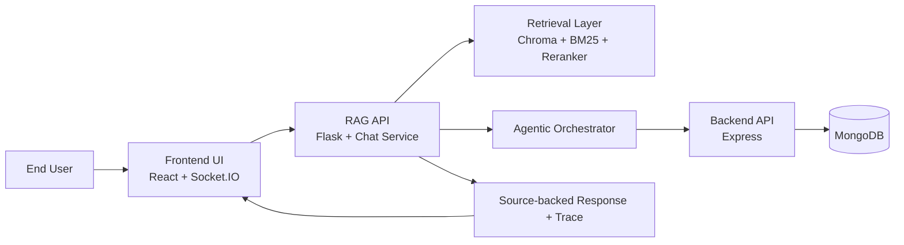
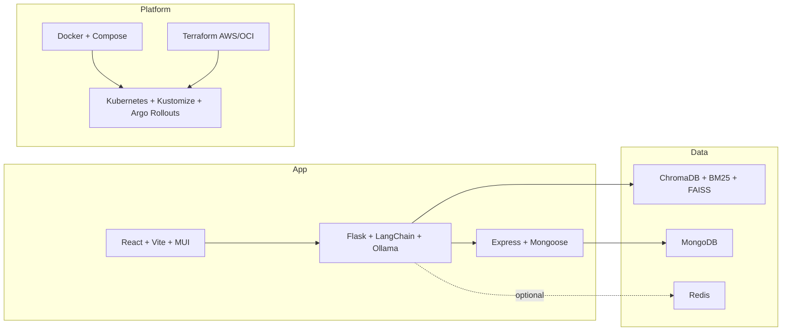
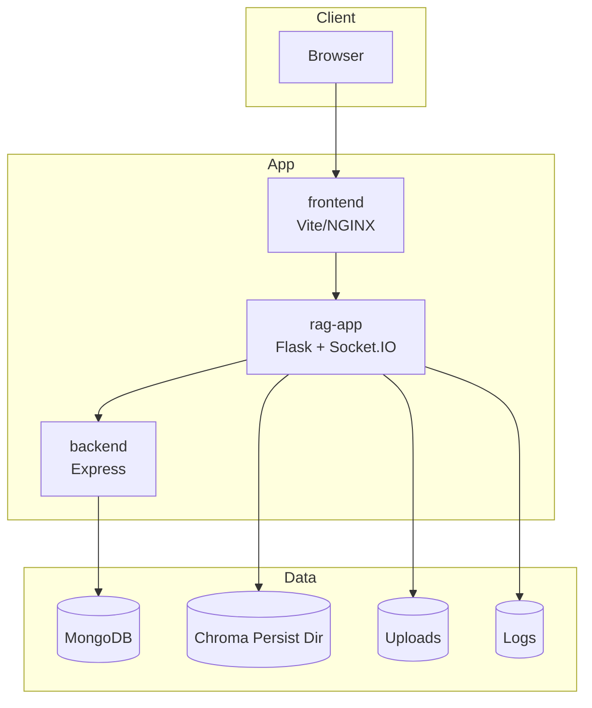
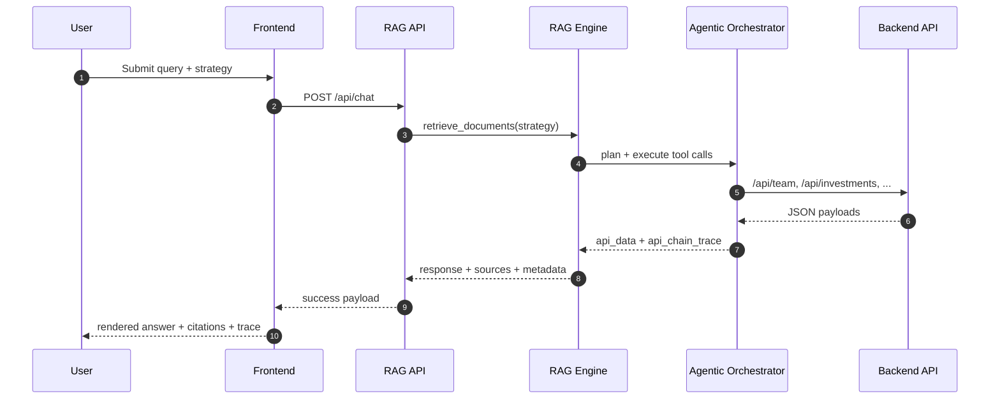
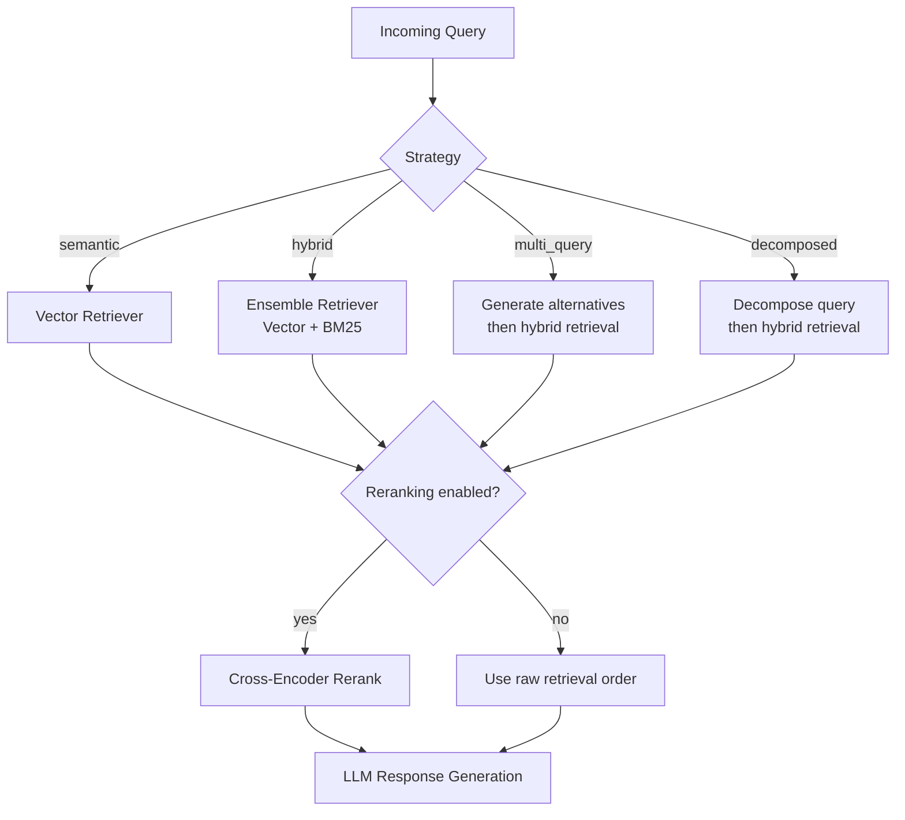
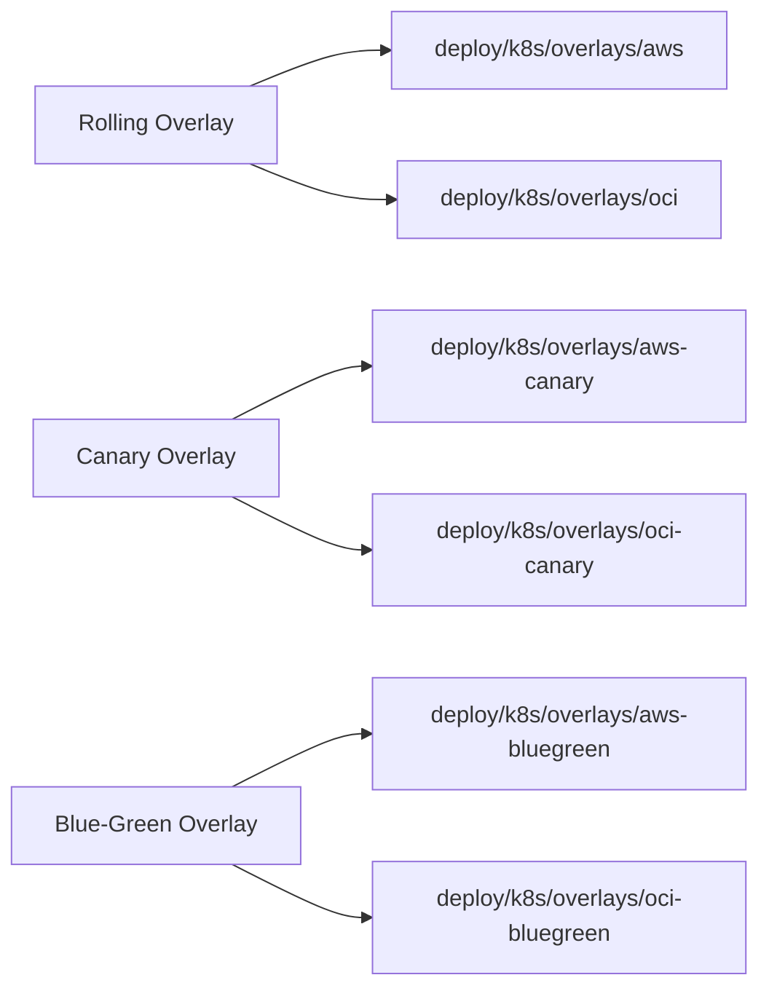
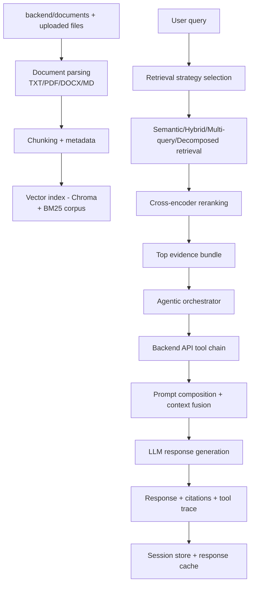
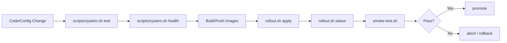
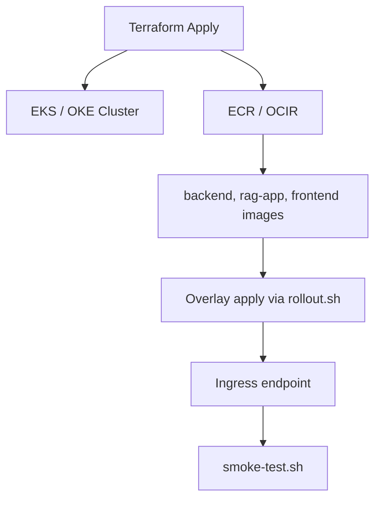
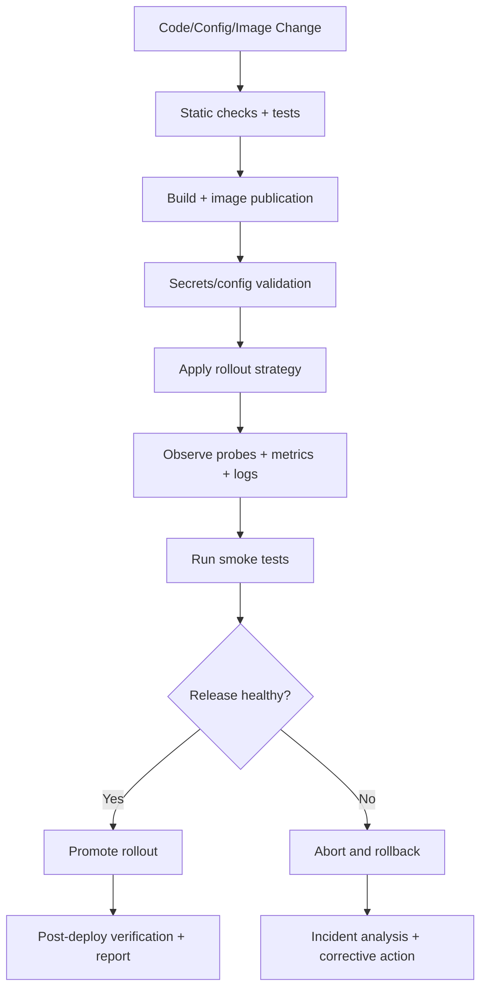

# RAG AI Portfolio Support Platform: Product And Operations Handbook

A comprehensive agentic RAG platform for portfolio intelligence, evidence-backed chat, and API-enriched responses.

This repository ships a complete application stack:
- `frontend` (`React + Vite + MUI`) for chat, strategy controls, sessions, and traceability.
- `rag-app` (`Flask + Socket.IO + LangChain`) for retrieval, orchestration, and response generation, with reranking support.
- `backend` (`Express + MongoDB`) for structured portfolio data APIs used by tool chaining.
- Deployment and operations assets for Docker, Kubernetes, progressive delivery, and Terraform.

<p align="center">
  
</p>

---

## Table Of Contents

1. [Platform Overview](#platform-overview)
2. [Core Capabilities](#core-capabilities)
3. [Technology Stack](#technology-stack)
4. [Architecture Overview](#architecture-overview)
5. [Repository Layout](#repository-layout)
6. [Runtime Contracts](#runtime-contracts)
7. [End-To-End Data Lifecycle](#end-to-end-data-lifecycle)
8. [Quick Start](#quick-start)
9. [Configuration And Secrets](#configuration-and-secrets)
10. [API Surface](#api-surface)
11. [Operations Toolkit](#operations-toolkit)
12. [Deployment And Infrastructure](#deployment-and-infrastructure)
13. [Production Governance And Release Decision Model](#production-governance-and-release-decision-model)
14. [Testing And Quality Gates](#testing-and-quality-gates)
15. [Security And Production Notes](#security-and-production-notes)
16. [Further Reading & Resources](#further-reading--resources)
17. [Documentation Index](#documentation-index)

---

## Platform Overview

The platform is designed around a single product goal: **deliver high-confidence assistant responses grounded in retrieved documents and structured backend evidence**.



---

## Core Capabilities

- Multi-strategy retrieval:
  - `semantic`
  - `hybrid`
  - `multi_query`
  - `decomposed`
- Hybrid retrieval stack:
  - Chroma vector retrieval
  - BM25 lexical retrieval
  - optional cross-encoder reranking
- Agentic backend tool chaining:
  - team profile + insights
  - investment profile + insights
  - sector profile
  - consultations
  - scrape simulation
- OpenAI-compatible endpoint:
  - `POST /api/chat/completions`
- Real-time frontend UX:
  - streaming chunks over Socket.IO
  - REST fallback
  - session create/load/delete
  - source cards + tool trace panel
- Production controls:
  - request IDs (`X-Request-ID`)
  - optional gateway auth
  - in-memory rate limiting for `/api/*`
  - liveness/readiness/health endpoints

---

## Technology Stack

### Languages And Formats


### RAG, AI, And Python Runtime


### Backend API Stack


### Frontend Stack


### Data, Infra, And Operations


### Quality And Developer Tooling




---

## Architecture Overview

### High-Level Service Topology



### Request Lifecycle (REST Chat)



### Retrieval Strategy Routing



### Progressive Delivery Modes



---

## Repository Layout

```text
.
├── backend/                    # Express + MongoDB API service
├── frontend/                   # React/Vite chat application
├── rag_system/                 # Flask RAG app (API, engine, services, storage)
├── scripts/                    # Unified local/dev/build/test/deploy wrappers
├── deploy/                     # K8s overlays, rollout scripts, runbooks
├── infra/terraform/            # AWS/OCI infrastructure definitions
├── tests/                      # Python tests
├── run.py                      # Canonical local Python entrypoint
├── Dockerfile                  # Root production RAG container definition
├── Dockerfile.rag              # RAG image variant used by compose/deploy docs
├── docker-compose.yml          # Local full-stack compose environment
├── openapi.yaml                # Unified API contract (RAG + backend)
├── QUICKSTART.md               # End-to-end operator quickstart
└── ARCHITECTURE.md             # Deep technical architecture
```

---

## Runtime Contracts

### Service Ports

| Service | Port | Purpose |
|---|---:|---|
| `frontend` | `3000` | Browser UI |
| `rag-app` | `5000` | RAG API + Socket.IO |
| `backend` | `3456` | Portfolio data API + Swagger docs |
| `mongodb` | `27017` | Backend persistence |
| `redis` | `6379` | Optional infra cache service |

### Component Responsibilities

| Layer | Primary Responsibility |
|---|---|
| `frontend` | User interaction, streaming UX, sessions, trace/citation rendering |
| `rag-app/api` | Request handling, auth/rate-limit hooks, health endpoints |
| `rag-app/services` | Session/cache management, query flow orchestration |
| `rag-app/engine` | Retrieval + rerank + prompt construction + response generation |
| `rag-app/clients` | Backend API tool client wrappers |
| `backend` | Structured domain data APIs for agentic enrichment |

---

## End-To-End Data Lifecycle

### Ingestion, Retrieval, Enrichment, And Delivery



### Runtime State Matrix

| State | Current Placement | Durability | Scale Consideration |
|---|---|---|---|
| Session history | In-memory (`rag_system/storage/session_store.py`) | process-local | externalize for multi-replica consistency |
| Response cache | In-memory LRU (`rag_system/storage/response_cache.py`) | process-local TTL | externalize for shared cache hit rate |
| Rate limiting | In-memory sliding window (`rag_system/storage/rate_limiter.py`) | process-local | move to distributed limiter for global enforcement |
| Vector data | `chroma_db` filesystem/PV | persisted on mounted volume | requires shared/managed vector strategy for horizontal scale |
| Upload artifacts | `uploads` filesystem/PV | persisted on mounted volume | requires shared object storage for stateless scaling |

---

## Quick Start

For full operator-level guidance, use [`QUICKSTART.md`](QUICKSTART.md).

### Option 1: Unified Script CLI (recommended)

```bash
scripts/system.sh setup
scripts/system.sh dev-up --setup
scripts/system.sh health
scripts/system.sh smoke
scripts/system.sh dev-down
```

### Option 2: Docker Compose

```bash
docker compose up -d
docker compose ps
```

Endpoints:
- Frontend: `http://localhost:3000`
- RAG API: `http://localhost:5000`
- Backend docs: `http://localhost:3456/docs`

Stop:

```bash
docker compose down
```

### Option 3: Manual Local (3 terminals)

Backend:

```bash
cd backend
cp .env.example .env  # first time only
npm install
npm run dev
```

RAG API (repo root):

```bash
python3 -m venv .venv
source .venv/bin/activate
pip install -r requirements.txt
python run.py
```

Frontend:

```bash
cd frontend
npm install
npm run dev
```

---

## Configuration And Secrets

### RAG Runtime (`rag_system/config.py`)

Key runtime inputs:
- API linkage: `API_BASE_URL`, `API_TOKEN`, `API_TIMEOUT_SECONDS`
- Gateway auth: `ENABLE_GATEWAY_AUTH`, `API_GATEWAY_TOKEN`
- Retrieval controls: `TOP_K`, `CHUNK_SIZE`, `CHUNK_OVERLAP`, `ENABLE_RERANKING`, `ENABLE_HYBRID_SEARCH`
- CORS and upload constraints: `CORS_ORIGINS`, `MAX_CONTENT_LENGTH_MB`, `ALLOWED_UPLOAD_EXTENSIONS`
- Session/cache/rate controls: `MAX_SESSION_MESSAGES`, `RESPONSE_CACHE_SIZE`, `RATE_LIMIT_REQUESTS_PER_MINUTE`

### Backend Runtime (`backend/.env`)

Required:
- `MONGO_URI` (defaults to `mongodb://localhost:27017/rag_db` if unset in current code)
- `PORT` (default `3456`)

Template file:
- `backend/.env.example`

### Frontend Runtime (`Vite`)

Optional variables:
- `VITE_API_BASE_URL`
- `VITE_SOCKET_URL`
- `VITE_API_GATEWAY_TOKEN`

### Production Security Baseline

- Never commit live secrets to git.
- Use cloud secret manager integration for Kubernetes deployments.
- Rotate gateway/API tokens by release window.
- Enforce TLS termination at ingress/load balancer.

---

## API Surface

### RAG API (port `5000`)

- Health and contract:
  - `GET /health`
  - `GET /livez`
  - `GET /readyz`
  - `GET /openapi.json`
- Chat:
  - `POST /api/chat`
  - `POST /api/chat/completions`
- Session lifecycle:
  - `POST /api/session`
  - `GET /api/session/<session_id>`
  - `DELETE /api/session/<session_id>`
  - `GET /api/sessions`
- Knowledge and metadata:
  - `POST /api/upload`
  - `GET /api/strategies`
  - `GET /api/system/info`
  - `GET /api/tools`

### Backend API (port `3456`)

- Auth bootstrap:
  - `GET /auth/token`
- Protected domain routes:
  - `GET /ping`
  - `GET /api/documents/download`
  - `GET /api/team`
  - `GET /api/team/insights`
  - `GET /api/investments`
  - `GET /api/investments/insights`
  - `GET /api/sectors`
  - `GET /api/consultations`
  - `GET /api/scrape`

Unified OpenAPI contract:
- [`openapi.yaml`](openapi.yaml)

---

## Operations Toolkit

### Root Scripts

Primary operator entrypoint:

```bash
scripts/system.sh help
```

Mapped workflows:
- setup: `scripts/system.sh setup`
- local lifecycle: `dev-up`, `dev-down`, `dev-status`, `dev-logs`
- quality gates: `build`, `test`, `health`, `smoke`
- docker lifecycle: `docker-up`, `docker-down`, `docker-logs`
- deployment wrappers: `deploy`, `deploy-smoke`

### Day-2 Operations Flow



---

## Deployment And Infrastructure

### Kubernetes + Progressive Delivery

- Base manifests: `deploy/k8s/base`
- Rolling overlays: `deploy/k8s/overlays/aws`, `deploy/k8s/overlays/oci`
- Canary overlays: `deploy/k8s/overlays/aws-canary`, `deploy/k8s/overlays/oci-canary`
- Blue-green overlays: `deploy/k8s/overlays/aws-bluegreen`, `deploy/k8s/overlays/oci-bluegreen`

Rollout helper:

```bash
deploy/scripts/rollout.sh <strategy> <cloud> <action> [service]
```

Examples:

```bash
deploy/scripts/rollout.sh rolling aws apply
deploy/scripts/rollout.sh canary aws status
deploy/scripts/rollout.sh bluegreen oci promote all
```

Live smoke validation:

```bash
deploy/scripts/smoke-test.sh https://rag.example.com
```

### Terraform

- AWS stack: `infra/terraform/aws`
  - EKS + VPC + ECR + optional canary node group
- OCI stack: `infra/terraform/oci`
  - OKE + VCN + optional canary node pool



---

## Production Governance And Release Decision Model



Release strategies supported:
- Rolling (`deploy/k8s/overlays/aws`, `deploy/k8s/overlays/oci`)
- Canary (`deploy/k8s/overlays/aws-canary`, `deploy/k8s/overlays/oci-canary`)
- Blue-green (`deploy/k8s/overlays/aws-bluegreen`, `deploy/k8s/overlays/oci-bluegreen`)

Primary release controls:
- `deploy/scripts/rollout.sh`
- `deploy/scripts/smoke-test.sh`
- `scripts/system.sh test|health|smoke`

---

## Testing And Quality Gates

We provide a unified test and quality gate script for local and CI use. It comprehensively runs all unit tests, type checks, and production builds for both backend and frontend components.

### Unified Gate

```bash
scripts/system.sh test
```

What it runs:
- Python tests (`pytest -q`)
- backend TypeScript build (`npm run build`)
- frontend typecheck (`npm run typecheck`)
- frontend production build (`npm run build`)

### Additional Checks

```bash
scripts/system.sh health
scripts/system.sh smoke
```

---

## Security And Production Notes

- Backend bearer auth currently uses a demo/static token behavior by default (`/auth/token` route and middleware logic); treat it as non-production auth unless replaced by real identity integration.
- RAG gateway auth is optional and controlled by `ENABLE_GATEWAY_AUTH` + `API_GATEWAY_TOKEN`.
- Current rate limiting and session/cache stores are in-memory and process-local.
- Enable hardened ingress, secret management, and centralized telemetry before multi-tenant production rollout.

---

## Further Reading & Resources

If you want to learn more about the concepts and technologies used in this project, as well as essential AI and RAG principles, check out the following resources:

- [AI Agents & Assistants](resources/AI_Agents_Assistants.ipynb)
- [AI and Businesses](resources/AI_and_Businesses.ipynb)
- [Confusion Matrix for LLM Outputs](resources/Confusion_Matrix.ipynb)
- [Data Science Pipeline with a Business Problem](resources/Data_Science_Pipeline.ipynb)
- [Decision Trees & Ensemble Learning](resources/Decision_Trees_Ensemble_Learning.ipynb)
- [Deep Learning & Neural Networks](resources/Deep_Learning_Neural_Networks.ipynb)
- [k-Nearest Neighbors Algorithm](resources/k-Nearest-Neighbors.ipynb)
- [LLM Mining for Customer Experience](resources/LLM_Mining_CX.ipynb)
- [Regression Analysis & Linear Models](resources/Regression.ipynb)
- [Representation Learning & Dimensionality Reduction for Recommender Systems](resources/Representation_Learning_Recommender.ipynb)
- [Retrieval Augmented Generation (RAG) Concepts](resources/Retrieval_Augmented_Generation.ipynb)
- [Unstructured Data Textual Analysis](resources/Unstructured_Data_Textual_Analysis.ipynb)
- [Storytelling with Data](resources/Storytelling_with_Data.pdf)
- [Synthetic Experts](resources/Synthetic_Experts.pdf)

---

## Documentation Index

- [QUICKSTART.md](QUICKSTART.md)
- [ARCHITECTURE.md](ARCHITECTURE.md)
- [deploy/README.md](deploy/README.md)
- [deploy/k8s/README.md](deploy/k8s/README.md)
- [deploy/docs/PROGRESSIVE_DELIVERY.md](deploy/docs/PROGRESSIVE_DELIVERY.md)
- [deploy/docs/PRODUCTION_CHECKLIST.md](deploy/docs/PRODUCTION_CHECKLIST.md)
- [scripts/README.md](scripts/README.md)
- [openapi.yaml](openapi.yaml)
