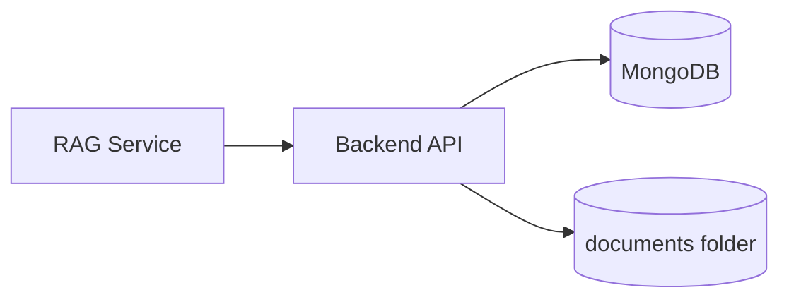
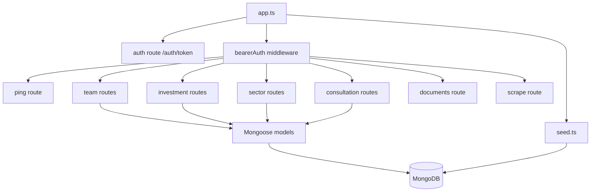
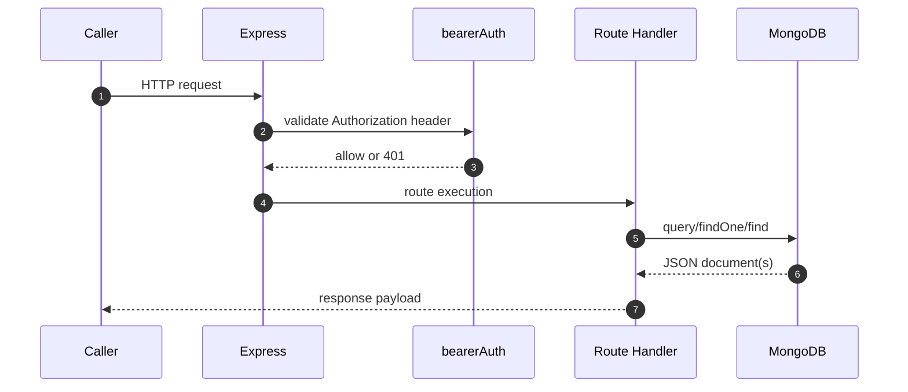
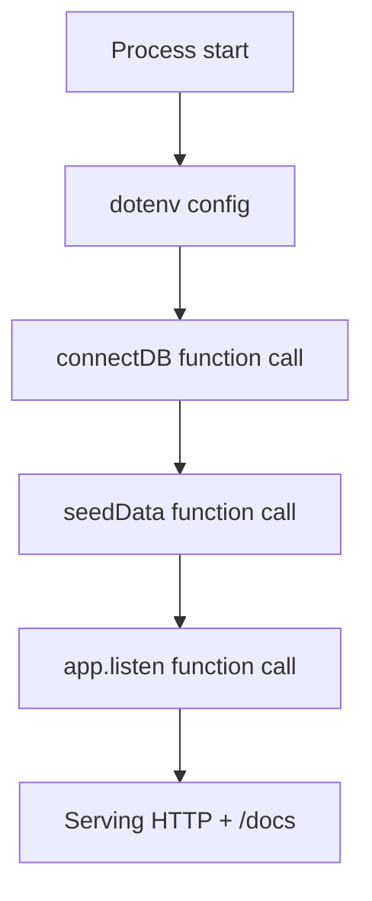
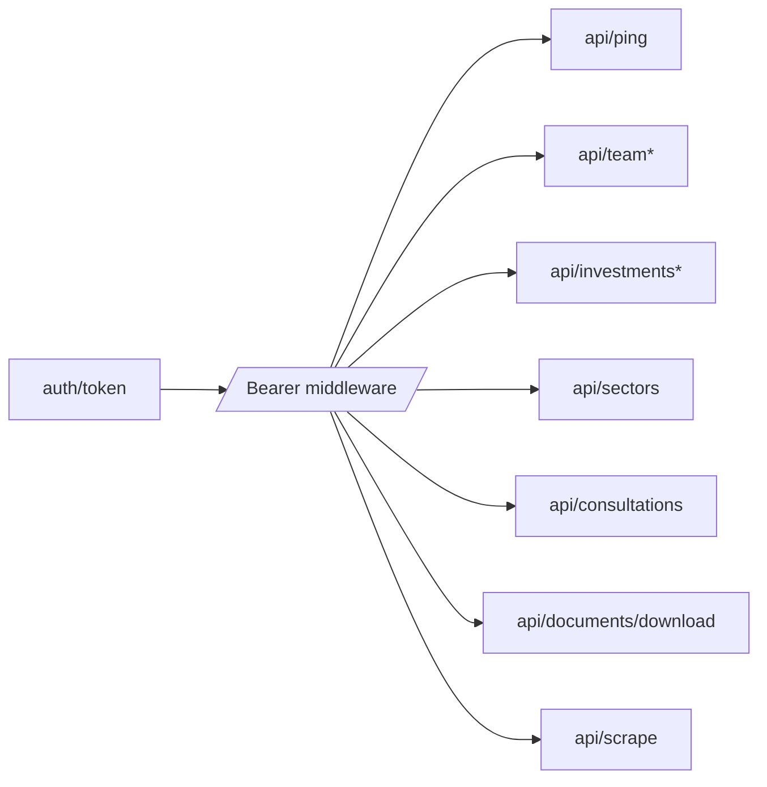
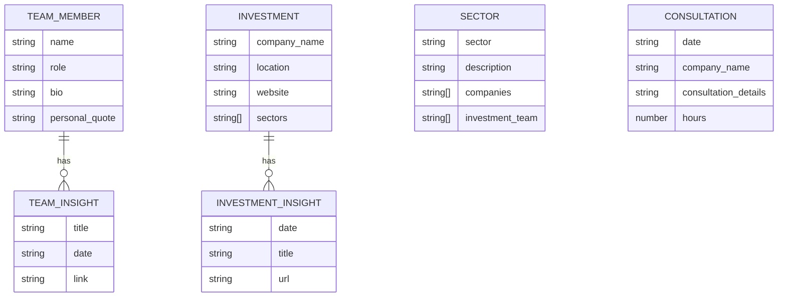
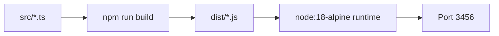
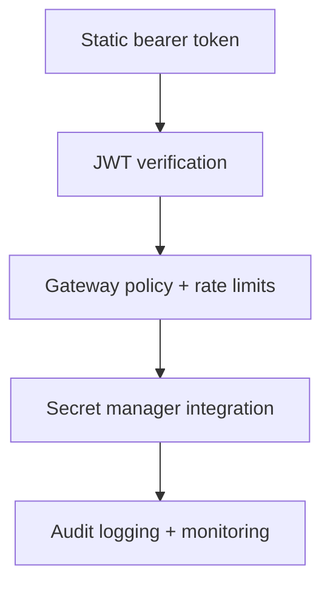
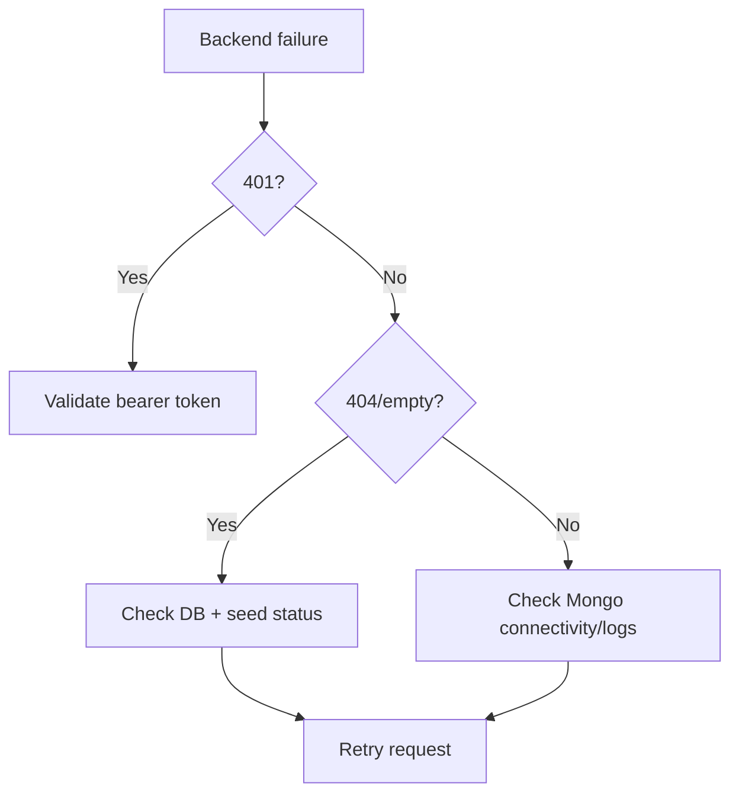

# Backend API Handbook (`backend`)

Production backend API for structured portfolio data used by the RAG agentic orchestration layer.

This service provides authenticated domain endpoints for:
- team members and related insights
- investments and investment insights
- sector profiles
- consultation records
- document archive export
- scrape simulation payloads

---

## Table Of Contents

1. [Purpose](#purpose)
2. [Service Architecture](#service-architecture)
3. [Runtime Request Pipeline](#runtime-request-pipeline)
4. [Source Layout](#source-layout)
5. [API Surface](#api-surface)
6. [Data Model](#data-model)
7. [Configuration](#configuration)
8. [Local Development](#local-development)
9. [Containerization And Deployment](#containerization-and-deployment)
10. [Operational Playbook](#operational-playbook)
11. [Security Hardening Checklist](#security-hardening-checklist)
12. [Troubleshooting](#troubleshooting)

---

## Purpose

`backend` is the domain data service for the RAG platform. It is intentionally narrow:
- exposes curated portfolio-related APIs
- persists and queries data in MongoDB
- offers a documents ZIP endpoint for RAG indexing bootstrap
- is consumed by `rag_system/clients/backend_api.py`



---

## Service Architecture



Core behavior in `src/app.ts`:
- loads env vars
- connects DB (`connectDB`)
- seeds data (`seedData`)
- initializes OpenAPI docs via `swagger-jsdoc`
- mounts unprotected `/auth`
- enforces auth middleware on all remaining routes

---

## Runtime Request Pipeline



### Startup Lifecycle



---

## Source Layout

```text
backend/
├── src/
│   ├── app.ts
│   ├── db.ts
│   ├── seed.ts
│   ├── middleware/
│   │   └── auth.ts
│   ├── models/
│   │   ├── TeamMember.ts
│   │   ├── Investment.ts
│   │   ├── Sector.ts
│   │   └── Consultation.ts
│   └── routes/
│       ├── auth.ts
│       ├── ping.ts
│       ├── documents.ts
│       ├── team.ts
│       ├── investments.ts
│       ├── sectors.ts
│       ├── consultations.ts
│       └── scrape.ts
├── documents/
├── Dockerfile
├── package.json
└── .env.example
```

---

## API Surface

Base local URL: `http://localhost:3456`

### Auth

| Method | Path | Auth | Description |
|---|---|---|---|
| `GET` | `/auth/token` | No | Returns demo token currently used by middleware. |

### Core

| Method | Path | Required Query | Description |
|---|---|---|---|
| `GET` | `/ping` | none | Returns authenticated user details from middleware context. |
| `GET` | `/api/documents/download` | none | Streams a ZIP of backend documents. |
| `GET` | `/api/team` | `name` | Team member profile without insights. |
| `GET` | `/api/team/insights` | `name` | Team member related insights only. |
| `GET` | `/api/investments` | `company_name` | Investment profile without insights. |
| `GET` | `/api/investments/insights` | `company_name` | Investment insights only. |
| `GET` | `/api/sectors` | `sector` | Sector profile details. |
| `GET` | `/api/consultations` | `name` | Consultations matching consultant name text. |
| `GET` | `/api/scrape` | `url` | Fake scrape payload for orchestration testing. |

Swagger UI:
- `GET /docs`



---

## Data Model

Collections are represented by Mongoose models in `src/models/*`.



### Seed Behavior

`src/seed.ts` loads faker data if corresponding collections are empty:
- 100 team members
- 200 investments
- 50 sectors
- 300 consultations

This makes local/prototype environments usable without manual import.

---

## Configuration

Environment values (`backend/.env.example`):

| Variable | Required | Default | Description |
|---|---|---|---|
| `MONGO_URI` | No | `mongodb://localhost:27017/rag_db` | MongoDB connection URI |
| `PORT` | No | `3456` | HTTP server port |

Local `.env` example:

```bash
MONGO_URI=mongodb://localhost:27017/rag_db
PORT=3456
```

---

## Local Development

Install and run:

```bash
cd backend
npm ci
npm run dev
```

Build TypeScript:

```bash
npm run build
```

Start compiled output:

```bash
node dist/app.js
```

Health smoke:

```bash
curl -s http://localhost:3456/auth/token
```

---

## Containerization And Deployment

`backend/Dockerfile` uses two stages:
1. Builder stage compiles TypeScript to `dist/`
2. Runtime stage installs production dependencies and runs `node dist/app.js`



Standalone container run:

```bash
docker build -t rag-backend ./backend
docker run --rm -p 3456:3456 --env-file backend/.env rag-backend
```

---

## Operational Playbook

Recommended probes:

```bash
curl -f http://localhost:3456/auth/token
curl -f -H "Authorization: Bearer psJN7z3J9q" "http://localhost:3456/ping"
curl -f -H "Authorization: Bearer psJN7z3J9q" "http://localhost:3456/api/team?name=John%20Doe"
```

Runtime observability:
- startup logs include DB connect and docs URL
- route handlers return explicit 400/404/500 responses
- Swagger UI reflects route annotations

---

## Security Hardening Checklist

Current auth is static-token middleware (`src/middleware/auth.ts`) and is suitable only for controlled environments.

Before internet-facing production, implement:
1. JWT or OAuth2 validation with issuer/audience checks.
2. Secret storage via managed vault, not inline literals.
3. Rate limiting and abuse protection at ingress/API gateway.
4. Request validation and response schema enforcement for all routes.
5. Structured audit logging and SIEM forwarding.
6. IP allowlist or private networking between `rag_system` and `backend`.



---

## Troubleshooting

| Symptom | Likely Cause | Resolution |
|---|---|---|
| `401 Unauthorized` for domain routes | missing or wrong bearer token | call `/auth/token` then retry with `Authorization` header |
| startup exits after DB connect attempt | invalid `MONGO_URI` | verify credentials/network and container DNS |
| `/api/documents/download` returns 500 | missing `documents/` folder | ensure folder exists and is copied into image |
| empty responses for profile lookups | seed data not present or query mismatch | check collection counts and query parameter spelling |
| Swagger missing route docs | route annotations not parsed | ensure file path pattern `./src/routes/*.ts` still valid |


