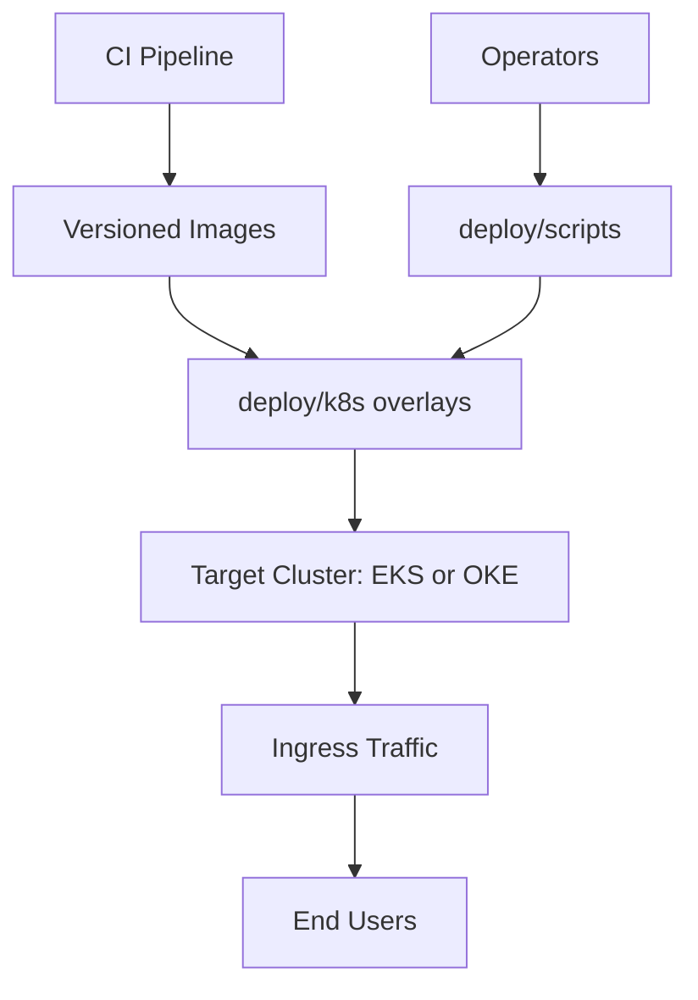
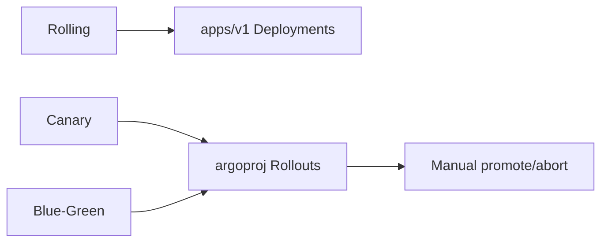
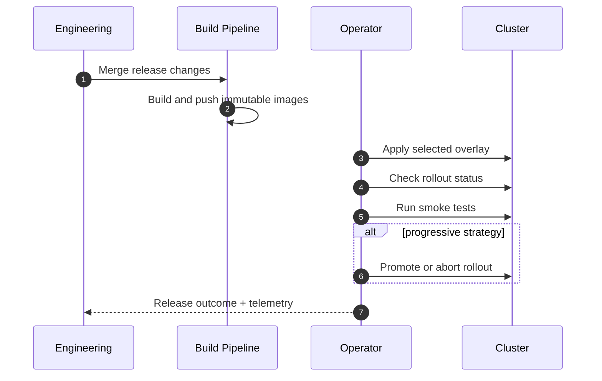

# Platform Deployment And Release Engineering Guide (`deploy`)

Production deployment assets for the complete RAG AI platform:
- `frontend` (React + NGINX)
- `rag-app` (Flask + Socket.IO + RAG runtime)
- `backend` (Express + MongoDB integration)
- stateful dependencies (`mongodb`, `redis`, PVC-backed data)

This directory is the operational control plane for Kubernetes rollout strategies and runbook-driven production changes.

---

## Table Of Contents

1. [Deployment Scope](#deployment-scope)
2. [Directory Map](#directory-map)
3. [Release Strategy Matrix](#release-strategy-matrix)
4. [End-To-End Promotion Flow](#end-to-end-promotion-flow)
5. [Operator Workflow](#operator-workflow)
6. [Safety Controls](#safety-controls)
7. [Related Docs](#related-docs)

---

## Deployment Scope



---

## Directory Map

```text
deploy/
├── README.md
├── k8s/
│   ├── base/                       # Shared manifests (deployments, services, probes, policies)
│   └── overlays/
│       ├── aws/                    # Rolling update overlays for AWS
│       ├── aws-canary/             # Canary overlays for AWS
│       ├── aws-bluegreen/          # Blue-green overlays for AWS
│       ├── oci/                    # Rolling update overlays for OCI
│       ├── oci-canary/             # Canary overlays for OCI
│       └── oci-bluegreen/          # Blue-green overlays for OCI
├── scripts/
│   ├── rollout.sh                  # apply/status/promote/abort/restart
│   └── smoke-test.sh               # endpoint smoke checks
└── docs/
    ├── README.md
    ├── IMAGE_BUILD_AND_PUSH.md
    ├── OPERATIONS.md
    ├── PRODUCTION_CHECKLIST.md
    ├── PROGRESSIVE_DELIVERY.md
    ├── SECRETS_AND_CONFIG.md
    └── TROUBLESHOOTING.md
```

---

## Release Strategy Matrix

| Strategy | Cloud overlays | Controller requirement | Promotion model |
|---|---|---|---|
| Rolling | `overlays/aws`, `overlays/oci` | native Deployment | automatic by rolling policy |
| Canary | `overlays/aws-canary`, `overlays/oci-canary` | Argo Rollouts | stepwise weighted traffic |
| Blue-Green | `overlays/aws-bluegreen`, `overlays/oci-bluegreen` | Argo Rollouts | explicit preview validation + manual promote |



---

## End-To-End Promotion Flow



---

## Operator Workflow

1. Provision/update cloud infrastructure using Terraform (`infra/terraform/*`).
2. Build and push images with immutable tags.
3. Update manifest image references/tag inputs.
4. Apply overlay using `deploy/scripts/rollout.sh`.
5. Validate health and smoke tests.
6. For canary/blue-green, perform controlled promotion.
7. Record release metadata and post-deploy verification.

Minimal command path:

```bash
# apply
./deploy/scripts/rollout.sh rolling aws apply

# validate
./deploy/scripts/rollout.sh rolling aws status
./deploy/scripts/smoke-test.sh https://rag.example.com
```

---

## Safety Controls

- Probes (startup/readiness/liveness) are configured for all runtime services.
- PDB and HPA protect availability and scaling behavior.
- NetworkPolicies enforce service-to-service boundaries.
- Canary and blue-green overlays support abort actions.
- Deployment docs include checklist and incident runbooks.

---

## Related Docs

- `deploy/docs/README.md` - release documentation index
- `deploy/docs/PRODUCTION_CHECKLIST.md` - pre-release gate checklist
- `deploy/docs/PROGRESSIVE_DELIVERY.md` - canary/blue-green procedures
- `deploy/k8s/README.md` - manifest and overlay reference
- `infra/terraform/aws/README.md` and `infra/terraform/oci/README.md` - cloud provisioning
