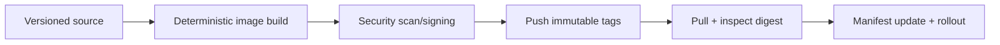
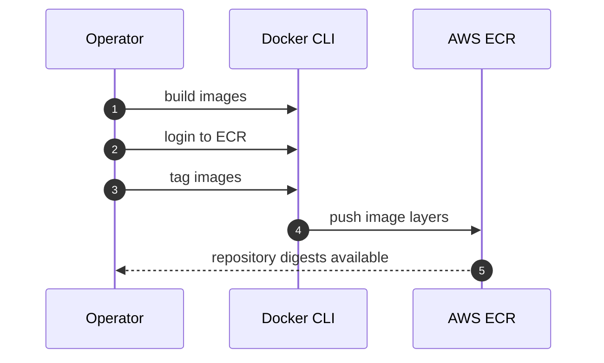
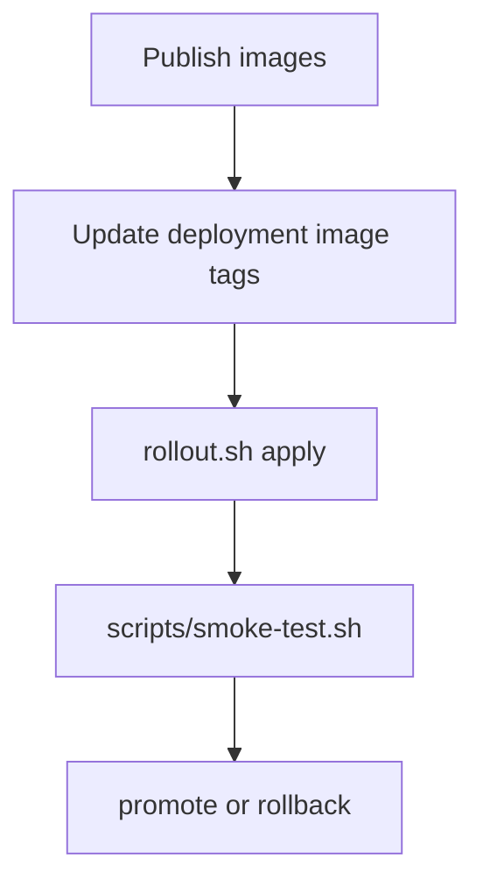

# Image Build, Signing, And Registry Publishing Runbook

Release image workflow for:
- `rag-backend` (`backend/Dockerfile`)
- `rag-app` (`Dockerfile.rag`)
- `rag-frontend` (`frontend/Dockerfile`)

This runbook standardizes deterministic tagging, registry publication, and promotion-ready artifact handling.

---

## Table Of Contents

1. [Release Principles](#release-principles)
2. [Build Inputs](#build-inputs)
3. [Tagging Strategy](#tagging-strategy)
4. [Local Build Procedure](#local-build-procedure)
5. [AWS ECR Publishing](#aws-ecr-publishing)
6. [OCI OCIR Publishing](#oci-ocir-publishing)
7. [Post-Publish Verification](#post-publish-verification)
8. [Manifest Update Expectations](#manifest-update-expectations)
9. [Failure Recovery](#failure-recovery)

---

## Release Principles

- Use immutable tags only for deployment.
- Keep backend, rag-app, and frontend tags aligned per release.
- Do not deploy images that failed smoke or security checks.



---

## Build Inputs

| Component | Dockerfile | Build Context |
|---|---|---|
| Backend API | `backend/Dockerfile` | `backend/` |
| RAG service | `Dockerfile.rag` | repo root |
| Frontend | `frontend/Dockerfile` | `frontend/` |

Pre-build checks:

```bash
git status --short
scripts/system.sh test
```

---

## Tagging Strategy

Recommended release tag shape:
- `vYYYY.MM.DD.N`
- commit SHA alias (`sha-<shortsha>`) optional

Example:

```bash
export RELEASE_TAG=v2026.02.06.2
```

Optional metadata tagging:

```bash
docker tag rag-app:${RELEASE_TAG} rag-app:sha-$(git rev-parse --short HEAD)
```

---

## Local Build Procedure

```bash
export RELEASE_TAG=v2026.02.06.2

docker build -t rag-backend:${RELEASE_TAG} backend

docker build -t rag-app:${RELEASE_TAG} -f Dockerfile.rag .

docker build -t rag-frontend:${RELEASE_TAG} frontend
```

Quick sanity checks:

```bash
docker images | rg 'rag-(backend|app|frontend)'
```

---

## AWS ECR Publishing

```bash
export AWS_ACCOUNT_ID=123456789012
export AWS_REGION=us-east-1
export ECR_PREFIX=${AWS_ACCOUNT_ID}.dkr.ecr.${AWS_REGION}.amazonaws.com/rag-system

aws ecr get-login-password --region ${AWS_REGION} | \
  docker login --username AWS --password-stdin ${AWS_ACCOUNT_ID}.dkr.ecr.${AWS_REGION}.amazonaws.com

for image in rag-backend rag-app rag-frontend; do
  docker tag ${image}:${RELEASE_TAG} ${ECR_PREFIX}/${image}:${RELEASE_TAG}
  docker push ${ECR_PREFIX}/${image}:${RELEASE_TAG}
done
```



---

## OCI OCIR Publishing

```bash
export OCI_REGION=us-ashburn-1
export OCI_TENANCY=mytenancy
export OCI_USER=myuser
export OCIR_PREFIX=${OCI_REGION}.ocir.io/${OCI_TENANCY}/rag-system

# OCI_AUTH_TOKEN should be an auth token, not your API private key.
docker login ${OCI_REGION}.ocir.io -u ${OCI_TENANCY}/${OCI_USER} -p ${OCI_AUTH_TOKEN}

for image in rag-backend rag-app rag-frontend; do
  docker tag ${image}:${RELEASE_TAG} ${OCIR_PREFIX}/${image}:${RELEASE_TAG}
  docker push ${OCIR_PREFIX}/${image}:${RELEASE_TAG}
done
```

---

## Post-Publish Verification

1. Verify tag presence in registry UI/CLI.
2. Verify digest immutability.
3. Optionally pull and inspect image metadata.

Example digest check (AWS):

```bash
aws ecr describe-images \
  --repository-name rag-system/rag-app \
  --image-ids imageTag=${RELEASE_TAG}
```

---

## Manifest Update Expectations

Before rollout:
- update image references/tags in selected overlay pipeline
- ensure all three services reference same release tag
- apply rollout and run smoke checks



---

## Failure Recovery

| Failure | Response |
|---|---|
| Push denied/auth failed | re-authenticate and confirm registry permissions |
| Wrong image tagged | retag correctly and re-push with immutable release tag |
| Vulnerability gate failed | block release, patch base/dependencies, rebuild |
| Mismatched service tags | standardize tags before rollout |

If a bad tag was already deployed, pin manifests to last known-good tag and run controlled rollout/restart.
