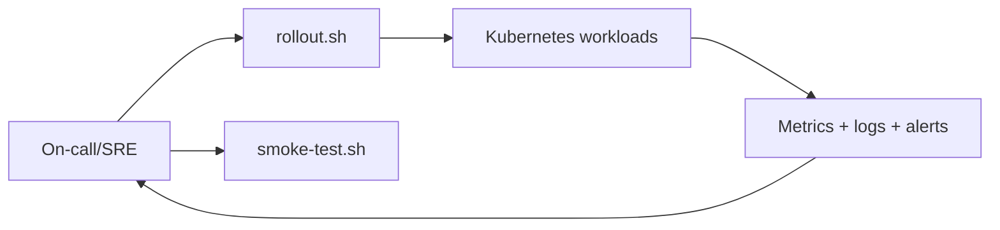
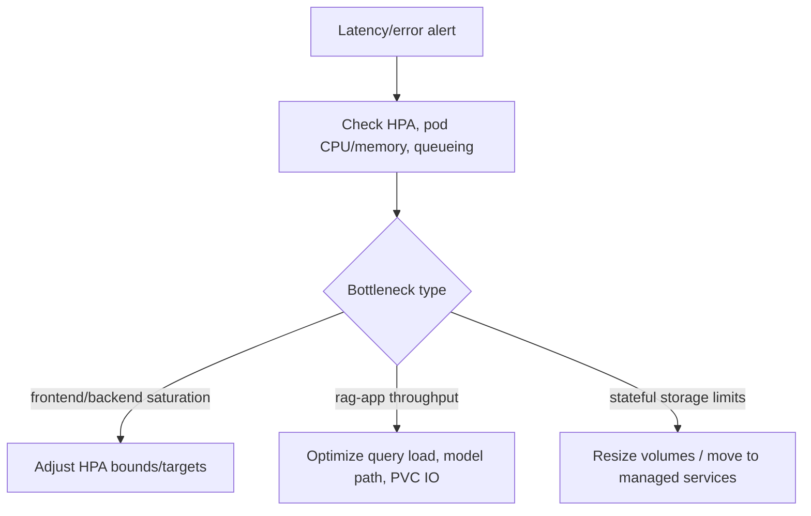
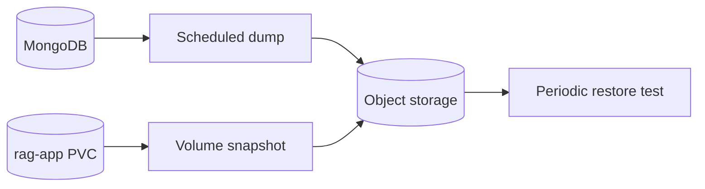
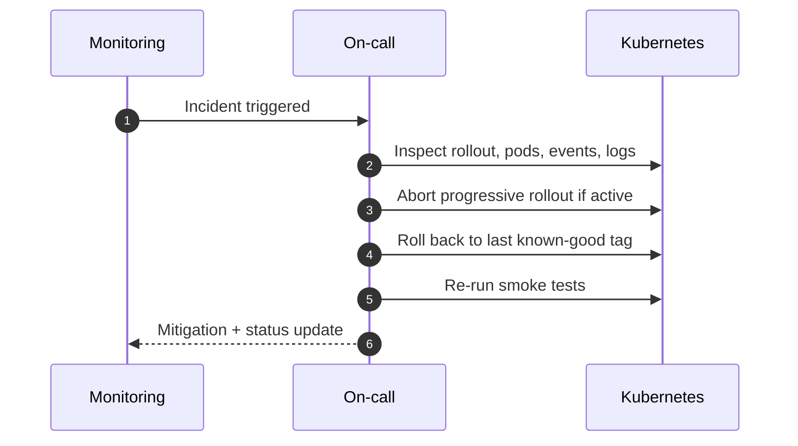

# Production Operations Runbook

Day-2 operational procedures for the platform in Kubernetes environments.

This runbook covers:
- rollout/status/restart command paths
- scaling and availability expectations
- backup/restore responsibilities
- incident response playbook

---

## Table Of Contents

1. [Operational Model](#operational-model)
2. [Core Command Set](#core-command-set)
3. [Workload Characteristics](#workload-characteristics)
4. [Scaling And Capacity Management](#scaling-and-capacity-management)
5. [Health Verification Procedures](#health-verification-procedures)
6. [Backup And Recovery Expectations](#backup-and-recovery-expectations)
7. [Incident Response Workflow](#incident-response-workflow)
8. [Post-Incident Actions](#post-incident-actions)

---

## Operational Model



Scope by service:
- `frontend`: stateless, HPA-backed
- `backend`: stateless API, HPA-backed
- `rag-app`: stateful constraints due local PVC usage (single replica default)
- `mongodb` / `redis`: stateful dependencies with dedicated storage

---

## Core Command Set

### Rolling deployment lifecycle

```bash
# Apply
./deploy/scripts/rollout.sh rolling aws apply

# Status
./deploy/scripts/rollout.sh rolling aws status

# Restart
./deploy/scripts/rollout.sh rolling aws restart

# Smoke
./deploy/scripts/smoke-test.sh https://rag.aws.example.com
```

### Progressive lifecycle (canary/blue-green)

```bash
# Canary
./deploy/scripts/rollout.sh canary aws apply
./deploy/scripts/rollout.sh canary aws status
./deploy/scripts/rollout.sh canary aws promote frontend
./deploy/scripts/rollout.sh canary aws abort frontend

# Blue-green
./deploy/scripts/rollout.sh bluegreen aws apply
./deploy/scripts/rollout.sh bluegreen aws status
./deploy/scripts/rollout.sh bluegreen aws promote all
./deploy/scripts/rollout.sh bluegreen aws abort all
```

---

## Workload Characteristics

| Service | Availability Model | State Model | Scaling |
|---|---|---|---|
| `frontend` | multi-replica | stateless | HPA (`3-12`) |
| `backend` | multi-replica | stateless API + Mongo dependency | HPA (`3-12`) |
| `rag-app` | single replica default | PVC-backed local artifacts | manual/controlled |
| `mongodb` | single StatefulSet | persistent data | vertical and storage scaling |
| `redis` | single StatefulSet | persistent cache (optional) | vertical scaling |

---

## Scaling And Capacity Management



Recommended cadence:
1. weekly HPA utilization review
2. monthly capacity forecast against traffic growth
3. quarterly load test of release candidate configuration

---

## Health Verification Procedures

Cluster-level checks:

```bash
kubectl -n rag-system get pods
kubectl -n rag-system get svc
kubectl -n rag-system get ingress
```

Application-level checks:

```bash
./deploy/scripts/smoke-test.sh https://rag.example.com
```

Service-specific probe checks:

- backend: `/auth/token`
- rag-app: `/livez`, `/readyz`, `/health`
- frontend: `/healthz`

---

## Backup And Recovery Expectations

Minimum production backup policy:
- MongoDB logical backup (`mongodump`) to object storage
- `rag-app` PVC snapshot schedule for uploads/vector artifacts
- restore drills in non-production at least monthly



---

## Incident Response Workflow



Immediate actions for release incidents:
1. freeze ongoing promotion (`abort` for canary/blue-green)
2. restore known-good image tags
3. validate health and critical endpoints
4. collect diagnostics (events, logs, rollout status)

---

## Post-Incident Actions

- publish incident summary with timeline and impact
- add/adjust alerts if detection lagged
- update runbook steps where operator friction occurred
- verify rollback procedures in staging before next release
