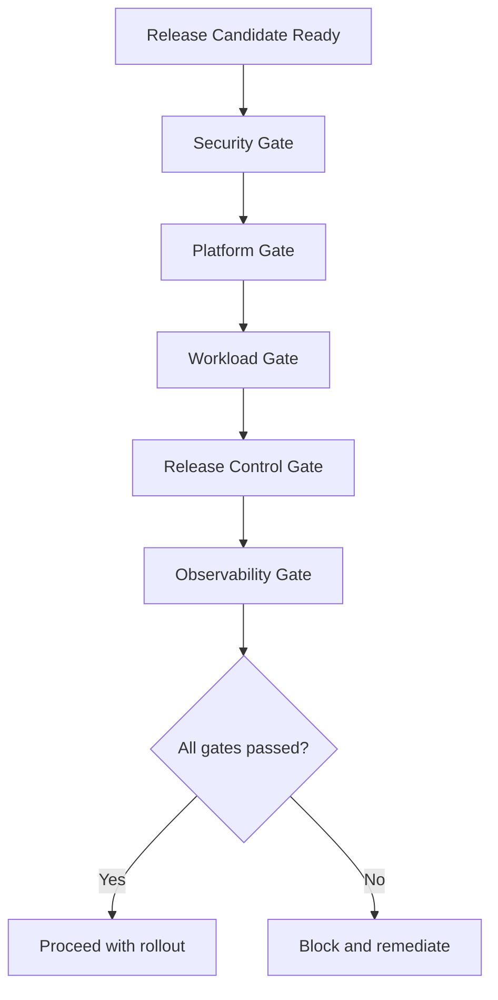

# Production Readiness And Release Gate Checklist

Mandatory pre-deployment checklist for production promotion.

Use this checklist before:
- `rollout.sh ... apply`
- `rollout.sh ... promote`

No unchecked critical item should be bypassed without an explicit incident/exception decision.

---

## Release Gate Model

---

## 1) Security Gate

- [ ] `rag-secrets` has no placeholder values (`change-me` removed).
- [ ] TLS certs issued and valid for active and preview ingress hosts.
- [ ] Cloud administrative CIDRs restricted (`admin_cidr` for OCI, SG/network controls for AWS).
- [ ] Container images scanned and policy-compliant for `backend`, `rag-app`, `frontend`.
- [ ] Runtime secrets are sourced from secure secret management flow (not manually edited in Git).
- [ ] IAM/OCI permissions verified least-privilege for rollout actor and cluster services.

---

## 2) Platform Gate

- [ ] Kubernetes cluster healthy and reachable.
- [ ] Ingress controller installed and functioning.
- [ ] Metrics Server healthy (required for HPA targets).
- [ ] Argo Rollouts installed if canary/blue-green strategy is selected.
- [ ] StorageClass overrides (`gp3`, `oci-bv`) validated for target cloud.
- [ ] Base NetworkPolicies tested for frontend->rag-app->backend->mongodb path.

---

## 3) Workload Gate

- [ ] Startup/readiness/liveness probes green for `frontend`, `rag-app`, `backend`.
- [ ] `rag-app` PVC (`rag-app-data`) is bound and writable.
- [ ] MongoDB connectivity validated from backend runtime.
- [ ] RAG health endpoints pass (`/health`, `/livez`, `/readyz`).
- [ ] HPA min/max and PDB settings match intended traffic profile.
- [ ] Images are pinned to immutable release tags.

---

## 4) Release Control Gate

- [ ] Smoke tests pass on active endpoint before promotion.
- [ ] For blue-green: smoke tests pass on preview endpoint.
- [ ] For canary: pause windows are sufficient to observe SLO impact.
- [ ] Abort and rollback commands have been validated in recent staging dry run.
- [ ] Operator on-call ownership and escalation contacts confirmed.

---

## 5) Observability Gate

- [ ] Centralized logs available for all runtime services.
- [ ] Alerts configured for 5xx rate, p95 latency, readiness failures, and rollout failures.
- [ ] Dashboards include endpoint health and rollout status visibility.
- [ ] Correlation IDs (`X-Request-ID`) are available end-to-end in logs.

---

## Final Decision Record

Release metadata template:

| Field | Value |
|---|---|
| Release tag | |
| Strategy (`rolling/canary/bluegreen`) | |
| Cloud (`aws/oci`) | |
| Operator | |
| Checklist reviewer | |
| Start time (UTC) | |
| End time (UTC) | |
| Outcome | |
| Rollback executed? | |
| Incident reference (if any) | |

