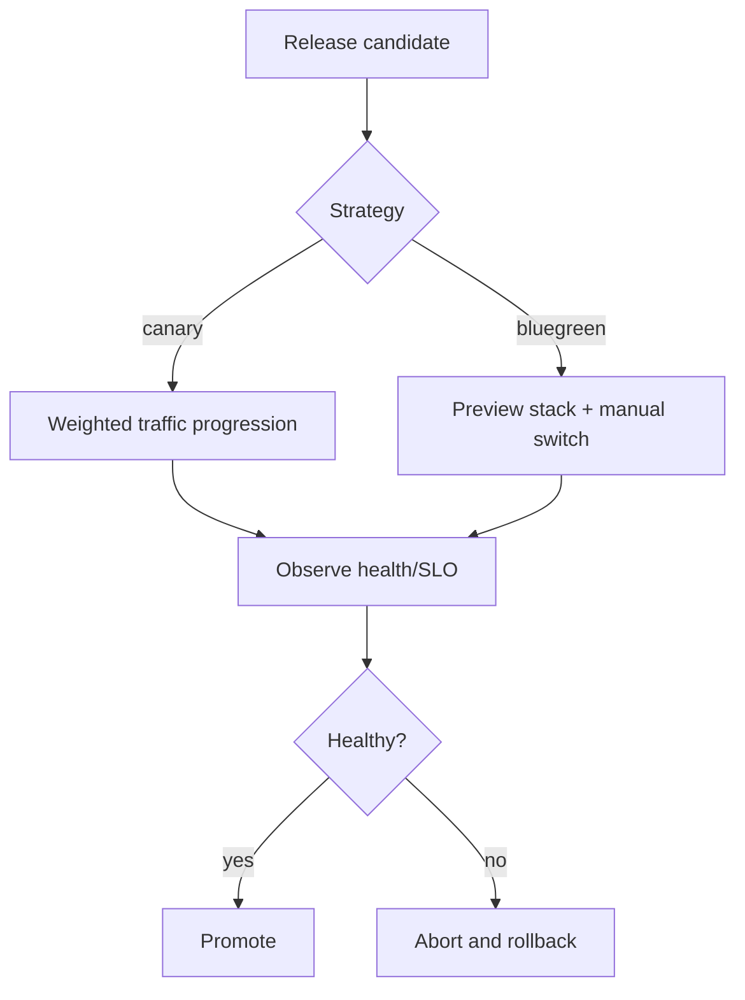
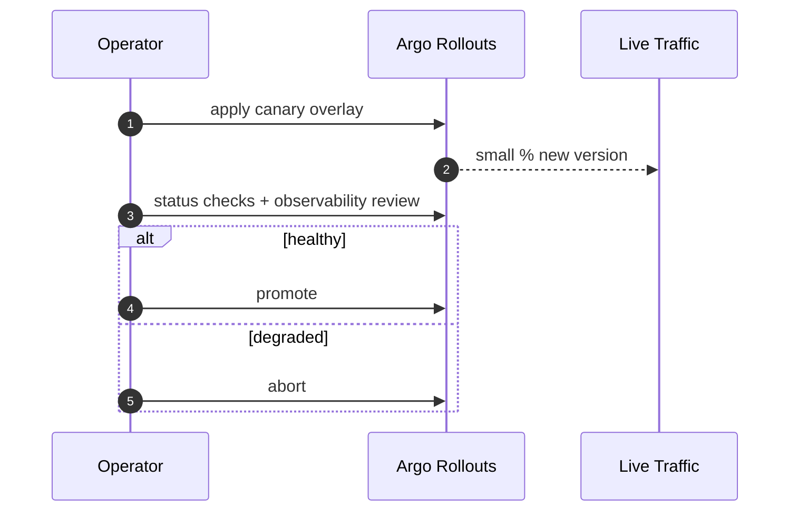
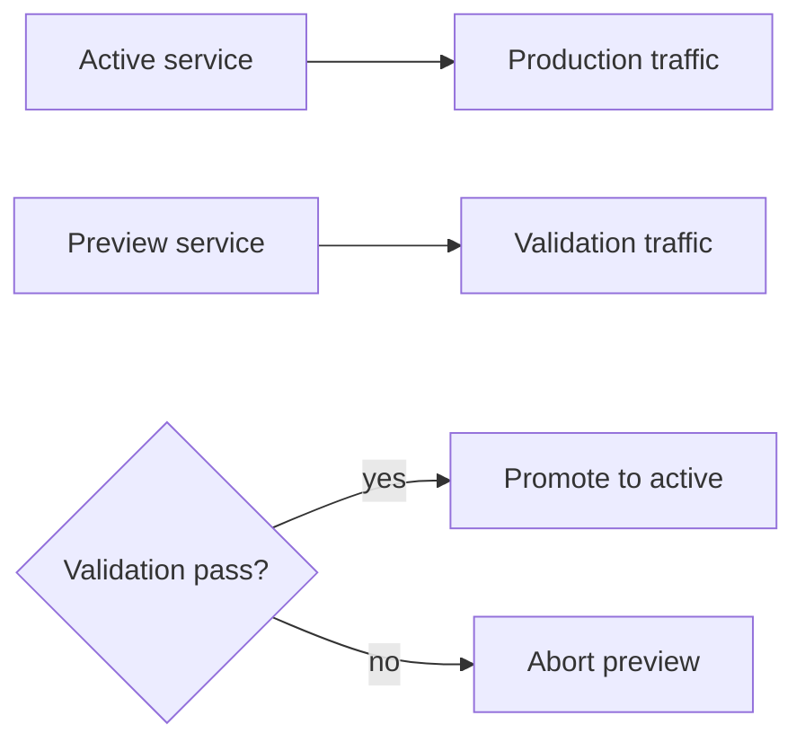

# Progressive Delivery Runbook (Canary And Blue-Green)

Detailed promotion procedures for controlled production releases using Argo Rollouts.

Supported strategies:
- `canary`
- `bluegreen`

Supported clouds:
- `aws`
- `oci`

---

## Table Of Contents

1. [Progressive Delivery Model](#progressive-delivery-model)
2. [Prerequisites](#prerequisites)
3. [Canary Procedure](#canary-procedure)
4. [Blue-Green Procedure](#blue-green-procedure)
5. [Promotion And Abort Decisions](#promotion-and-abort-decisions)
6. [Service Order Guidance](#service-order-guidance)
7. [Validation Checkpoints](#validation-checkpoints)
8. [Rollback Strategy](#rollback-strategy)

---

## Progressive Delivery Model



---

## Prerequisites

- Argo Rollouts controller installed in cluster.
- `kubectl argo rollouts` plugin installed locally.
- Overlay selected from:
  - `deploy/k8s/overlays/aws-canary`
  - `deploy/k8s/overlays/aws-bluegreen`
  - `deploy/k8s/overlays/oci-canary`
  - `deploy/k8s/overlays/oci-bluegreen`

Validation command:

```bash
kubectl argo rollouts version
```

---

## Canary Procedure

### 1) Apply canary overlay

```bash
./deploy/scripts/rollout.sh canary aws apply
```

### 2) Inspect rollout status

```bash
./deploy/scripts/rollout.sh canary aws status
```

### 3) Validate runtime behavior

```bash
./deploy/scripts/smoke-test.sh https://rag.aws.example.com
```

### 4) Promote or abort

```bash
# promote one service
./deploy/scripts/rollout.sh canary aws promote frontend

# abort one service
./deploy/scripts/rollout.sh canary aws abort frontend
```

Canary step plans are defined in overlay manifests (for example `setWeight` + `pause` sequences).



---

## Blue-Green Procedure

### 1) Apply blue-green overlay

```bash
./deploy/scripts/rollout.sh bluegreen aws apply
```

### 2) Validate preview endpoint

```bash
./deploy/scripts/smoke-test.sh https://preview.rag.aws.example.com
```

### 3) Promote or abort

```bash
./deploy/scripts/rollout.sh bluegreen aws promote all
./deploy/scripts/rollout.sh bluegreen aws abort all
```

Blue-green overlays include preview services and preview ingress for isolated validation before traffic switch.



---

## Promotion And Abort Decisions

Promote only when all are true:
- probes green
- smoke checks pass
- error rate and latency stable
- no unresolved critical alerts

Abort immediately when any are true:
- rising 5xx/error budget burn
- readiness instability
- critical user-facing regression
- data integrity/auth/security concern

---

## Service Order Guidance

For high-risk releases, prefer serial promotion:
1. `frontend`
2. `rag-app`
3. `backend`

Rationale:
- UI compatibility first
- orchestration/core runtime second
- domain API dependencies last

---

## Validation Checkpoints

```mermaid
flowchart TD
  Start[Release step] --> Health[/health /livez /readyz]
  Health --> API[/api/system/info /api/tools]
  API --> Smoke[smoke-test.sh]
  Smoke --> Observability[Logs + latency + error rate]
  Observability --> Decision{Promote?}
```

Minimum command set:

```bash
./deploy/scripts/rollout.sh <strategy> <cloud> status
./deploy/scripts/smoke-test.sh <base-url>
kubectl -n rag-system get pods
kubectl -n rag-system get events --sort-by=.metadata.creationTimestamp
```

---

## Rollback Strategy

- Canary: use `abort` to stop progression and retain stable revision.
- Blue-green: abort before promotion to discard preview safely.
- If a bad revision is already promoted:
  1. pin manifests to last known-good image tags
  2. re-apply strategy overlay
  3. re-run smoke and health validation

