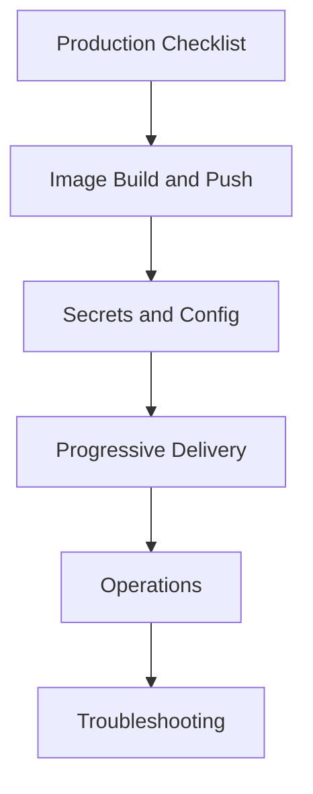

# Deployment Runbook Index (`deploy/docs`)

Authoritative operational documentation for release, security, scaling, and incident response in production environments.

---

## Document Map

| Document | Primary Audience | Use When |
|---|---|---|
| `PRODUCTION_CHECKLIST.md` | Release manager, SRE | before any production apply/promote |
| `IMAGE_BUILD_AND_PUSH.md` | Platform engineer | building and publishing release images |
| `SECRETS_AND_CONFIG.md` | Security/platform team | rotating secrets or changing runtime config |
| `OPERATIONS.md` | On-call, SRE | day-2 ops, scaling, recovery actions |
| `PROGRESSIVE_DELIVERY.md` | Release manager | canary or blue-green controlled rollout |
| `TROUBLESHOOTING.md` | On-call engineer | diagnosing failed rollouts and runtime incidents |

---

## Recommended Consumption Order

---

## Release Flow Alignment

---

## Conventions Used In This Doc Set

- Commands assume repository-root execution unless noted otherwise.
- Namespace defaults to `rag-system` unless overridden by `NAMESPACE`.
- Prefer immutable image tags (`vYYYY.MM.DD.N`, commit SHA, release tag).
- All production changes should be gated by `PRODUCTION_CHECKLIST.md`.
