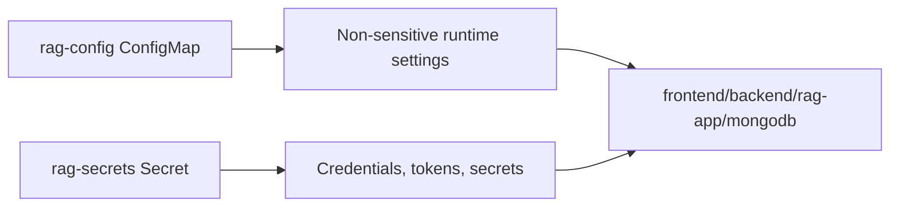
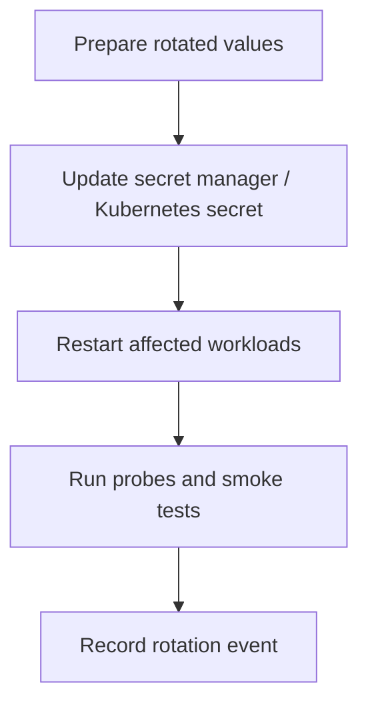
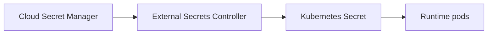

# Secrets, Configuration, And Runtime Policy Guide

Configuration governance for Kubernetes deployment manifests and runtime service behavior.

This document explains:
- what belongs in ConfigMap vs Secret
- required keys for this platform
- secure secret creation and rotation
- cloud secret-manager integration expectations

---

## Configuration Boundaries



---

## Source Manifests

- ConfigMap: `deploy/k8s/base/configmap.yaml`
- Secret: `deploy/k8s/base/secret.yaml`

Important: default secret values in source manifests are placeholders and must be replaced before production rollout.

---

## Required Secret Keys

| Key | Consumed By | Purpose |
|---|---|---|
| `API_TOKEN` | `rag-app` | bearer token for backend tool calls |
| `API_GATEWAY_TOKEN` | `rag-app` | inbound API gateway auth token (if enabled) |
| `SECRET_KEY` | `rag-app` | Flask secret key |
| `MONGO_INITDB_ROOT_USERNAME` | `mongodb` | MongoDB admin user bootstrap |
| `MONGO_INITDB_ROOT_PASSWORD` | `mongodb` | MongoDB admin password bootstrap |
| `MONGO_URI` | `backend` | backend database connection string |

---

## Key ConfigMap Settings

| Key | Purpose |
|---|---|
| `APP_ENVIRONMENT` | environment label (`production`) |
| `BACKEND_PORT` | backend service port |
| `API_BASE_URL` | `rag-app` -> backend base URL |
| `FLASK_ENV` | Flask runtime mode |
| `LOG_LEVEL` | logging verbosity |
| `ENABLE_GATEWAY_AUTH` | require bearer auth for RAG `/api/*` |
| `ENABLE_RATE_LIMIT` | enable API rate limiting |
| `RATE_LIMIT_REQUESTS_PER_MINUTE` | limiter budget |
| `MAX_QUERY_CHARS` | chat request length cap |
| `CORS_ORIGINS` | allowed browser origins |

---

## Safe Secret Creation Procedure

Create/replace runtime secret without committing values to Git:

```bash
kubectl -n rag-system create secret generic rag-secrets \
  --from-literal=API_TOKEN=<token> \
  --from-literal=API_GATEWAY_TOKEN=<gateway-token> \
  --from-literal=SECRET_KEY=<flask-secret> \
  --from-literal=MONGO_INITDB_ROOT_USERNAME=admin \
  --from-literal=MONGO_INITDB_ROOT_PASSWORD=<password> \
  --from-literal=MONGO_URI='mongodb://admin:<password>@mongodb:27017/rag_db?authSource=admin' \
  --dry-run=client -o yaml | kubectl apply -f -
```

TLS secrets required by ingress:
- `rag-tls`
- `rag-preview-tls` (blue-green preview host)

---

## Rotation Workflow



Rotation recommendations:
- rotate API/auth tokens and database credentials on a defined cadence
- rotate immediately after suspected exposure
- verify workloads reload values (restart if required)

---

## Secret Manager Integration Guidance

Production pattern preference:
1. external secret manager (AWS Secrets Manager / OCI Vault / ESO)
2. controller sync to Kubernetes Secret
3. no plaintext secret values in repo or CI logs



---

## Validation Commands

```bash
kubectl -n rag-system get configmap rag-config -o yaml
kubectl -n rag-system get secret rag-secrets -o yaml
kubectl -n rag-system describe deployment rag-app
kubectl -n rag-system describe deployment backend
```

Never paste decoded secret values into tickets or chat.

