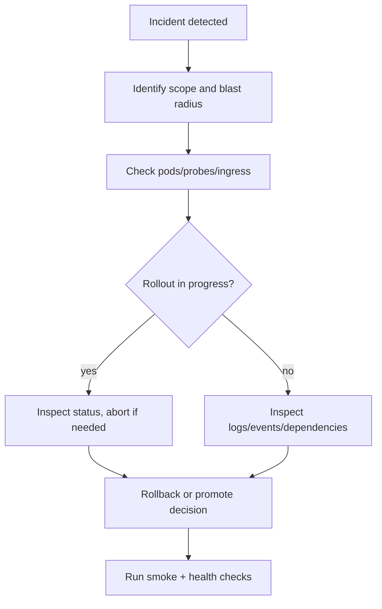
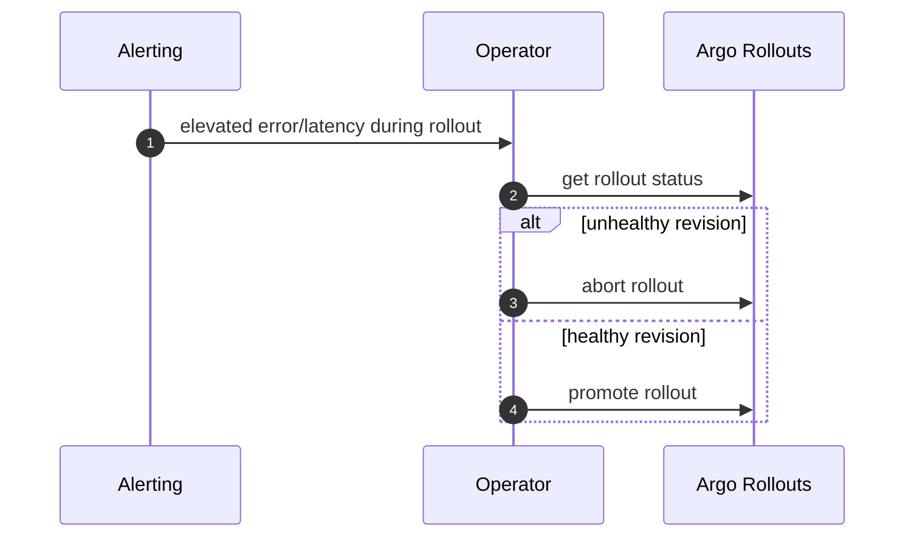
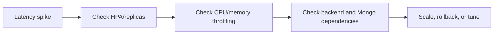

# Production Troubleshooting And Incident Diagnostics Runbook

Structured diagnosis guide for Kubernetes rollout failures and runtime incidents across frontend, rag-app, backend, and stateful dependencies.

---

## Table Of Contents

1. [Triage Workflow](#triage-workflow)
2. [Cluster Baseline Commands](#cluster-baseline-commands)
3. [Common Failure Modes](#common-failure-modes)
4. [Progressive Rollout Failures](#progressive-rollout-failures)
5. [Data And Connectivity Failures](#data-and-connectivity-failures)
6. [Performance Degradation](#performance-degradation)
7. [Escalation Signals](#escalation-signals)

---

## Triage Workflow



---

## Cluster Baseline Commands

```bash
kubectl -n rag-system get pods -o wide
kubectl -n rag-system get svc
kubectl -n rag-system get ingress
kubectl -n rag-system get events --sort-by=.metadata.creationTimestamp | tail -n 80
```

Service-level logs:

```bash
kubectl -n rag-system logs deploy/frontend --tail=200
kubectl -n rag-system logs deploy/rag-app --tail=200
kubectl -n rag-system logs deploy/backend --tail=200
kubectl -n rag-system logs statefulset/mongodb --tail=200
```

---

## Common Failure Modes

### Pods stuck in `Pending`

Likely causes:
- storage class mismatch (`gp3`, `oci-bv`)
- insufficient node capacity
- PVC not bound

Commands:

```bash
kubectl get sc
kubectl -n rag-system describe pvc rag-app-data
kubectl -n rag-system describe pod <pod-name>
```

### `CrashLoopBackOff`

Likely causes:
- invalid `MONGO_URI`
- missing secret/config keys (`API_TOKEN`, `SECRET_KEY`)
- broken startup dependency chain

Commands:

```bash
kubectl -n rag-system logs deploy/rag-app --tail=200
kubectl -n rag-system logs deploy/backend --tail=200
kubectl -n rag-system describe pod <pod-name>
```

### Ingress unreachable

Likely causes:
- DNS not pointing to load balancer
- missing TLS secrets
- ingress controller not healthy

Commands:

```bash
kubectl get ingressclass
kubectl -n rag-system describe ingress rag-ingress
kubectl -n rag-system get secret rag-tls
```

---

## Progressive Rollout Failures

Inspect rollout state:

```bash
kubectl -n rag-system argo rollouts get rollout frontend
kubectl -n rag-system argo rollouts get rollout rag-app
kubectl -n rag-system argo rollouts get rollout backend
```

Action commands:

```bash
# promote if healthy
./deploy/scripts/rollout.sh canary aws promote frontend

# abort if unhealthy
./deploy/scripts/rollout.sh canary aws abort frontend
```



---

## Data And Connectivity Failures

### MongoDB failures

```bash
kubectl -n rag-system get svc mongodb
kubectl -n rag-system get pods -l app=mongodb
kubectl -n rag-system get secret rag-secrets -o yaml
```

Checklist:
- secret contains valid `MONGO_URI`
- backend can resolve `mongodb` service
- MongoDB pod is running and volume healthy

### RAG -> backend API failures

Check `rag-app` environment and logs for:
- wrong `API_BASE_URL`
- wrong `API_TOKEN`
- backend readiness or auth failures

```bash
kubectl -n rag-system describe deploy rag-app
kubectl -n rag-system logs deploy/rag-app --tail=300
```

---

## Performance Degradation

Symptoms:
- increased p95 latency
- `/readyz` flapping on rag-app
- elevated 5xx from backend or rag-app

Investigation path:
1. validate HPA activity and replica saturation
2. inspect resource throttling (`kubectl top pods`)
3. check dependency latency (MongoDB and backend reachability)
4. verify ingress/controller errors



---

## Escalation Signals

Escalate immediately when any occur:
- sustained 5xx above error budget
- repeated rollout aborts for same release
- data loss or corruption indicators
- auth/secret compromise suspicion
- inability to restore service within agreed recovery target

Post-incident:
- capture exact failing commands and timestamps
- attach relevant events/log snippets
- update runbooks to close discovered gaps

