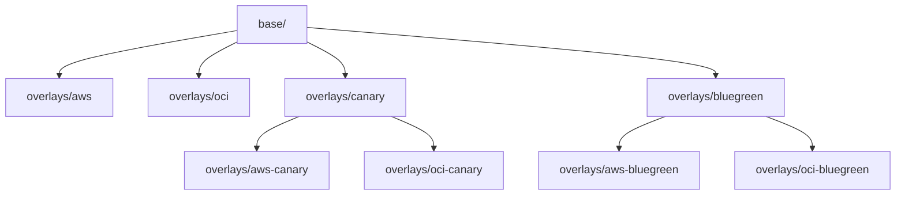
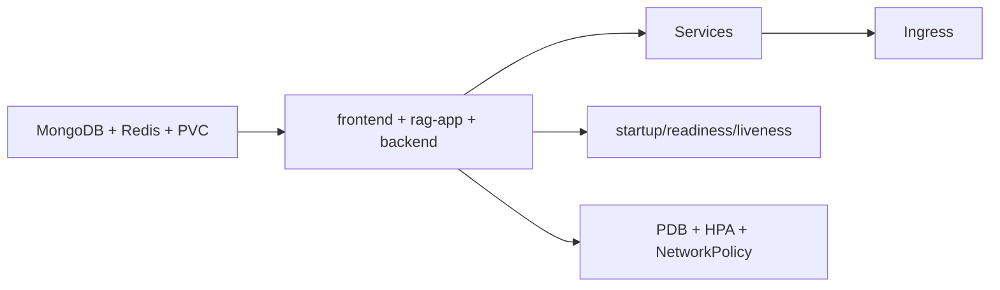
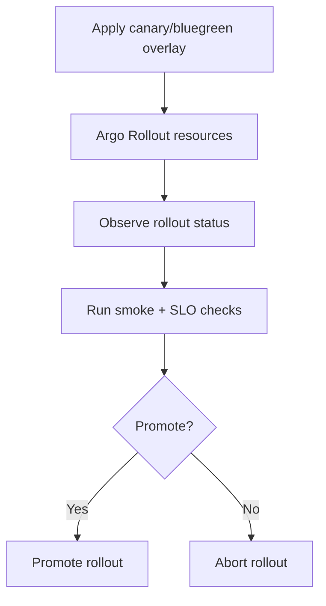

# Kubernetes Manifests And Overlay Reference (`deploy/k8s`)

Production Kubernetes deployment model for the RAG AI platform.

This directory provides:
- hardened base manifests
- cloud-specific overlays (AWS/OCI)
- progressive delivery overlays (canary/blue-green)

---

## Table Of Contents

1. [Manifest Architecture](#manifest-architecture)
2. [Base Components](#base-components)
3. [Overlay Strategy Matrix](#overlay-strategy-matrix)
4. [Cloud-Specific Patches](#cloud-specific-patches)
5. [Progressive Delivery Mechanics](#progressive-delivery-mechanics)
6. [Apply Procedures](#apply-procedures)
7. [Validation Commands](#validation-commands)
8. [Operational Notes](#operational-notes)

---

## Manifest Architecture



Design intent:
- keep workload definitions centralized in `base/`
- apply minimal cloud and strategy-specific patches in overlays
- preserve repeatable rollout behavior across providers

---

## Base Components

`deploy/k8s/base` includes:
- namespace
- config and secret manifests
- persistent storage (`pvc`, StatefulSets)
- deployments for `frontend`, `rag-app`, `backend`
- services and ingress
- HPA, PDB, and NetworkPolicy hardening



Notable runtime defaults:
- frontend/backend replicas: `3`
- rag-app replicas: `1`
- rag-app data persisted via PVC `rag-app-data`
- HPA targets configured for frontend/backend

---

## Overlay Strategy Matrix

| Overlay | Strategy | Cloud | Notes |
|---|---|---|---|
| `overlays/aws` | rolling | AWS | base + AWS ingress/storageclass patches |
| `overlays/oci` | rolling | OCI | base + OCI ingress/storageclass patches |
| `overlays/aws-canary` | canary | AWS | Argo Rollout canary + AWS patches |
| `overlays/oci-canary` | canary | OCI | Argo Rollout canary + OCI patches |
| `overlays/aws-bluegreen` | blue-green | AWS | Argo Rollout blueGreen + preview ingress |
| `overlays/oci-bluegreen` | blue-green | OCI | Argo Rollout blueGreen + preview ingress |

---

## Cloud-Specific Patches

Cloud overlays patch:
- storage class (`gp3` for AWS, `oci-bv` for OCI)
- ingress annotations/class details
- preview ingress hosts for blue-green

Apply examples:

```bash
# rolling
kubectl apply -k deploy/k8s/overlays/aws
kubectl apply -k deploy/k8s/overlays/oci

# progressive
kubectl apply -k deploy/k8s/overlays/aws-canary
kubectl apply -k deploy/k8s/overlays/aws-bluegreen
```

---

## Progressive Delivery Mechanics

`overlays/canary` and `overlays/bluegreen` replace Deployments with Argo Rollout CRs and retarget HPAs.

### Canary
- weighted step progression (`setWeight` + pauses)
- manual promote/abort control

### Blue-Green
- active/preview services
- preview ingress for pre-cutover validation
- `autoPromotionEnabled: false` for explicit operator approval



---

## Apply Procedures

Preferred interface:

```bash
./deploy/scripts/rollout.sh <strategy> <cloud> apply
./deploy/scripts/rollout.sh <strategy> <cloud> status
```

Examples:

```bash
./deploy/scripts/rollout.sh rolling aws apply
./deploy/scripts/rollout.sh canary aws apply
./deploy/scripts/rollout.sh bluegreen oci apply
```

---

## Validation Commands

```bash
kubectl -n rag-system get pods
kubectl -n rag-system get svc
kubectl -n rag-system get ingress
kubectl -n rag-system get hpa
kubectl -n rag-system get pdb
kubectl -n rag-system get networkpolicy
```

Progressive rollout status:

```bash
kubectl -n rag-system argo rollouts get rollout frontend
kubectl -n rag-system argo rollouts get rollout rag-app
kubectl -n rag-system argo rollouts get rollout backend
```

---

## Operational Notes

- Keep image tags immutable and synchronized per release.
- Preserve `rag-app` PVC between updates unless intentionally resetting vector/upload state.
- Validate NetworkPolicy reachability whenever service labels/selectors are changed.
- For blue-green, ensure both active and preview TLS hosts resolve correctly.

