# Frontend Application Handbook (`frontend`)

Production UI for the RAG AI Portfolio Support platform.

This package provides a resilient, API-driven chat experience with:
- real-time streaming over Socket.IO
- automatic REST fallback
- session lifecycle controls
- citation and tool-trace visibility
- health/runtime observability paneling

---

## Table Of Contents

1. [Purpose](#purpose)
2. [Architecture At A Glance](#architecture-at-a-glance)
3. [Runtime Component Model](#runtime-component-model)
4. [Request And Streaming Flows](#request-and-streaming-flows)
5. [Source Layout](#source-layout)
6. [Environment Configuration](#environment-configuration)
7. [API Contracts Consumed](#api-contracts-consumed)
8. [Local Development](#local-development)
9. [Build And Production Delivery](#build-and-production-delivery)
10. [Operational Playbook](#operational-playbook)
11. [Quality Gates](#quality-gates)
12. [Troubleshooting](#troubleshooting)

---

## Purpose

`frontend` is the user-facing application for interacting with the RAG system. It does not contain inference logic. It orchestrates transport, UX state, and rendering of response evidence from the RAG API.

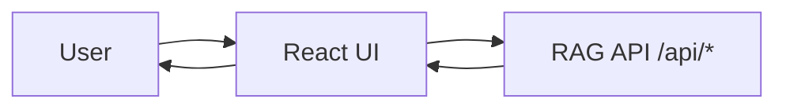

<p align="center">
  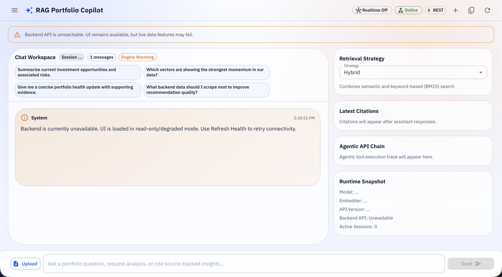
</p>

---

## Architecture At A Glance

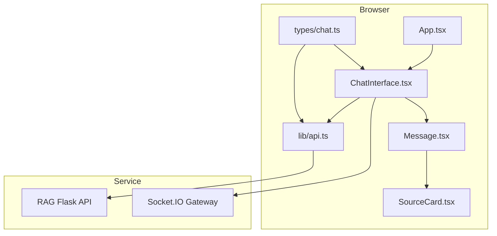

The UI is intentionally thin:
- transport and error normalization live in `src/lib/api.ts`
- state orchestration lives in `src/components/ChatInterface.tsx`
- render-specific components are isolated (`Message`, `SourceCard`)

---

## Runtime Component Model

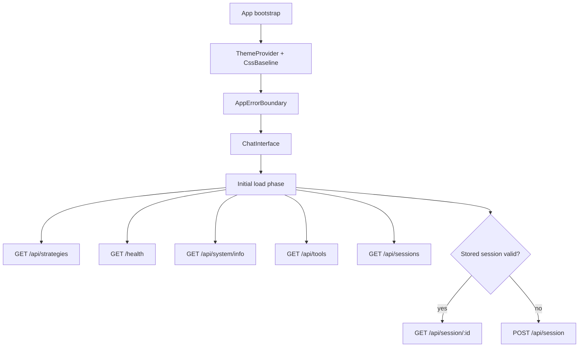

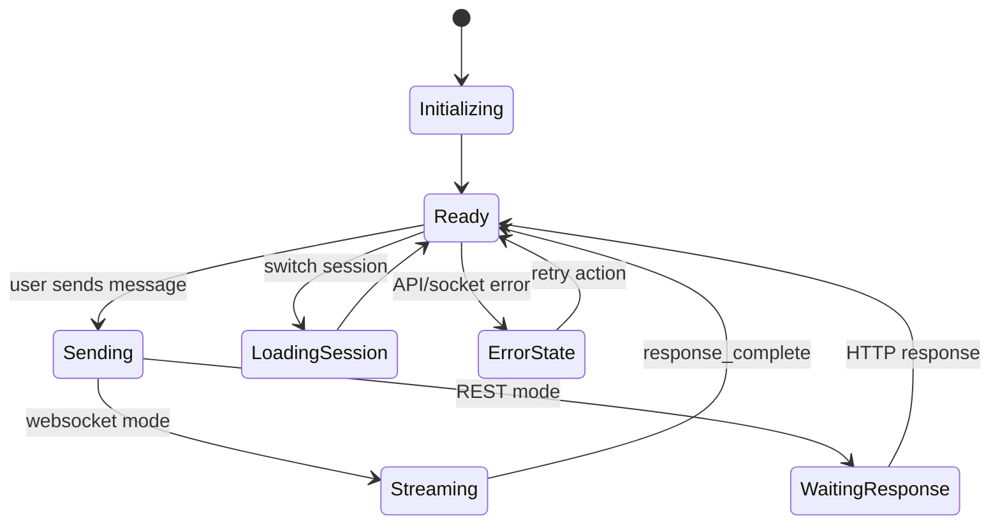

---

## Request And Streaming Flows

### Transport Decision

`ChatInterface` prefers WebSocket when all conditions are true:
- browser online
- websocket toggle enabled
- socket connected
- active socket instance available

Otherwise it uses REST (`POST /api/chat`).

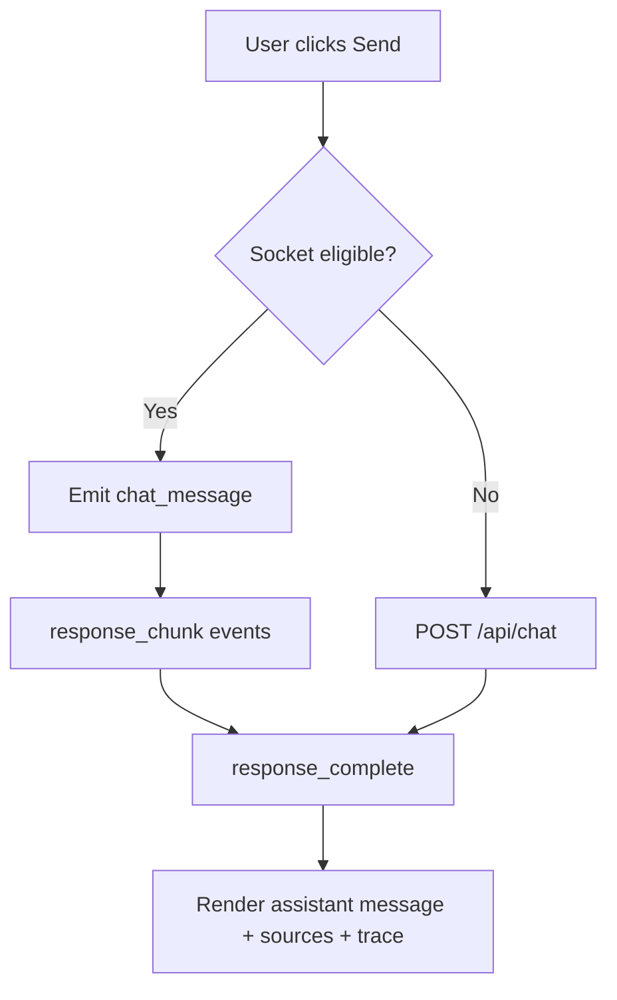

### WebSocket Sequence

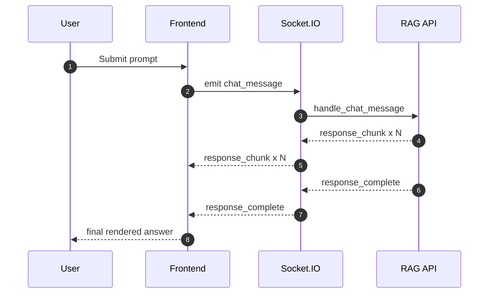

### REST Fallback Sequence

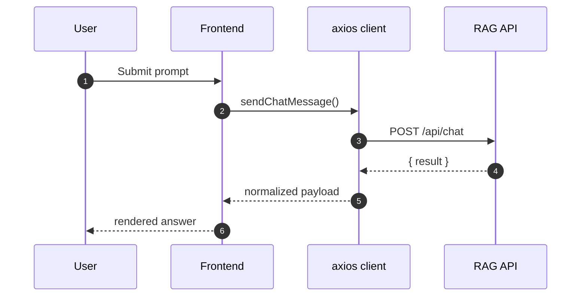

---

## Source Layout

```text
frontend/
├── src/
│   ├── components/
│   │   ├── ChatInterface.tsx
│   │   ├── Message.tsx
│   │   ├── SourceCard.tsx
│   │   └── AppErrorBoundary.tsx
│   ├── lib/
│   │   └── api.ts
│   ├── types/
│   │   └── chat.ts
│   ├── App.tsx
│   ├── main.tsx
│   └── index.css
├── nginx.conf
├── vite.config.ts
├── Dockerfile
└── package.json
```

Module boundaries:
- `src/lib/api.ts`: all HTTP calls and error shaping
- `src/types/chat.ts`: response and UI contracts
- `src/components/ChatInterface.tsx`: orchestration and interaction logic
- `src/components/Message.tsx`: markdown, code blocks, metadata chips

---

## Environment Configuration

Vite-exposed runtime variables:

| Variable | Required | Default | Purpose |
|---|---|---|---|
| `VITE_API_BASE_URL` | No | `""` | Base URL for REST calls. Empty means same-origin. |
| `VITE_API_GATEWAY_TOKEN` | No | unset | Bearer token automatically attached by `api.ts` when provided. |
| `VITE_SOCKET_URL` | No | `window.location.origin` | Socket.IO endpoint root for realtime chat. |

Recommended local setup (`frontend/.env.local`):

```bash
VITE_API_BASE_URL=http://localhost:5000
VITE_SOCKET_URL=http://localhost:5000
# VITE_API_GATEWAY_TOKEN=...
```

---

## API Contracts Consumed

Primary endpoints consumed by the UI:

| Method | Endpoint | Used For |
|---|---|---|
| `POST` | `/api/session` | create session |
| `GET` | `/api/session/:session_id` | load session history |
| `DELETE` | `/api/session/:session_id` | delete session |
| `GET` | `/api/sessions` | list sessions |
| `POST` | `/api/chat` | REST chat path |
| `GET` | `/api/strategies` | strategy selector |
| `POST` | `/api/upload` | document ingestion |
| `GET` | `/health` | runtime health card |
| `GET` | `/api/system/info` | model/system panel |
| `GET` | `/api/tools` | backend tool display |

Socket.IO events used:
- outbound: `join_session`, `leave_session`, `chat_message`
- inbound: `connected`, `joined_session`, `left_session`, `thinking`, `status`, `response_chunk`, `response_complete`, `error`

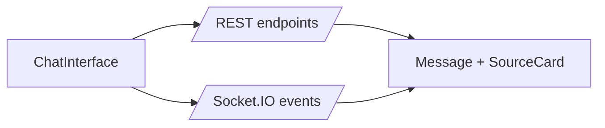

---

## Local Development

Install and run:

```bash
cd frontend
npm ci
npm run dev
```

Type-check:

```bash
npm run typecheck
```

Build:

```bash
npm run build
npm run preview
```

Dev proxy behavior (`vite.config.ts`):
- `/api`, `/health`, `/readyz`, `/livez`, `/openapi.json` -> `http://localhost:5000`
- `/socket.io` proxied with websocket support

---

## Build And Production Delivery

### Build Pipeline

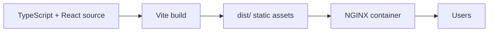

### Docker Image

`frontend/Dockerfile` is multi-stage:
1. Node build stage: install dependencies and run `npm run build`
2. NGINX runtime stage: copy `dist/` and `nginx.conf`

Run standalone container:

```bash
docker build -t rag-frontend ./frontend
docker run --rm -p 3000:80 rag-frontend
```

### NGINX Runtime Responsibilities

`frontend/nginx.conf` handles:
- SPA fallback (`try_files ... /index.html`)
- static asset caching for `/assets/*`
- proxying `/api/*`, `/health`, `/readyz`, `/livez`, `/openapi.json`, `/socket.io/*` to `rag-app:5000`
- baseline security headers

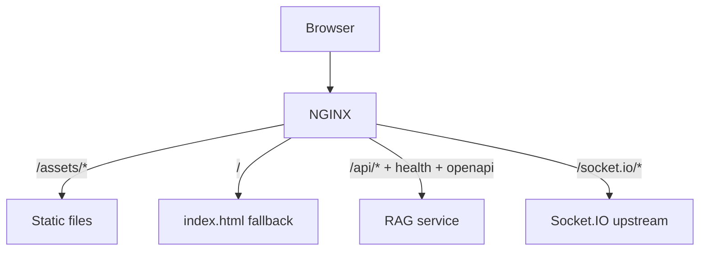

---

## Operational Playbook

Runtime checks:

```bash
curl -f http://localhost:3000/healthz
curl -f http://localhost:3000/openapi.json
```

Performance knobs:
- vendor chunk splitting defined in `vite.config.ts`
- immutable cache for `/assets/*`
- websocket fallback toggle in UI to force REST if needed

Client-side resilience features:
- request timeout set to `30000ms`
- normalized API error object with status/request-id
- online/offline event handling and user notifications

---

## Quality Gates

Minimum CI checks recommended:

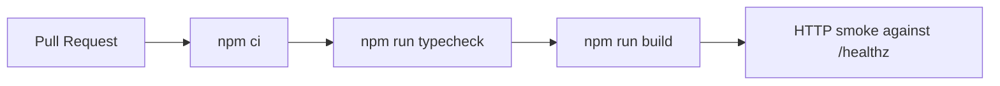

Suggested additions:
- ESLint with strict rules
- React Testing Library unit tests for `ChatInterface`
- Playwright E2E for chat, session switch, upload, fallback modes

---

## Troubleshooting

| Symptom | Likely Cause | Action |
|---|---|---|
| API calls return 401 | gateway auth enabled, missing token | set `VITE_API_GATEWAY_TOKEN` |
| WebSocket never connects | wrong `VITE_SOCKET_URL` or proxy issue | verify `/socket.io` proxy and URL |
| Empty strategy list | RAG API unavailable | check `http://localhost:5000/health` |
| Session load fails | stale session in localStorage | create a new session from UI controls |
| Upload fails | unsupported extension | use `.txt`, `.md`, `.pdf`, `.docx` |

Debug sequence:

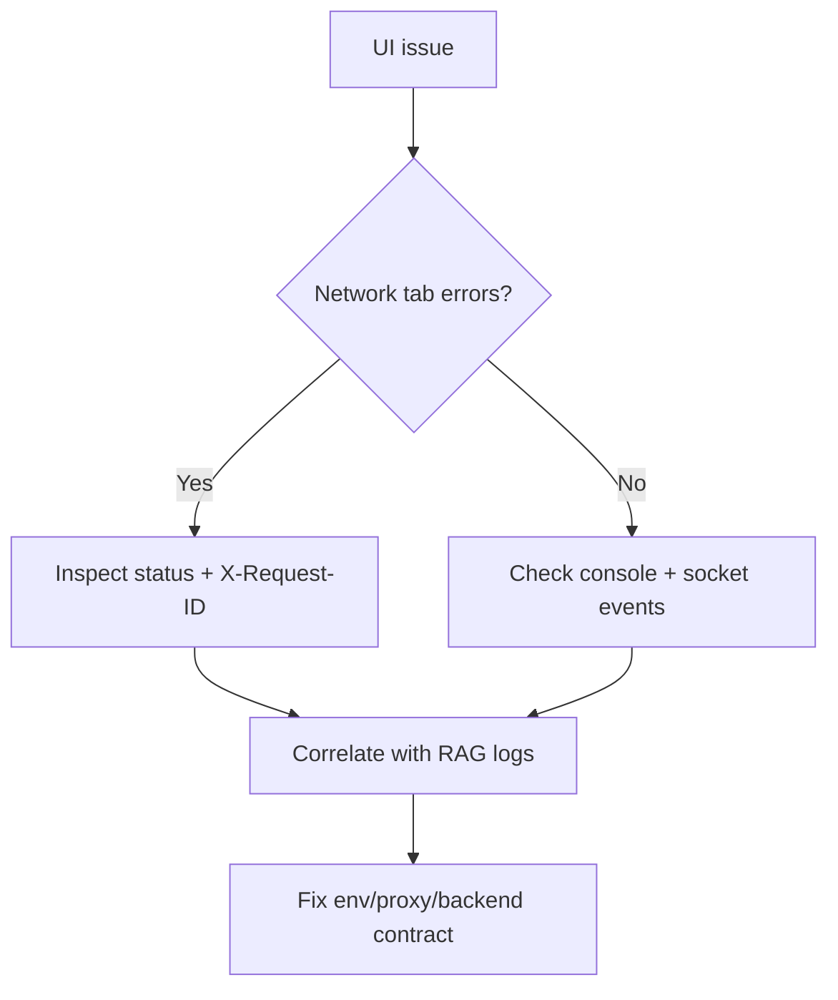
