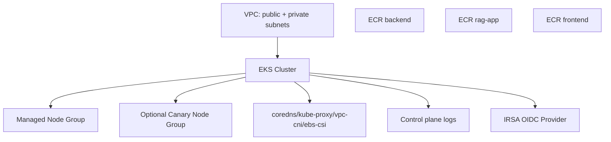
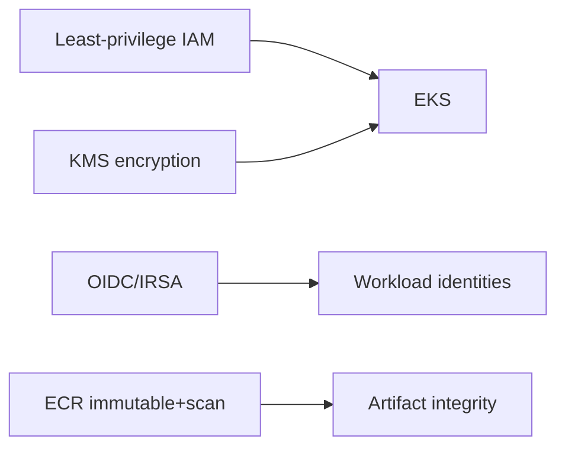
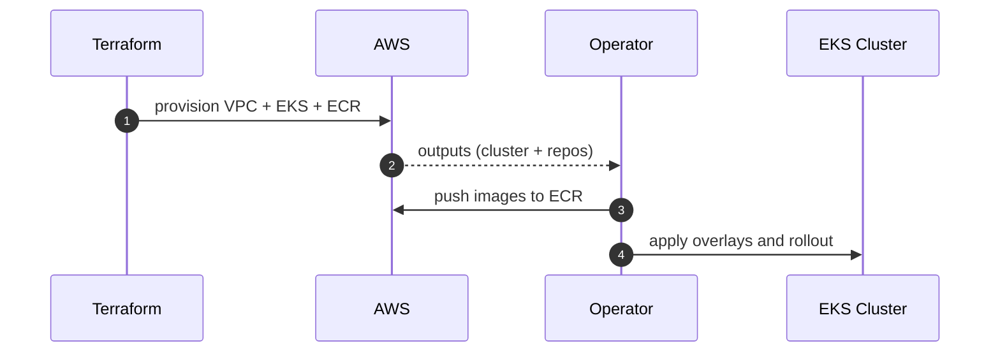

# AWS Production Infrastructure Blueprint (EKS, VPC, ECR)

Terraform infrastructure module for production AWS deployment of the RAG AI platform.

This stack provisions:
- multi-AZ networking
- EKS cluster and managed node groups
- optional canary node group isolation
- ECR repositories with immutable tags and lifecycle policies

---

## Table Of Contents

1. [Provisioned Architecture](#provisioned-architecture)
2. [Module Inputs And Outputs](#module-inputs-and-outputs)
3. [Security And Reliability Defaults](#security-and-reliability-defaults)
4. [Bootstrap Procedure](#bootstrap-procedure)
5. [Post-Apply Integration](#post-apply-integration)
6. [Upgrade And Change Management](#upgrade-and-change-management)
7. [Troubleshooting](#troubleshooting)

---

## Provisioned Architecture



Core resources from `main.tf`:
- `terraform-aws-modules/vpc/aws`
- `terraform-aws-modules/eks/aws`
- optional KMS key for secret encryption
- three ECR repositories + lifecycle policies

---

## Module Inputs And Outputs

### Key inputs (`variables.tf`)

| Variable | Default | Purpose |
|---|---|---|
| `region` | `us-east-1` | AWS region |
| `cluster_name` | `rag-system` | EKS name |
| `kubernetes_version` | `1.29` | control plane version |
| `enable_cluster_encryption` | `true` | KMS-backed secret encryption |
| `enable_canary_node_group` | `true` | isolate canary workloads |
| `node_group_instance_types` | `t3.large` | primary node shape |
| `canary_node_group_instance_types` | `t3.large` | canary node shape |
| `ecr_scan_on_push` | `true` | registry security scans |

### Important outputs (`outputs.tf`)

| Output | Description |
|---|---|
| `cluster_name` | EKS cluster name |
| `cluster_endpoint` | Kubernetes API endpoint |
| `cluster_oidc_provider_arn` | IRSA OIDC provider |
| `eks_managed_node_groups` | node group metadata |
| `kms_key_arn` | KMS key used for encryption (if enabled) |
| `ecr_repo_urls` | backend/rag-app/frontend repo URLs |

---

## Security And Reliability Defaults

- Multi-AZ VPC with one NAT gateway per AZ.
- EKS control-plane log types enabled by default.
- IRSA enabled for workload IAM best practice.
- Optional KMS envelope encryption for Kubernetes secrets.
- ECR repositories configured with:
  - immutable tags
  - scan-on-push
  - lifecycle retention rules



---

## Bootstrap Procedure

### 1) Initialize

```bash
cd infra/terraform/aws
cp terraform.tfvars.example terraform.tfvars
terraform init
```

### 2) Plan and apply

```bash
terraform plan
terraform apply
```

### 3) Configure kube access

```bash
aws eks update-kubeconfig --region <region> --name <cluster_name>
kubectl get nodes
```

---

## Post-Apply Integration

1. Capture `ecr_repo_urls` output.
2. Build and push release images to those repositories.
3. Update Kubernetes overlays with target image tags.
4. Deploy via `deploy/scripts/rollout.sh`.



---

## Upgrade And Change Management

- Prefer incremental Terraform changes with reviewed plans.
- Avoid simultaneous major cluster version and workload rollout changes.
- For node group modifications, validate disruption impact against PDBs.
- Keep Terraform state secured (remote backend + locking recommended).

---

## Troubleshooting

| Issue | Diagnostic | Action |
|---|---|---|
| `terraform apply` IAM errors | review AWS credentials and policy scope | grant required EKS/VPC/ECR permissions |
| EKS endpoint unreachable | inspect endpoint public/private access settings | adjust access and network path |
| nodes not joining | check node group health and subnet/NAT routing | verify IAM role + VPC routes |
| ECR push denied | verify auth/login and repo policy | renew auth and confirm permissions |

