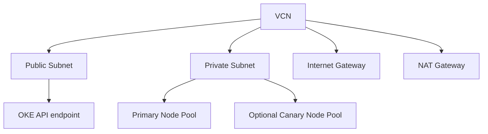
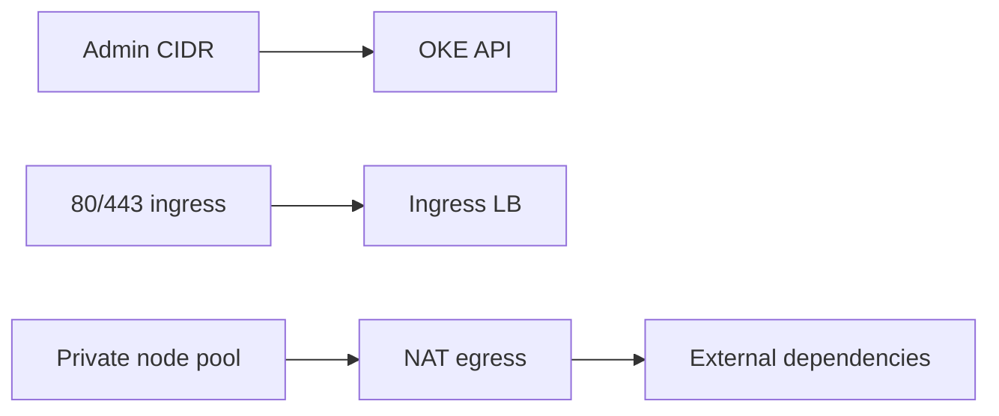
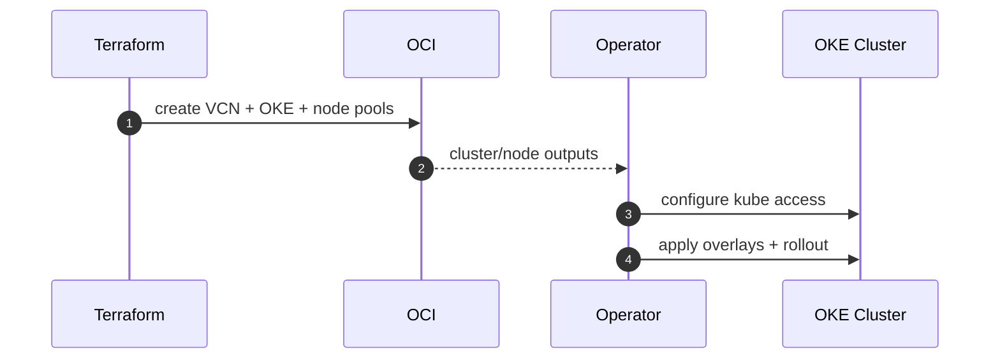

# OCI Production Infrastructure Blueprint (OKE, VCN, Node Pools)

Terraform infrastructure module for production Oracle Cloud deployment of the RAG AI platform.

This stack provisions:
- VCN and subnet topology
- OKE control plane and worker pools
- optional canary node pool
- security lists and route tables for cluster networking

---

## Table Of Contents

1. [Provisioned Architecture](#provisioned-architecture)
2. [Module Inputs And Outputs](#module-inputs-and-outputs)
3. [Security And Network Defaults](#security-and-network-defaults)
4. [Bootstrap Procedure](#bootstrap-procedure)
5. [Post-Apply Integration](#post-apply-integration)
6. [Upgrade And Change Management](#upgrade-and-change-management)
7. [Troubleshooting](#troubleshooting)

---

## Provisioned Architecture



Resources in `main.tf` include:
- VCN, route tables, internet + NAT gateways
- security lists for public and private zones
- OKE cluster
- primary node pool
- optional canary node pool

---

## Module Inputs And Outputs

### Key inputs (`variables.tf`)

| Variable | Default | Purpose |
|---|---|---|
| `region` | `us-ashburn-1` | OCI region |
| `cluster_name` | `rag-system` | OKE name |
| `kubernetes_version` | `v1.29.1` | OKE version |
| `cluster_endpoint_public_access` | `true` | API endpoint accessibility |
| `node_shape` | `VM.Standard.E4.Flex` | worker shape |
| `node_ocpus` | `2` | compute per node |
| `node_memory_in_gbs` | `16` | memory per node |
| `enable_canary_node_pool` | `true` | dedicated canary capacity |
| `admin_cidr` | `203.0.113.0/24` | API/SSH allowed CIDR |

### Important outputs (`outputs.tf`)

| Output | Description |
|---|---|
| `cluster_id` | OKE cluster OCID |
| `node_pool_id` | primary node pool OCID |
| `canary_node_pool_id` | optional canary node pool OCID |
| `vcn_id` | VCN OCID |
| `public_subnet_id` | public subnet OCID |
| `private_subnet_id` | private subnet OCID |

---

## Security And Network Defaults

- Public subnet for control-plane/API endpoint and load balancers.
- Private subnet for worker node placement.
- Security rules include explicit API and HTTPS ingress handling.
- NAT path for private subnet egress.
- Tagging model supports governance and cost attribution.



---

## Bootstrap Procedure

### 1) Initialize

```bash
cd infra/terraform/oci
cp terraform.tfvars.example terraform.tfvars
terraform init
```

### 2) Plan and apply

```bash
terraform plan
terraform apply
```

### 3) Generate kubeconfig

```bash
oci ce cluster create-kubeconfig \
  --cluster-id <cluster_ocid> \
  --file $HOME/.kube/config \
  --region <region> \
  --token-version 2.0.0

kubectl get nodes
```

---

## Post-Apply Integration

1. Build and push platform images to your registry.
2. Configure Kubernetes secrets and config values.
3. Apply OCI overlays from `deploy/k8s/overlays/oci*`.
4. Run rollout status and smoke checks.



---

## Upgrade And Change Management

- Apply network changes carefully to avoid API/data-plane disruption.
- Stage node shape/count adjustments with capacity headroom.
- Keep `admin_cidr` restrictive and auditable.
- Use controlled rollout strategies for workload changes after infra updates.

---

## Troubleshooting

| Issue | Diagnostic | Action |
|---|---|---|
| `terraform apply` auth failure | verify OCI user/key/fingerprint and tenancy values | correct provider credentials |
| nodes not registering | inspect node pool status and subnet reachability | validate subnet, route table, security list rules |
| cannot access API endpoint | check `cluster_endpoint_public_access` and CIDR controls | adjust endpoint mode or admin CIDR |
| ingress traffic failing | confirm LB provisioning and subnet route paths | inspect ingress controller logs and OCI networking |

