# RAG Service Engineering Handbook (`rag_system`)

Production RAG API and orchestration engine for portfolio intelligence.

This package delivers:
- retrieval-augmented generation over indexed documents
- agentic backend API chaining for structured enrichment
- REST and OpenAI-compatible chat interfaces
- WebSocket streaming for incremental response UX
- session state, response caching, and API rate limiting

---

## Table Of Contents

1. [Purpose](#purpose)
2. [Service Architecture](#service-architecture)
3. [Execution Flows](#execution-flows)
4. [Retrieval System](#retrieval-system)
5. [Agentic API Chaining](#agentic-api-chaining)
6. [Storage And Runtime State](#storage-and-runtime-state)
7. [API Endpoints](#api-endpoints)
8. [Configuration Matrix](#configuration-matrix)
9. [Code Layout](#code-layout)
10. [Running Locally](#running-locally)
11. [Production Runtime](#production-runtime)
12. [Observability And SLO Signals](#observability-and-slo-signals)
13. [Troubleshooting](#troubleshooting)

---

## Purpose

`rag_system` is the central intelligence service in the platform. It coordinates retrieval, backend data tools, and LLM response generation behind stable APIs.

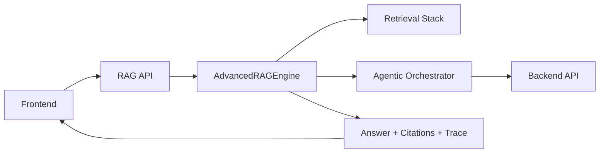

---

## Service Architecture

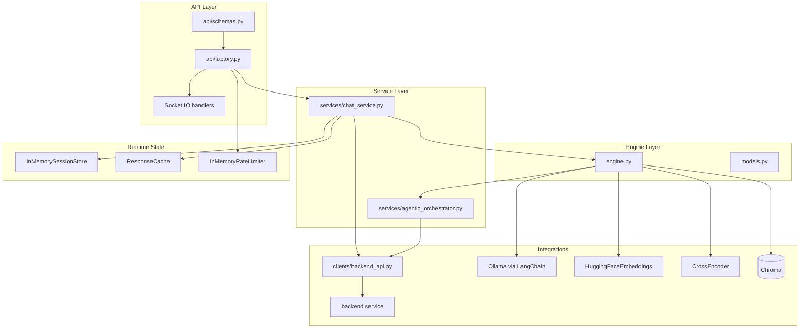

---

## Execution Flows

### REST Chat (`POST /api/chat`)

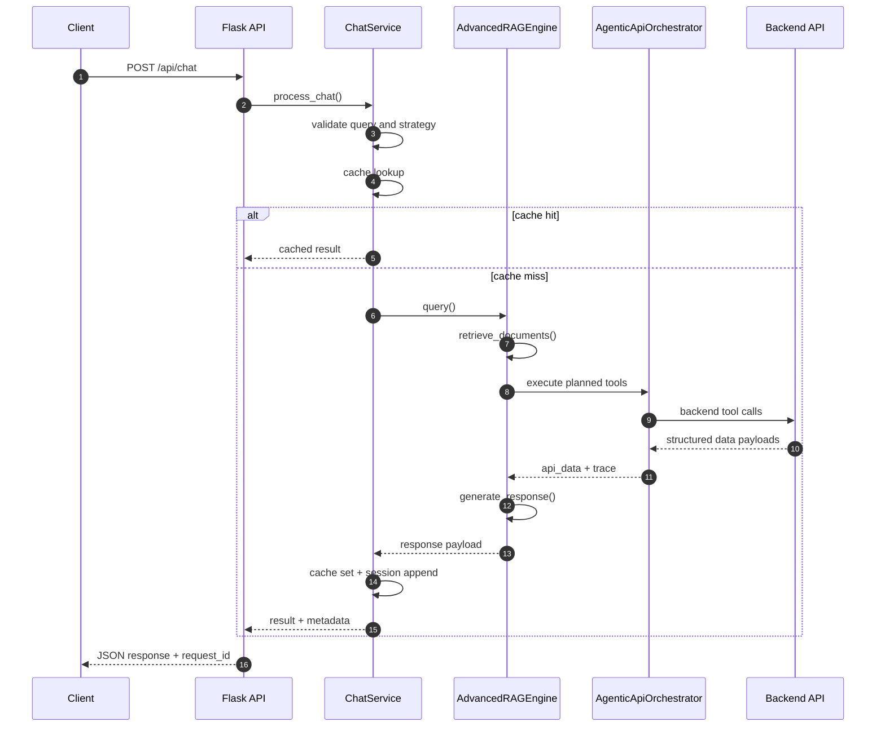

### WebSocket Chat (`chat_message`)

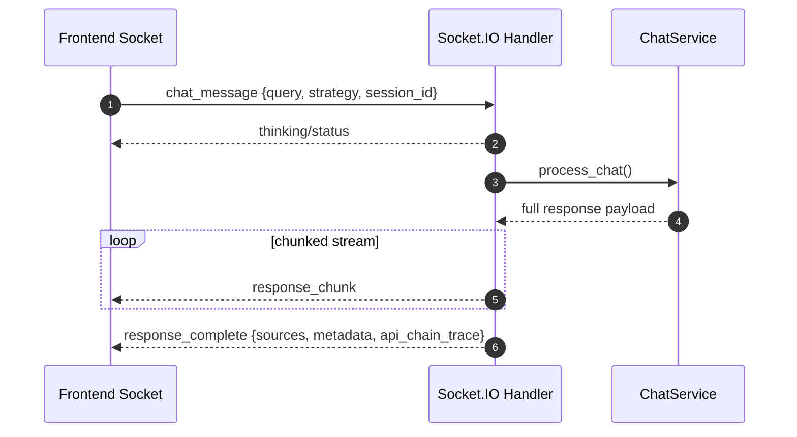

### OpenAI-Compatible Flow (`POST /api/chat/completions`)

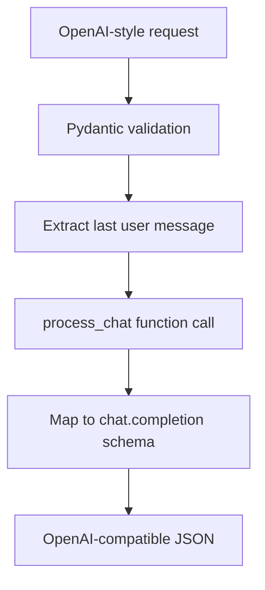

---

## Retrieval System

`AdvancedRAGEngine` supports these strategies:
- `semantic`
- `hybrid`
- `multi_query`
- `decomposed`

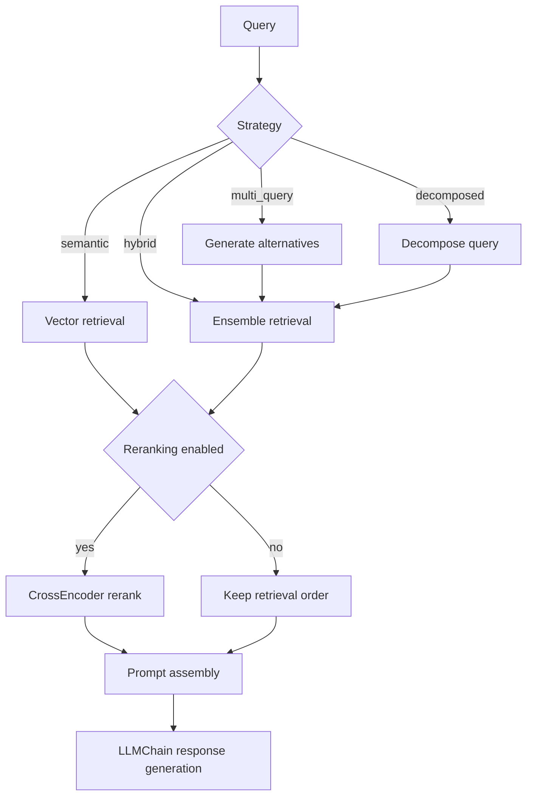

### Index Bootstrap And Fallback

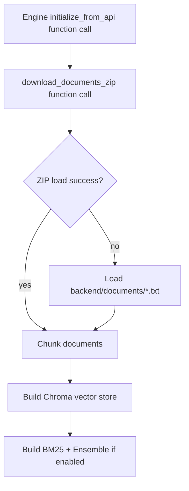

### Document Upload Ingestion

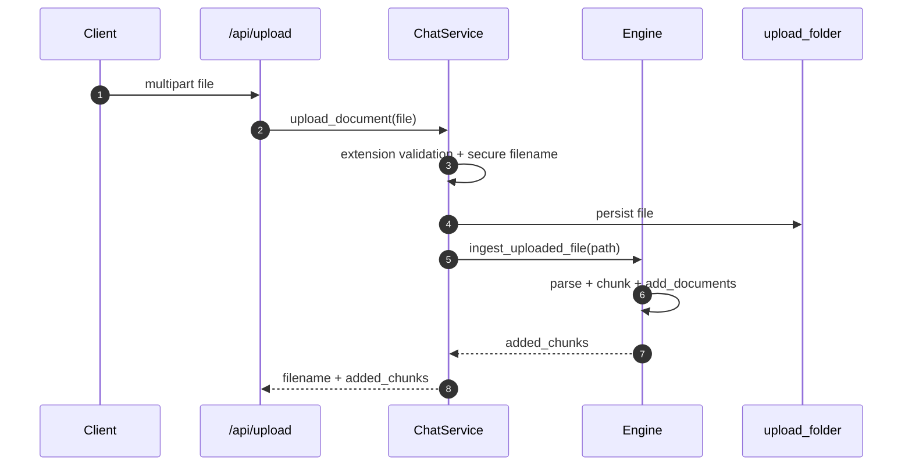

---

## Agentic API Chaining

The orchestrator combines heuristic planning with optional LLM-seeded calls.

Planning inputs:
- user query
- extracted entities (persons, companies, sectors, urls)
- retrieval context snippet
- optional LLM planner output (JSON tool list)

Supported tool names from `BackendApiClient`:
- `team_profile`
- `team_insights`
- `investment_profile`
- `investment_insights`
- `sector_profile`
- `consultations`
- `scrape_page`

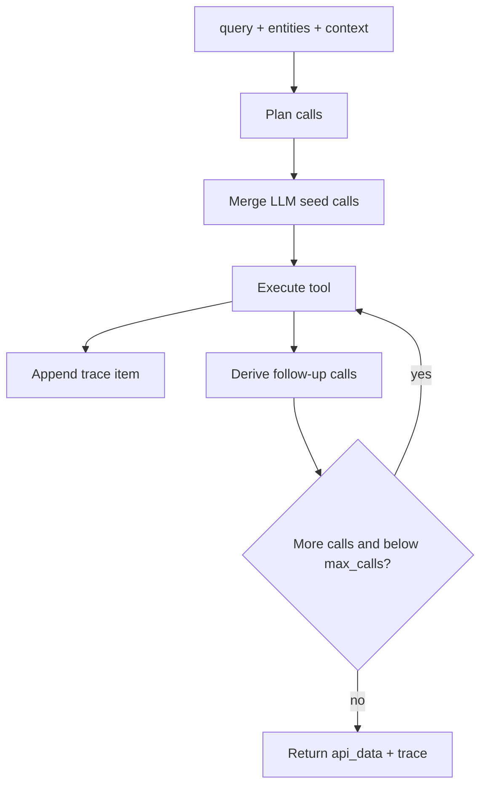

Trace semantics (`api_chain_trace`):
- `status=ok`: tool returned data
- `status=empty`: tool returned no usable payload
- `status=error`: tool execution failed

---

## Storage And Runtime State

### Runtime State Components

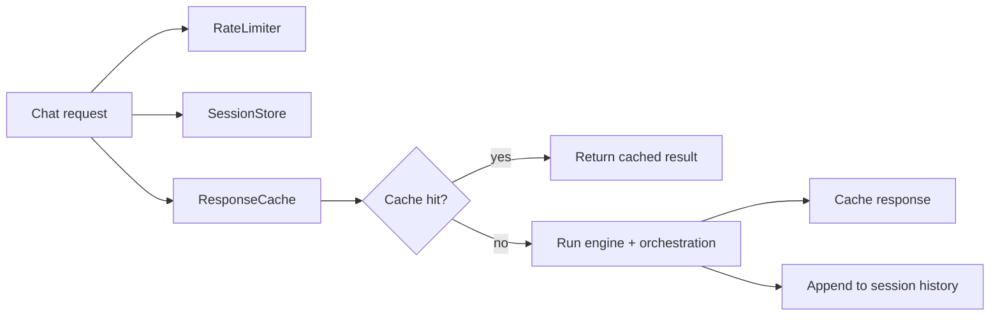

### Session Store

`InMemorySessionStore` provides:
- create/get/delete session
- append bounded message history
- list sessions with `message_count`

### Response Cache

`ResponseCache` provides:
- thread-safe LRU behavior
- default TTL: 900 seconds
- key shape: `(session_id|anonymous, strategy, normalized_query_sha256)`

### Rate Limiter

`InMemoryRateLimiter` applies a sliding window for `/api/*` routes.
Default behavior derives from settings:
- requests/minute: `rate_limit_requests_per_minute`
- window: 60 seconds

---

## API Endpoints

Base local URL: `http://localhost:5000`

### Health And Metadata

| Method | Path | Description |
|---|---|---|
| `GET` | `/livez` | liveness probe |
| `GET` | `/readyz` | readiness probe based on engine state |
| `GET` | `/health` | rich health payload |
| `GET` | `/openapi.json` | generated OpenAPI summary |
| `GET` | `/api/system/info` | runtime model/config summary |
| `GET` | `/api/tools` | backend tools currently advertised |
| `GET` | `/api/strategies` | retrieval strategies and descriptions |

### Chat And Sessions

| Method | Path | Description |
|---|---|---|
| `POST` | `/api/chat` | primary chat endpoint |
| `POST` | `/api/chat/completions` | OpenAI-compatible completions |
| `POST` | `/api/session` | create session |
| `GET` | `/api/session/<session_id>` | fetch session history |
| `DELETE` | `/api/session/<session_id>` | delete session |
| `GET` | `/api/sessions` | list sessions |
| `POST` | `/api/upload` | upload and index document |

### Security And Headers

- `X-Request-ID` accepted inbound and echoed in response
- optional bearer gateway auth when `enable_gateway_auth=true`
- rate-limit headers when limiter is active:
  - `X-RateLimit-Remaining`
  - `X-RateLimit-Reset`

---

## Configuration Matrix

Configuration is defined in `config.py` (`AppSettings`) and loaded from environment variables.

### Core runtime

| Setting | Default | Notes |
|---|---|---|
| `app_name` | `RAG AI Portfolio Support` | service identity |
| `api_version` | `v1` | exposed in system info |
| `environment` | `development` | environment label |
| `host` | `0.0.0.0` | bind host |
| `port` | `5000` | bind port |
| `debug` | `false` | flask/socket debug |

### Backend integration

| Setting | Default | Notes |
|---|---|---|
| `api_base_url` | `https://rag-langchain-ai-system.onrender.com` | backend base URL |
| `api_token` | `token` | backend bearer token |
| `api_timeout_seconds` | `10` | HTTP timeout |
| `enable_gateway_auth` | `false` | protect incoming `/api/*` requests |
| `api_gateway_token` | empty | required when gateway auth enabled |

### Retrieval and models

| Setting | Default |
|---|---|
| `embedding_model` | `sentence-transformers/all-MiniLM-L6-v2` |
| `llm_model` | `llama2` |
| `rerank_model` | `cross-encoder/ms-marco-MiniLM-L-6-v2` |
| `chunk_size` | `1000` |
| `chunk_overlap` | `200` |
| `top_k` | `5` |
| `similarity_threshold` | `0.7` |
| `enable_reranking` | `true` |
| `enable_hybrid_search` | `true` |

### Runtime protections and limits

| Setting | Default | Purpose |
|---|---|---|
| `max_query_chars` | `4000` | query input guardrail |
| `max_session_messages` | `100` | bounded memory per session |
| `response_cache_size` | `200` | LRU cache size |
| `enable_rate_limit` | `true` | route throttling |
| `rate_limit_requests_per_minute` | `60` | per-client budget |
| `max_content_length_mb` | `16` | upload payload size cap |

### Filesystem and logging

| Setting | Default |
|---|---|
| `upload_folder` | `uploads` |
| `vector_persist_directory` | `chroma_db` |
| `vector_collection_name` | `rag_documents` |
| `log_dir` | `logs` |
| `log_level` | `INFO` |
| `log_rotation` | `500 MB` |
| `log_retention` | `10 days` |

---

## Code Layout

```text
rag_system/
├── api/
│   ├── factory.py
│   └── schemas.py
├── clients/
│   └── backend_api.py
├── services/
│   ├── chat_service.py
│   └── agentic_orchestrator.py
├── storage/
│   ├── session_store.py
│   ├── response_cache.py
│   └── rate_limiter.py
├── config.py
├── engine.py
├── models.py
├── logging.py
└── server.py
```

---

## Running Locally

From repository root:

```bash
pip install -r requirements.txt
python run.py
```

Recommended `.env` values for local full-stack interoperability:

```bash
# RAG service bind
HOST=0.0.0.0
PORT=5000

# Backend integration
API_BASE_URL=http://localhost:3456
API_TOKEN=psJN7z3J9q

# Optional gateway auth for clients calling /api/*
ENABLE_GATEWAY_AUTH=false
# API_GATEWAY_TOKEN=<set-if-enable-gateway-auth>
```

Note: with the current backend middleware, `API_TOKEN` must match the value returned by `GET /auth/token` (currently `psJN7z3J9q`) for agentic tool calls to succeed.

Or run module entrypoint directly:

```bash
python -m rag_system.server
```

Smoke checks:

```bash
curl -f http://localhost:5000/livez
curl -f http://localhost:5000/readyz
curl -f http://localhost:5000/health
curl -f http://localhost:5000/api/strategies
```

Minimal chat test:

```bash
curl -s -X POST http://localhost:5000/api/chat \
  -H "Content-Type: application/json" \
  -d '{"query":"Summarize portfolio risk outlook","strategy":"hybrid"}'
```

---

## Production Runtime

Root `Dockerfile` launches via Gunicorn + eventlet:
- worker class: `eventlet`
- workers: `1`
- bind: `0.0.0.0:5000`
- app: `rag_system.server:app`

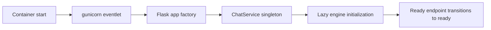

Deployment notes:
- persist `chroma_db`, `logs`, and `uploads` volumes
- ensure backend API reachability from RAG network
- ensure model runtime dependencies are available where LLM/embeddings run

---

## Observability And SLO Signals

Key observability outputs:
- request logs with method/path/status/latency and request_id
- health payload fields:
  - `rag_engine_initialized`
  - `rag_engine_ready`
  - `backend_api_available`
  - `active_sessions`
  - `response_cache_size`

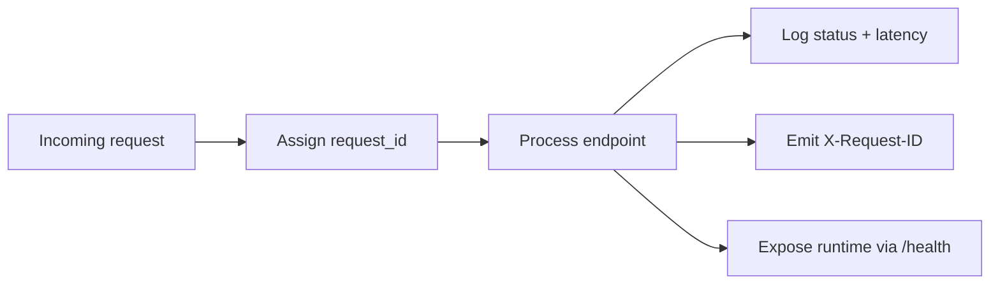

Suggested SLO indicators:
1. `p95` chat latency (`/api/chat`) under target threshold.
2. readiness success rate near 100% after warmup.
3. low backend API failure ratio in orchestrator trace.
4. bounded cache hit ratio targets for repeated workloads.

---

## Troubleshooting

| Symptom | Likely Cause | Action |
|---|---|---|
| `/readyz` returns 503 | engine not initialized/failed index bootstrap | inspect logs; verify backend docs download and local fallback documents |
| `/api/chat` 400 query error | empty or oversized query | ensure query is non-empty and <= `max_query_chars` |
| frequent 429 responses | rate limiter budget too low | raise `rate_limit_requests_per_minute` or tune caller behavior |
| tool trace mostly `error` | backend unavailable/auth mismatch | verify `api_base_url`, `api_token`, backend health |
| upload rejected | unsupported extension or payload too large | use allowed extensions and size under `max_content_length_mb` |

Debug flow:

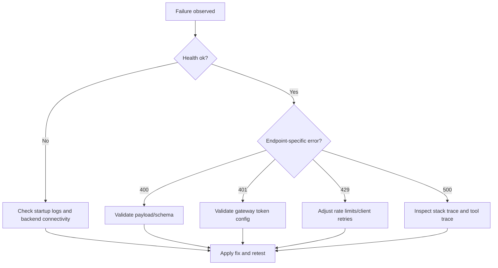
