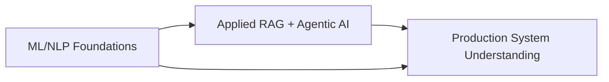
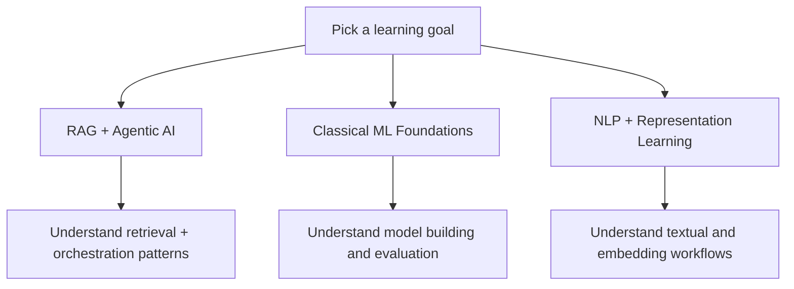

# Learning Resources And Notebook Curriculum (`resources`)

This folder contains learning and reference assets used to understand the ideas behind the project (RAG, NLP, ML, agent systems, and model evaluation).

Scope:
- Teaching notebooks (`.ipynb`) for hands-on practice
- Reference diagrams and PDFs for concepts and architecture
- Supporting datasets in `resources/data/`

These are educational resources, not production runtime code.



## At a Glance

- Notebooks: 12
- Reference docs/images: 4 (`.pdf` / `.JPG`)
- Local datasets/assets: `resources/data/`

Main audiences:
- Engineers onboarding to the RAG/ML stack
- Students learning ML and NLP workflows
- Contributors who want context before changing production components

## Folder Structure

```text
resources/
├── *.ipynb                       # Learning notebooks
├── RAG_Info_Diagrams.pdf
├── RAG_System_Diagram.JPG
├── Storytelling_with_Data.pdf
├── Synthetic_Experts.pdf
└── data/
    ├── Bank_Churn_Train.json
    ├── DrDsAmazinGroceryStore1.csv
    ├── Graduate2022-2k.json
    ├── books.csv
    ├── coronaUSA2022.json
    ├── graduatetweets
    ├── loan_train.csv
    └── simple_product_text.txt
```

## Notebook Catalog

| Notebook | Focus | Typical Data | Notes |
|---|---|---|---|
| `AI_Agents_Assistants.ipynb` | Intro to AI agents and multi-agent workflows with CrewAI | None required | Uses `crewai`, `duckduckgo_search`, Colab helpers |
| `AI_and_Businesses.ipynb` | API-based AI integration in business workflows | None required | Uses OpenAI API; requires API key |
| `Retrieval_Augmented_Generation.ipynb` | RAG motivation and conceptual framing | None required | Mostly conceptual/diagrammatic |
| `Deep_Learning_Neural_Networks.ipynb` | Conceptual intro to deep learning and neural networks | None required | Markdown-heavy, no code cells |
| `LLM_Mining_CX.ipynb` | BERT/SBERT embeddings and topic mining for customer experience text | `Graduate2022-2k.json` | Uses `sentence-transformers`, `BERTopic`, clustering |
| `Unstructured_Data_Textual_Analysis.ipynb` | NLP fundamentals: regex, tokenization, sentiment, word clouds | `simple_product_text.txt`, `coronaUSA2022.json` | Uses NLTK, VADER, WordCloud |
| `Representation_Learning_Recommender.ipynb` | Embeddings and recommender-system concepts (Word2Vec) | `books.csv` | Uses `gensim`, t-SNE, similarity methods |
| `Data_Science_Pipeline.ipynb` | End-to-end churn modeling workflow | `Bank_Churn_Train.json` | Data wrangling, cleaning, modeling, evaluation |
| `k-Nearest-Neighbors.ipynb` | Classification basics with KNN | `DrDsAmazinGroceryStore1.csv` | Intro-level supervised learning workflow |
| `Regression.ipynb` | Regression modeling and diagnostics | `housing.csv` (external) | `housing.csv` is referenced in notebook and not included here |
| `Decision_Trees_Ensemble_Learning.ipynb` | Trees, bagging, random forest, boosting | `loan_train.csv` | Classification plus ensemble methods |
| `Confusion_Matrix.ipynb` | Metrics, confusion matrix, ROC/PR, tuning and validation | `loan_train.csv` | Strong focus on evaluation quality |

## Supporting Reference Files

- `RAG_Info_Diagrams.pdf`: RAG concepts and flow visuals.
- `RAG_System_Diagram.JPG`: high-level system view.
- `Storytelling_with_Data.pdf`: communication/reporting guidance for analytics outcomes.
- `Synthetic_Experts.pdf`: reference reading for synthetic/agentive expert patterns.

## Data Inventory (`resources/data`)

| File | Type | Used By |
|---|---|---|
| `Bank_Churn_Train.json` | JSON | `Data_Science_Pipeline.ipynb` |
| `DrDsAmazinGroceryStore1.csv` | CSV | `k-Nearest-Neighbors.ipynb` |
| `Graduate2022-2k.json` | JSON Lines | `LLM_Mining_CX.ipynb` |
| `books.csv` | CSV | `Representation_Learning_Recommender.ipynb` |
| `coronaUSA2022.json` | JSON Lines | `Unstructured_Data_Textual_Analysis.ipynb` |
| `loan_train.csv` | CSV | `Decision_Trees_Ensemble_Learning.ipynb`, `Confusion_Matrix.ipynb` |
| `simple_product_text.txt` | TXT | `Unstructured_Data_Textual_Analysis.ipynb` |
| `graduatetweets` | Model/artifact folder | Saved/loaded artifact in `LLM_Mining_CX.ipynb` |

## Recommended Learning Paths



### Path A: RAG + Agentic AI
1. `AI_and_Businesses.ipynb`
2. `AI_Agents_Assistants.ipynb`
3. `Retrieval_Augmented_Generation.ipynb`
4. `RAG_Info_Diagrams.pdf`
5. `RAG_System_Diagram.JPG`

### Path B: Classical ML Foundations
1. `k-Nearest-Neighbors.ipynb`
2. `Regression.ipynb`
3. `Decision_Trees_Ensemble_Learning.ipynb`
4. `Confusion_Matrix.ipynb`
5. `Data_Science_Pipeline.ipynb`

### Path C: NLP + Representation Learning
1. `Unstructured_Data_Textual_Analysis.ipynb`
2. `LLM_Mining_CX.ipynb`
3. `Representation_Learning_Recommender.ipynb`

## Environment Setup

Most notebooks were authored with Google Colab in mind (many include `google.colab` and `drive.mount(...)` cells). You can run them either in Colab or locally.

### Option 1: Google Colab
- Open notebook in Colab.
- Upload required data files or mount your Drive.
- Run cells top-to-bottom.
- For notebooks using OpenAI, store API keys in Colab secrets and avoid hardcoding.

### Option 2: Local Jupyter

From repository root:

```bash
python3 -m venv .venv
source .venv/bin/activate
pip install -r requirements.txt
pip install jupyterlab
jupyter lab
```

Then:
- open notebooks under `resources/`
- set working directory so relative data paths resolve, for example:
  - run Jupyter from `resources/`, or
  - update file paths in notebook cells to `resources/data/<file>`

Common extra packages referenced by notebooks:
- `openai`
- `crewai`, `crewai-tools`, `duckduckgo_search`
- `sentence-transformers`, `bertopic`, `hdbscan`, `umap-learn`
- `tweet-preprocessor`
- `nltk`, `wordcloud`, `vaderSentiment`
- `gensim`, `yellowbrick`

## Known Gaps and Notes

- `Regression.ipynb` references `housing.csv`, which is not present in `resources/data`.
- `Data_Science_Pipeline.ipynb` references `Bank_Churn_NewCustomers.json` in some steps; this file is not in `resources/data`.
- Several notebooks contain Colab-specific cells (`drive.mount`, `%cd`, `files.download`) that may need edits for local execution.
- Some notebooks include generated output artifacts (for example predictions CSV/model artifacts) in instructional cells; these are not required to read the concepts.

## How These Resources Relate to Production Code

- Production RAG/API implementation lives outside this folder (for example `rag_system/`, `backend/`, `frontend/`).
- This folder is intended for skill-building, experimentation, and onboarding context.
- Use these notebooks to understand rationale and patterns, then implement production changes in the main codebase.

## Maintenance Guidelines

When adding new learning assets:
- keep filenames descriptive and topic-focused
- place reusable datasets in `resources/data/`
- update this README with:
  - notebook summary
  - required data files
  - required packages
  - recommended placement in one learning path
