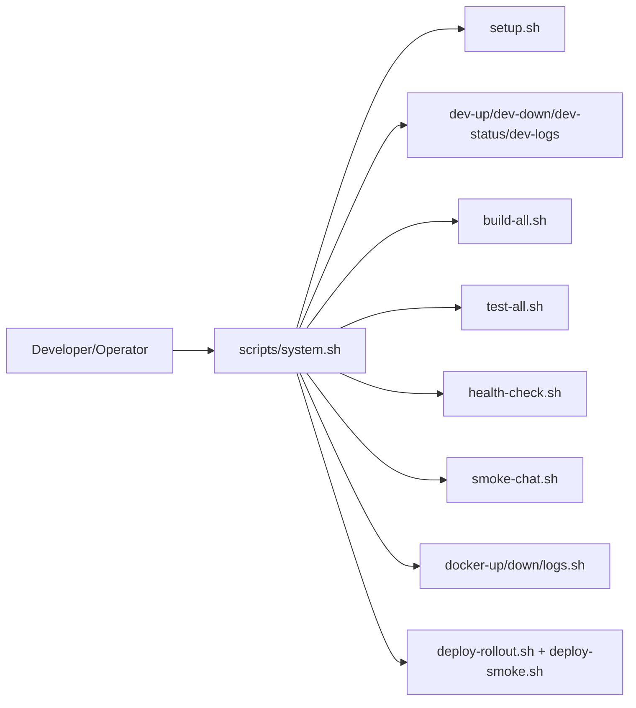
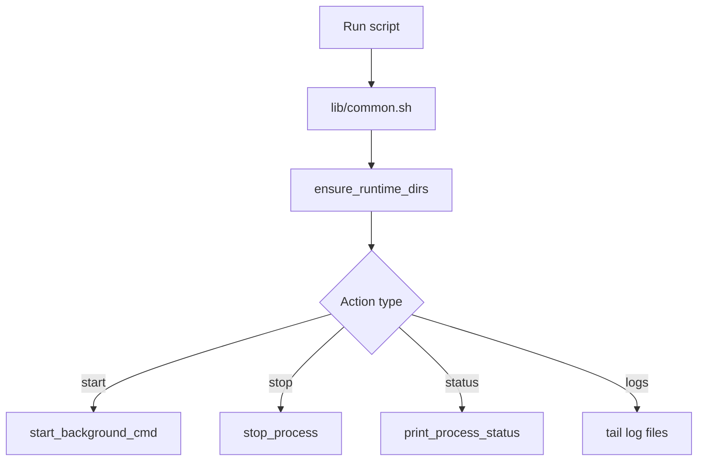
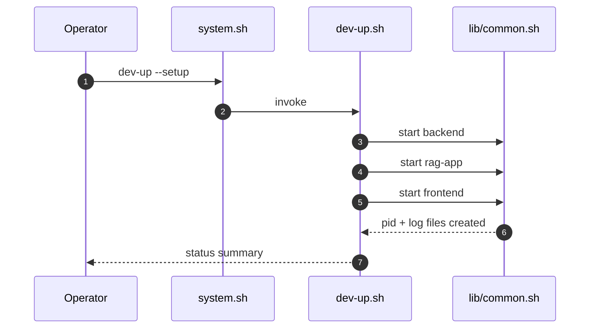
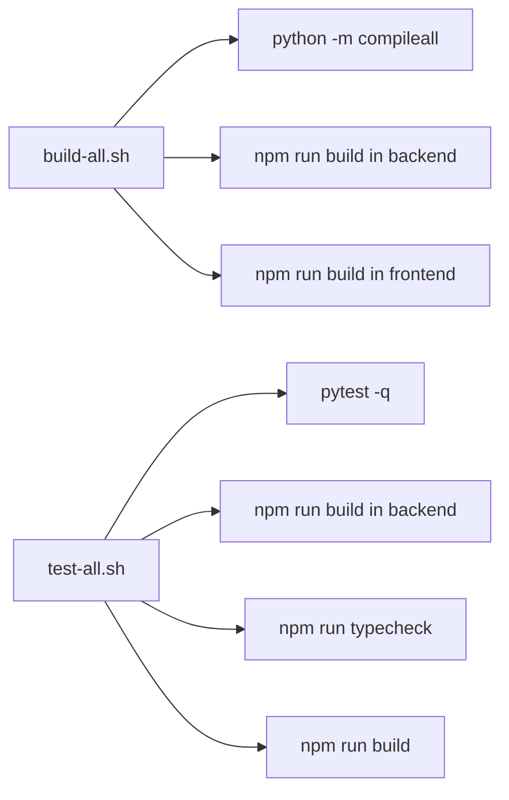
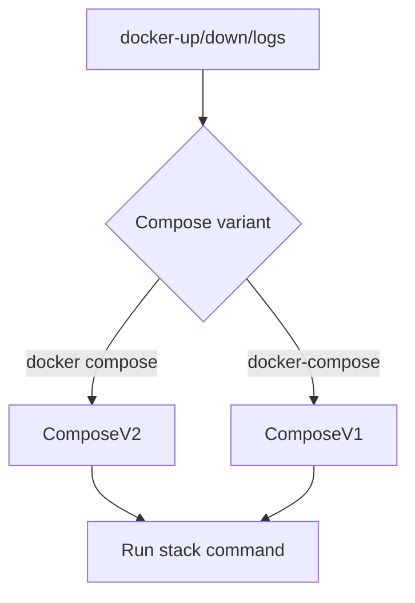

# Platform Automation Scripts Handbook (`scripts`)

Operational shell automation for the entire platform lifecycle:
- local setup
- multi-service development runtime
- build and verification
- health and smoke checks
- Docker Compose control
- deployment command forwarding

This directory is the preferred operator interface for repeatable day-to-day workflows.

---

## Table Of Contents

1. [Automation Scope](#automation-scope)
2. [Command Topology](#command-topology)
3. [Execution Model](#execution-model)
4. [Primary CLI Entrypoint](#primary-cli-entrypoint)
5. [Command Reference](#command-reference)
6. [Local Runtime Internals](#local-runtime-internals)
7. [Build And Verification Pipeline](#build-and-verification-pipeline)
8. [Docker Workflow](#docker-workflow)
9. [Deployment Wrappers](#deployment-wrappers)
10. [Troubleshooting](#troubleshooting)

---

## Automation Scope



---

## Command Topology

```text
scripts/
├── system.sh              # Unified command router
├── setup.sh               # Python + backend + frontend dependency setup
├── dev-up.sh              # Start backend, rag-app, frontend locally
├── dev-down.sh            # Stop local dev processes
├── dev-status.sh          # Process status
├── dev-logs.sh            # Tail local logs
├── build-all.sh           # Python compile + backend/frontend build
├── test-all.sh            # pytest + TS build + frontend checks
├── health-check.sh        # HTTP health probes
├── smoke-chat.sh          # End-to-end chat smoke validation
├── docker-up.sh           # docker compose up -d
├── docker-down.sh         # docker compose down
├── docker-logs.sh         # docker compose logs
├── deploy-rollout.sh      # Wrapper to deploy/scripts/rollout.sh
├── deploy-smoke.sh        # Wrapper to deploy/scripts/smoke-test.sh
├── clean.sh               # Remove runtime artifacts and python cache
└── lib/common.sh          # Shared helpers and runtime directory logic
```

---

## Execution Model

Runtime files are managed under `.run/`:
- PID files: `.run/<service>.pid`
- log files: `.run/logs/<service>.log`



Services managed by local dev scripts:
- `backend` (`npm run dev` in `backend/`)
- `rag-app` (`python run.py` at repo root)
- `frontend` (`npm run dev` in `frontend/`)

---

## Primary CLI Entrypoint

Use `scripts/system.sh` whenever possible.

```bash
scripts/system.sh help
```

Unified command map:

| Command | Script | Purpose |
|---|---|---|
| `setup` | `setup.sh` | install project dependencies |
| `dev-up` | `dev-up.sh` | start all local services |
| `dev-down` | `dev-down.sh` | stop local services |
| `dev-status` | `dev-status.sh` | process-level status |
| `dev-logs` | `dev-logs.sh` | log tailing |
| `build` | `build-all.sh` | build artifacts |
| `format` | `format-all.sh` | format TS/JS/HTML/CSS + Python (no docs) |
| `test` | `test-all.sh` | verification suite |
| `health` | `health-check.sh` | endpoint health checks |
| `smoke` | `smoke-chat.sh` | E2E API smoke chat |
| `docker-up/down/logs` | docker wrappers | Compose lifecycle |
| `deploy` | `deploy-rollout.sh` | rollout forwarding |
| `deploy-smoke` | `deploy-smoke.sh` | remote smoke checks |
| `clean` | `clean.sh` | clean runtime/cache artifacts |

---

## Command Reference

### Environment bootstrap

```bash
scripts/system.sh setup
```

Options:
- `--skip-python`
- `--skip-backend`
- `--skip-frontend`

### Local development lifecycle

```bash
scripts/system.sh dev-up --setup
scripts/system.sh dev-status
scripts/system.sh dev-logs all -f
scripts/system.sh dev-down
```

### Build and tests

```bash
scripts/system.sh build
scripts/system.sh format
scripts/system.sh test
```

### Health and smoke

```bash
scripts/system.sh health
scripts/system.sh smoke
```

### Docker control

```bash
scripts/system.sh docker-up
scripts/system.sh docker-logs rag-app -f
scripts/system.sh docker-down
scripts/system.sh docker-down --volumes
```

### Deployment wrapper examples

```bash
scripts/system.sh deploy rolling aws apply
scripts/system.sh deploy canary aws status
scripts/system.sh deploy-smoke https://rag.aws.example.com
```

---

## Local Runtime Internals

`dev-up.sh` launches processes in background and persists PID/log metadata. This avoids terminal-coupled sessions and enables reproducible restart semantics.



Expected local endpoints:
- `http://localhost:3000` frontend
- `http://localhost:5000` rag-app
- `http://localhost:3456` backend

---

## Build And Verification Pipeline



The `test` command intentionally includes build validation to catch packaging regressions, not just unit-level issues.

---

## Docker Workflow

Docker wrappers use `docker compose` when available and fall back to `docker-compose`.



Common pattern:

```bash
scripts/system.sh docker-up
scripts/system.sh docker-logs -f
scripts/system.sh health
scripts/system.sh smoke
scripts/system.sh docker-down
```

---

## Deployment Wrappers

These wrappers forward directly to `deploy/scripts` tooling and preserve arguments.

- `deploy-rollout.sh` -> `deploy/scripts/rollout.sh`
- `deploy-smoke.sh` -> `deploy/scripts/smoke-test.sh`

This keeps developer ergonomics consistent (`scripts/system.sh deploy ...`) while maintaining a single deployment script source of truth.

---

## Troubleshooting

| Symptom | Likely Cause | Resolution |
|---|---|---|
| `dev-up` starts only some services | missing dependency/runtime | run `scripts/system.sh setup` and re-run |
| `health` fails for backend | backend not running or Mongo unavailable | inspect `scripts/system.sh dev-logs backend -f` |
| `smoke` fails with jq error | `jq` missing | install `jq` and retry |
| stale PID prevents restart | previous process exited unexpectedly | run `scripts/system.sh dev-down` then `clean` |
| compose command not found | Docker tooling unavailable | install Docker Desktop/CLI and retry |

Fast reset sequence:

```bash
scripts/system.sh dev-down
scripts/system.sh clean
scripts/system.sh setup
scripts/system.sh dev-up
scripts/system.sh health
```
